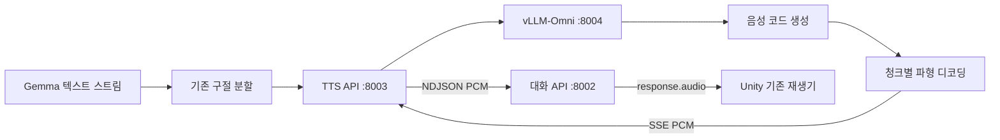

# TTS 생성 중 오디오 스트리밍

> 2026-09-18 03:49 KST 운영 TTS를 VoxCPM2로 전환했다. 현재 상태·검사·복구·Claude Code 재개는 [TTS 작업 인계](TTS_작업인계_20260918.md)를 따른다. 아래는 이전 Qwen 경로의 설치·실측 기록으로, 현재 기본 설정이 아니다. 8004 재시작·Qwen 재설치를 반복하지 않는다.

2026-09-14. 대화 AI 영역의 TTS 변경 기록과 재설치 방법이다.
9월 15일에는 이 엔진을 유지한 채 [캐릭터 대기 리액션](캐릭터_대기_리액션.md)을 추가했다.
아래 변경 전후 시간은 9월 14일 측정이다. 리액션의 구현·초기 검증은 해당 문서,
9월 15일 재측정한 첫 음성 시간과 통합 검증은 [전체 검증 기록](전체_검증_20260915.md)을 따른다.

## 구조

기존 Qwen Python API는 첫 구절의 음성을 끝까지 합성한 뒤 WAV를 반환했다.
`non_streaming_mode=False`만으로 생성 도중 오디오를 받을 수 있는 API는 아니었다.
새 경로는 같은 Qwen3-TTS 1.7B Base 모델을 vLLM-Omni의 두 단계 엔진으로 실행한다.
음성 코드 생성과 파형 디코딩을 겹치고, 디코딩한 부분부터 대화 서버에 보낸다.



- `tts_server.py`: 인증, 연결별 참조 ID, 합성 동시 실행 1개, 기존 NDJSON 계약.
- `tts_omni.py`: 엔진 시작·상태·종료, 참조 업로드/삭제, 생성 중 SSE → PCM 전달.
- `tts_streaming.yaml`: 두 단계의 메모리 예산과 청크 크기. 기본 GPU 비율 합계 0.10은 96GB 장비 기준이다.
- `realtime_tts.py`: 기존 대화 연결 계약을 유지하고 실제 worker의 스트리밍 모드를 확인한다.

출력은 **24kHz, mono, PCM16 little endian**이다. 2026-09-17 사용자 요청으로
200ms→50ms 고정 길이 전송 실험의 누적 버퍼·마지막 무음 패딩을 제거했다.
TTS API는 엔진 어댑터가 넘긴 조각을 **받는 즉시 같은 바이트·같은 길이로** 전달한다.
조각 크기는 **최대 9,600 bytes(200ms)**이며 고정 길이가 아니다. 짧은 중간·마지막 조각도
다음 조각을 기다리거나 무음을 채우지 않고 그대로 보낸다. 기존 완성 PCM 호환 경로도
최대 9,600 bytes씩 보내고 마지막 잔여는 실제 길이대로 전송한다.
`done.audio_sec`는 실제 원음 송신 길이, `source_samples`는 원음 표본 수,
`padding_samples`는 항상 0이다. 빈 출력·잘못된 PCM·오류·취소를 정상 완료로 처리하지 않는다.
`/health`는 `audio_packet_mode=passthrough`, `audio_packet_max_ms=200`,
`audio_tail_padding=false`를 반환한다. 고정 길이를 의미하던 `audio_packet_ms`는 제거했다.
별도로 넣는 문장 사이 150ms 무음과 기존 대기 음성 캐시는 유지한다.
`response_id`, `turn_id`, 문장별 `audio.boundary`, 실제 재생 확인 후 기록하는 규칙을 보존한다.
첫 구절이 준비되는 시점까지는 기다리지만 구절의 음성 전체가 완성될 때까지 기다리지 않는다.

고정 길이 패딩은 말끝 잘림을 개선하지 못해 되돌린 것이며, 생성 단계의 원인 조사는 계속 구분한다.
Unity의 전체 수신 비교 모드는 해제해 다음 Play부터
`Tools > Dialogue > Playback mode > Stream as received`로 실행한다.
구현은 `tts_server.py` 한 파일이며 모델·엔진 설정과 Unity 소스는 이번에 바꾸지 않았다.
검증·배포 기록은 [말끝 오디오 진단 27장](말끝_오디오_진단.md#27-고정-길이-전송무음-패딩-되돌리기)을 따른다.

참조 WAV와 정확한 전사를 함께 업로드하며 `Base`, `x_vector_only_mode=false`로 ICL 복제를 유지한다.
정상 연결 종료 시 엔진 참조를 삭제한다. 관리하는 엔진은 실행마다 별도 임시 참조 폴더를 사용하고 종료 시 지운다.
끊긴 연결의 참조는 기존 8개 상한·6시간 만료 규칙을 적용한다.
서버의 전체 사용자 자료나 등록된 원본 음성을 수정하지 않는다.

## 문장 사이 간격

2026-09-17. 문장이 붙어 들리는 문제로 문장 사이에 짧은 간격을 추가한다.
`realtime_dialogue.py`의 `SENTENCE_GAP_MS = 150`이며 24kHz 기준 3,600 샘플(7,200 bytes)이다.

- 이 간격은 실제로 전송하는 무음 PCM이다. 전송 시점만 늦추면 이미 버퍼에 쌓인 음성이
  있어 원하는 쉼을 보장하지 못하므로 오디오에 간격을 넣는다.
- 앞 구절이 종결 부호(`.!?。！？…`, 닫는 따옴표·괄호 포함)나 줄바꿈으로 끝났고 실제로
  소리가 나간 경우에만 넣는다. 문장 끝이 아닌 길이 제한 분할에는 넣지 않는다.
- 첫 답변 음성 앞이나 마지막 문장 뒤에는 붙이지 않는다. 앞 문장의 `audio.boundary` 뒤,
  다음 구절의 첫 실제 PCM 직전에 보내므로 다음 TTS가 실패하거나 빈 음성이면 추가 무음도 없다.
- 모델이 만든 PCM은 그대로 보존한다. 추가 무음은 누적 `samples`와 진단의 오디오 집계에
  포함하며 `text_chars` 대응과 보류·재개·취소 규칙을 유지한다. 대기 리액션에는 적용하지 않는다.

검증·적용 결과(2026-09-17):

- `python tools/check.py --area dialogue`: 하네스 164개, 서버 284개, 합계 **448개 통과**.
  원본 PCM 보존, 첫·마지막 위치의 무음 제외, 길이 분할 제외, 빈 TTS,
  무음 전송 중 보류·재개 및 추가 샘플의 진단 집계를 확인했다.
  결과: `tools/_work/checks/20260916T193021Z-dialogue-20283892/report.json`.
- 운영 대화 API에 위 두 파일을 적용하고 해시 및 health를 확인했다.
  백업: `~/capstone-server/backups/sentence_gap_20260916T193112Z/`.
  Unity 코드, LLM·TTS 프로세스, 등록 인물은 변경하지 않았다.
- 실제 LLM·Qwen TTS·WebSocket 검사에서 세 문장 답변의 경계 세 곳과
  중간 무음 두 곳(각 3,600 샘플 = 150ms)을 확인했다. 누적 샘플과 경계 값도 일치했다.
  결과: `tools/_work/sentence_gap_20260917/live-gap.json`, 배포 기록: 같은 폴더의 `deployment.json`.
- 위 실서버 검사는 합성 텍스트 입력·공개 참조 음성·가상 재생 확인을 사용했다.
  Unity 장치 재생과 사람의 청취 평가는 수행하지 않았다. Scene_2에서 체험을 시작해 쉼의 길이를 확인한다.

## 취소와 오류

응답 취소·전환·연결 종료 시 생성 중인 HTTP 스트림을 닫아 엔진 추론도 중단한다.
보류/재개는 기존 의미를 유지한다. 보류가 GPU 계산 자체를 정지시키지는 않는다.
중간 오류, 완료 이벤트 누락, 빈 오디오, 잘못된 PCM을 정상 완료로 처리하지 않는다.
엔진이 중단되면 health도 준비되지 않은 상태를 보고한다.

`TTS_ENGINE_MANAGED=1`에서는 TTS API가 직접 생성한 엔진 프로세스 그룹만 종료한다.
이미 해당 포트를 사용 중인 프로세스가 있으면 교체하지 않고 시작을 거부한다.
Gemma와 웹·등록·Tripo 프로세스에는 영향이 없다.

## 설치와 실행

서버 Linux / Python 3.12 기준이다. 기존 `qwentts`, `dialogue`, Gemma의 `vllm` 환경에
새 엔진 의존성을 설치하지 않는다. CUDA 13을 지원하는 드라이버와 여유 GPU 메모리가 필요하다.

```bash
python3 -m venv ~/venv/qwentts-stream
~/venv/qwentts-stream/bin/python -m pip install -r ~/capstone-server/requirements-tts-streaming.txt
~/venv/qwentts-stream/bin/python ~/capstone-server/setup_tts_streaming.py
~/venv/qwentts/bin/python -m pip install httpx==0.28.1
```

vLLM와 vLLM-Omni는 함께 0.26.0으로 고정했다. Torch 2.11.0/cu130에 맞춰
nvcc·CRT·NVVM도 13.0.88로 맞춘다. 미고정 설치에서는 CUDA 13.0 헤더와 13.4 컴파일러가
혼합돼 빌드에 실패했다. 서버의 시스템 CUDA 12.8은 변경하지 않는다.
`setup_tts_streaming.py`가 전용 venv 안의 `lib64`, `libcudart.so` 링크를 준비하고,
실행기는 그 환경의 CUDA 13 compiler와 `bin` 경로를 선택한다.

실제 `tts.env`의 토큰은 유지하고 아래 설정을 적용한다. 실제 토큰/환경 파일은 Git에 넣지 않는다.

```dotenv
TTS_MODEL=Qwen/Qwen3-TTS-12Hz-1.7B-Base
TTS_BACKEND=vllm_omni
TTS_ENGINE_URL=http://127.0.0.1:8004
TTS_ENGINE_MANAGED=1
TTS_ENGINE_PYTHON=~/venv/qwentts-stream/bin/python
TTS_ENGINE_START_TIMEOUT=600
TTS_ENGINE_WARMUP=1
```

```bash
bash ~/capstone-server/dialogue.sh tts stop
bash ~/capstone-server/dialogue.sh tts start
curl -s http://127.0.0.1:8003/health
curl -s http://127.0.0.1:8002/health
```

처음 설치한 장비는 커널 컴파일과 모델 준비 시간이 필요하다. `tts-engine.log`로 오류를 확인한다.
시작 시 합성한 테스트 신호로 Base ICL 경로를 예열한 후에만 준비 완료를 보고한다.
엔진의 INFO 로그는 음성 합성할 텍스트를 출력하므로 운영 엔진은 WARNING 수준으로 실행한다.
8003은 `status=ready`, `streaming=generation_pcm`, 8002는 `tts_ready=true`,
`tts_streaming=generation_pcm`이어야 한다. 8004는 내부 loopback 전용이며 Unity 설정을 바꾸지 않는다.
TTS API의 준비 완료 전에 대화 테스트를 시작하지 않는다.

복구가 필요하면 `TTS_BACKEND=legacy`로 바꾸고 TTS만 재시작한다. 이전 `qwentts` 환경은 보존한다.
이 경우 health는 `phrase_pcm`을 보고한다. 자동으로 구형 방식에 넘어가고 스트리밍이라고 표시하지 않는다.

## 검증

`python tools/check.py --area dialogue`에서 생성 중 첫 오디오, 취소 후 HTTP 해제,
PCM 패킷 상한, 참조 전사 보존·삭제, 중간 오류·미완료 스트림 처리를 확인한다.
실제 모델의 첫 PCM 도착, 전체 생성 완료, 오디오 길이, 재생 중 공급 부족은 별도로 측정한다.
모의 검사 통과는 실제 GPU 성능이나 음질 평가를 대신하지 않는다.

2026-09-14 운영 반영 후 대화 API와 TTS 모두 `generation_pcm`, 참조 ICL, 메모리,
`semantic_v1` 상태를 확인했다. Gemma와 웹·등록·Tripo는 재시작하지 않았다. Unity 소스·씬은 변경하지 않았다.

| 측정 | 이전 | 변경 후 | 조건 |
|---|---:|---:|---|
| TTS 요청 → 첫 PCM | 2.095초 | 0.114초 | 같은 공개 참조, 같은 문장 3개 × 3회, 구형/신형 교대로 요청 |
| 입력 전송 종료 → 첫 음성, 일반 | 3.625초 | 1.096초 | 같은 입력 WAV, 일반 6회씩 |
| 입력 전송 종료 → 첫 음성, 추론 | 8.346초 | 6.546초 | 같은 입력 WAV, 추론 3회씩 |

TTS 단독 비교의 신형 오디오 길이는 평균 4.684초, 생성 완료까지 0.960초였다.
첫 부분을 받은 시점에 재생을 시작한다고 계산했을 때 9회 모두 오디오 공급 부족은 없었다.
전체 경로는 PC → 80ms PCM 전송 → 실제 VAD·SenseVoice·자동 모드 판정·Gemma·Qwen → PC PCM 수신이다.
실제 스피커 장치 지연은 포함하지 않는다. 모드·질문별로 새 답변을 생성하므로 전체 경로 비교는
LLM 출력이 고정된 실험이 아니다. 일반과 추론의 VAD 설정은 동일하다.
변경 후 추론 경로의 LLM 시작 → 첫 글자는 평균 5.244초로, TTS 외의 대기 원인이 남아 있다.

첫 설치 후 탐색 검사에서는 첫 요청 41.23초와 중간에 31.84초짜리 요청이 각각 있었다.
이 자료는 `bench_initial.json`에 보존했다. 후자의 원인을 커널 준비와 완전히 분리해 확정하지는 않았다.
자동 예열을 추가하고 엔진을 재시작한 뒤 짧은/긴 문장을 9회 재검사했으며
첫 PCM 0.104–0.161초, 오디오 공급 부족 0초였다. 예열이 완료된 운영 엔진에서도 전체 경로 9회가 통과했다.
장비·공용 GPU 부하·새 참조 음성에 따라 지연은 달라질 수 있다.

생성 중 HTTP 연결을 닫는 실제 취소 검사에서 worker 잠금 해제까지 0.0028초,
바로 다음 요청의 첫 PCM까지 0.110초였다. 참조 해제 후 `references=0`, `busy=false`를 확인했다.
이는 한 건의 취소 측정이며 최대 지연 보장은 아니다.

Unity 2022.3.62f2의 기존 `AI_Response_Test`에서 공개 참조 업로드 → 실제 음성 입력 →
AudioSource 재생을 통과했다. 첫 음성 표시값은 0.684초, 수신 샘플은 136,320개였다.
이 표시값은 Unity의 발화 종료 처리 이후 기준이며 위 PC 입력 전송 종료 기준과 다르다.
재개·수정·주제 전환·대기 후 재개 4개 경로도 모두 통과했다. 재개 시 PCM 커서는
4,800→4,800, 대기 후 재개는 14,400→14,400으로 유지됐고, 수정·전환은 각각 한 번 취소했다.
검사 후 Play 모드를 종료하고 기존 씬을 유지했다. Quest 장치에서 직접 마이크/스피커를 검사한 것은 아니다.

운영 엔진의 GPU 프로세스 2개는 각각 7,008MiB와 3,700MiB, 합계 **10,708MiB(약 10.5GiB)**를 사용했다.
기존 TTS의 약 5.3GiB보다 증가했다. YAML의 메모리 비율은 엔진 예산이며 CUDA 실행 부대 메모리까지
포함한 엄격한 상한은 아니다. 측정 당시 공용 GPU 여유는 9,829MiB였고 다른 서비스 PID는 유지됐다.

검사 자료:

- `tools/_work/checks/20260914T090712Z-all-35ef77ac/report.json`: 하네스 11 + 서버 93 + 제작 작업자 5 = 109개 통과.
- `tools/_work/tts_streaming_20260914/comparison.json`: 동일 문장 TTS 18회 비교 원본.
- `tools/_work/tts_streaming_20260914/managed_check.json`: 엔진 재시작·예열·9회 스트리밍·취소.
- `tools/_work/tts_streaming_20260914/pipeline/report.json`: 운영 전체 음성 경로 9회, 누락 없이 통과.
- `tools/_work/tts_streaming_20260914/unity-reference-upload.json`, `unity-interruption.json`: Unity 실제 재생·4경로 끼어들기.
- `tools/_work/tts_streaming_20260914/postcheck.json`: 배포 파일 해시, 엔진 인증, 임시 포트 정리, 서비스·GPU 상태.
- 서버 `~/capstone-server/checks/tts_streaming_20260914/`: 설치 잠금 목록, 로그, 배포 전후 상태·해시.
- 서버 `~/capstone-server/backups/tts_streaming_20260914/`: 이전 코드·설정의 복구용 백업. 설정은 서버에만 보관한다.

음성 내용·목소리 유사도·억양에 대한 청취 품질 평가는 이 속도/프로토콜 검사와 별도다.

## 공식 근거

- [Qwen Python 추론 API](https://github.com/QwenLM/Qwen3-TTS/blob/main/qwen_tts/inference/qwen3_tts_model.py)
- [vLLM-Omni 0.26 Speech API](https://docs.vllm.ai/projects/vllm-omni/en/v0.26.0/serving/speech_api/)
- [적용 버전의 Qwen3-TTS 단계별 설정](https://github.com/vllm-project/vllm-omni/blob/v0.26.0/vllm_omni/deploy/qwen3_tts.yaml)

모델 소개의 최저 지연 수치를 현재 서버의 실측 대기시간으로 사용하지 않는다.
