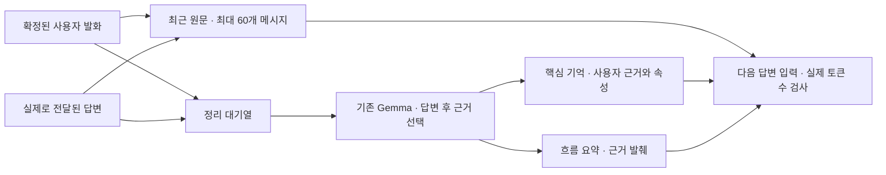

# 연결 안의 대화 기억

기준일: 2026-09-15. **대화 서버에 `session_memory_v1`을 적용했다.** 같은 WebSocket 연결에서
최근 원문 밖으로 밀려난 핵심 내용을 다시 참고한다. Unity 수정 없이 기존 최종 전사 입력에 적용하며,
연결 종료·재접속·초기화 후의 복원과 SQLite 저장은 아직 구현하지 않았다.
현재는 TTS 생성 스트리밍과 함께 동작한다. [재연결 당시의 기억·음성 검사](TTS_재연결_검증.md)와
[대기 리액션의 기억 제외·최신 검사](캐릭터_대기_리액션.md)는 아래 텍스트 메모리 실험과 구분한다.

## 사용 방법

기존 대화 연결에서 평소처럼 말하면 된다. 다음은 가상 정보로 확인하는 예다.

1. “내 발표는 다음 주 수요일 오후 3시야. 기억해 줘.”
2. “발표가 목요일 오후 4시로 바뀌었어.” → “시간만 오후 5시로 바꿀게.”
3. 다른 대화를 충분히 진행한 뒤 “내 발표 일정 다시 알려줘.”
4. “발표 일정은 기억에서 지워줘.” → “내 발표 일정이 언제였지?”
5. 전체 삭제는 “지금까지의 대화 기억을 전부 잊어줘.” 또는 기존 초기화를 사용한다.

기억 정리는 답변이 끝난 뒤 진행한다. 확인할 때는 답변 후 잠깐 기다린다.
`기억해 줘`는 우선 정리할 신호이며 저장 성공을 보장하는 별도 명령은 아니다.
아래 9월 13~14일 장기 기억·되물음 검사는 서버 텍스트 입력으로 실행했다. 실제 마이크 인식 검증은 포함하지 않았다.

## 구성과 저장 범위



| 항목 | 현재 동작 |
|---|---|
| 최근 원문 | 사용자·전달된 답변 합계 최대 60개 메시지. 보통 약 30턴 |
| 핵심 기억 | 일정·취향·관계·경험·약속 등 최대 48개. 사용자 원문, 출처 ID, 발화 턴, 시각, 우선순위, 수명 |
| 흐름 요약 | 현재 주제·이어갈 질문을 보여 주는 실제 발화 최대 3개, 원문 합계 1,200자 |
| 정리 시점 | 미정리 사용자 발화 3개 이상 또는 기억·정정 관련 표현이 있으면 답변 완료 후 0.5초 대기해 실행 |
| 모델 | 현재 Gemma의 비추론 모드. 추가 모델·벡터 DB·외부 메모리 서비스 없음 |
| 수명 | 연결 안에서 유지. 당일 상태의 `today` 항목은 서버 현지 날짜가 바뀌면 핵심 기억에서 만료 |
| 조회 | 현재 질문과 항목 이름의 단어·한국어 2글자 겹침, 중요도, 최신 순으로 원문 근거를 선택 |
| 삭제·초기화 | 관련 원문·핵심 기억·요약·대기열을 함께 제거. reset/close는 모두 제거 |

요약은 모델이 자유롭게 다시 쓴 문단이 아니라 **근거를 발췌한 요약**이다.
모델은 저장할 항목과 실제 발화 ID를 고르고, 서버가 원문을 복사한다.
인물 설정·말투 예시·AI의 추측은 핵심 기억 추출 입력의 사용자 사실로 제공하지 않는다.
감정 태그·중간 STT 전사·미전달 초안도 핵심 사실의 출처에 넣지 않는다.
TTS를 사용할 경우 assistant 근거는 재생 확인된 본답변만, TTS를 끈 텍스트 모드는 전송된 부분만 기록한다.
대기 리액션은 자막·재생 확인에는 포함되지만 최근 원문·핵심 기억에는 저장하지 않는다.

정정은 같은 항목을 갱신한다. 완전한 정정이면 최신 근거로 교체하고, “시간만 바꿀게” 같은 부분 정정은
이전 근거와 새 근거를 함께 남긴다. 한 항목당 최대 3개 근거이며 최신 ID의 정정이 우선한다.
상대 날짜는 발화 시각을 함께 제공하지만 별도의 달력 날짜 계산 엔진은 없다.

정리 결과가 잘린 JSON이거나 출처가 실제 입력에 없거나 AI 발화를 사용자 사실로 고르면 적용을 거절한다.
실패한 묶음은 다음 정리 기회까지 남긴다. 다음 사용자 입력이 시작되면 정리 요청을 취소하고,
취소·초기화 전에 시작한 작업의 늦은 결과가 기억을 되살리지 않도록 세대 번호를 검사한다.

## 삭제 동작

“잊어줘”, “기억하지 마”, “지워줘” 등의 한국어 표현을 먼저 찾은 뒤 모델이 실제 삭제 의도와 대상을 판단한다.
인용한 문장과 “잊지 마”를 삭제 명령으로 처리하지 않는다. 명확하지 않거나 판정이 실패하면
삭제하지 않고 대상을 확인한다. 성공 안내는 서버가 실제로 삭제한 뒤 고정 문장으로 보낸다.

삭제 대상을 언급한 재질문·정정·과거 답변도 함께 골라 원문에 남은 값을 다시 회상하지 않게 한다.
삭제 요청 자체의 구체적인 값은 새 기억에 넣지 않고 처리 상태로 바꿔 기록한다.
보류된 답변에서 뒤늦게 전달 확인된 부분도 삭제 범위에 반영한다.

삭제 단위는 선택된 **발화 턴 전체**다. 한 발화에 삭제할 사실과 유지할 사실이 섞여 있으면 함께 제거될 수 있다.
유지할 사실에 별도 발화 근거가 있으면 그 기억은 유지한다. 문장 안의 특정 부분만 편집하는 기능은 없다.
삭제 범위는 이 연결의 서버 대화 기록이다. Unity 화면에 이미 표시된 자막이나 별도로 보관한 검사 보고서를 지우는 기능은 아니다.

## 토큰 예산과 제한

`DIALOGUE_MEMORY_ENABLED=1`, `DIALOGUE_CONTEXT_TOKENS=8192`가 기본값이다.
메모리만 끄려면 첫 값을 `0`으로 설정한 뒤 대화 API를 다시 시작한다. 기존 응답 경로는 유지된다.
메모리는 별도 설정이 없으면 기본값으로 활성화된다. 9월 13일 첫 배포는 TTS를 끈 상태였고,
9월 14일부터 운영 TTS를 재연결해 생성 스트리밍을 사용한다.

답변 호출 전 현재 vLLM `/tokenize`로 채팅 템플릿을 포함한 실제 입력 토큰 수를 센다.
일반 출력 256, 추론 출력 2,048, 여유 64토큰을 남기고 오래된 원문부터 완전한 턴 단위로 줄인다.
인물 설정·선택한 기억·현재 발화만으로도 넘치면 `context_too_long` 오류를 반환한다.
`/tokenize` 실패를 임의의 글자 수 추정으로 통과시키지 않는다. 다른 모델 제공자로 바꿀 때는 이 API 호환성도 확인한다.

다음 제한을 전제로 사용한다.

- 모든 대화를 영구 보관하지 않는다. 기억 48개가 넘으면 중요도와 최신 순서로 남기고, 대기열은 160개 발화로 제한한다.
- 2,000자보다 긴 발화는 핵심 기억 추출에서 생략한다. 최근 원문과 삭제용 출처 연결은 유지한다.
- 답변 프롬프트의 핵심 기억은 JSON 기준 최대 3,500자다. 저장된 기억 전부가 매번 들어가지는 않는다.
- `today` 만료는 핵심 기억의 수명이다. 최근 원문·흐름 요약에 같은 말이 아직 있으면 참고될 수 있다. 완전한 제거는 삭제 요청이다.
- 끊임없이 발화해 정리 요청이 계속 취소되거나 모델 오류가 지속되면 오래된 입력이 대기열에서 밀려날 수 있다.
- 삭제 판정은 전체 12초 안에 끝나야 한다. 긴 자료나 불명확한 의도는 삭제 보류로 처리한다.
- 원문 출처 검사는 사실을 보장하는 의미 검증이 아니다. 중요도·항목 선택·정정 해석·최종 답변에서 모델 오류는 가능하다.

## 개발 위치와 확인 API

| 파일 | 역할 |
|---|---|
| `Server/dialogue_memory.py` | 근거·기억·발췌 요약, 정리 작업, 정정·삭제·만료 |
| `Server/realtime_dialogue.py` | 확정 입력·전달된 출력 연결, 답변 프롬프트, 중단·초기화 |
| `Server/realtime_llm.py` | 같은 모델의 JSON 선택 호출, 실제 토큰 예산 |
| `Server/dialogue_server.py` | 연결별 객체와 health, 테스트용 검사 제어 |
| `Server/tests/test_memory.py` | 출처·경합·삭제·긴 대화·토큰·WebSocket 계약 검사 |
| `tools/eval_dialogue_memory.py` | 가상 정보로 실제 모델 60턴 검사 |
| `tools/service_bundle.py` | 대화 번들에 새 메모리 모듈 포함 |

`/health`와 연결의 `ready`에 다음 상태가 추가됐다. 공개 health에는 대화 내용이 없다.

```json
{"memory":{"enabled":true,"version":"session_memory_v1","scope":"connection"}}
```

서버가 테스트 모드를 허용하고 `X-Token` 인증을 통과한 `start.test_mode=true` 연결에서만
아래 제어를 사용할 수 있다. 등록 인물 연결에서는 허용하지 않는다.

| 요청 | 응답·용도 |
|---|---|
| `{"type":"memory.inspect"}` | `memory.snapshot`: 이 연결의 사실·원문 근거·요약, facts/pending_users/updates/failures/dropped/busy |
| `{"type":"memory.flush"}` | `memory.scheduled`: 응답·보류가 없을 때 대기열 정리를 예약. `idle` 확인 후 inspect로 완료 확인 |
| 기존 `{"type":"reset"}` | `reset.done`: 원문·핵심 기억·요약·대기 작업 초기화 |

`memory.flush`는 검사 보조 기능이다. 일반 사용자는 자동 정리를 사용한다.
`failures`는 추출 실패 횟수, `dropped`는 용량·길이 제한으로 추출 입력이나 기억을 생략한 횟수다.
삭제 판정 실패는 이 추출 실패 카운터에 포함되지 않으며 서버 로그에 오류 종류만 남긴다.
스냅샷은 원문을 포함하므로 실제 참여자 자료를 Git이나 평가 프롬프트에 복사하지 않는다.

## 실제 검증 결과

2026-09-13 Windows Python 3.9에서 `python tools/check.py --area all`을 실행해 **101개 통과, 건너뜀 0개**를 확인했다.
하네스 11, 서버 85, Tripo 작업자 모의 검사 5개다. 새 메모리 검사는 22개다.
결과: `tools/_work/checks/20260913T143005Z-all-04c072ee/report.json`.

실제 Gemma 검사에서는 55턴 이후 초반 일정·취향·이름이 최근 원문 밖으로 밀려났음을 먼저 확인했다.
56턴 회상에서 목요일 오후 5시·보리차·구름을 맞혔다. 같은 최근 원문에서 메모리만 뺀 한 번의 회상은
세 정보를 모른다고 답했다. 별도 전체 대화를 두 번 진행한 통계 비교는 아니다.
이후 특정 기억 삭제·다른 기억 유지·초기화까지 **총 60턴, 9개 조건**을 통과했다.
원문과 요약에서도 삭제한 일정이 사라졌는지 검사했다.

| 실측 | 범위·결과 |
|---|---|
| 답변 완료 시간 중앙값 | 1.21초. 텍스트 입력·의도 분류·토큰 검사·답변 완료까지. STT·TTS 제외 |
| 정리 대기 | 검사 중 총 11.89초를 별도 대기. 답변 시간에 합산하지 않음 |
| 55턴 후 정리 상태 | 핵심 기억 3개, 적용 19회, 추출 실패·용량 생략 0회 |
| 토큰 압력 검사, 일반 | 입력 11,956 → 7,598 + 출력 256 + 여유 64 ≤ 8,192 |
| 토큰 압력 검사, 추론 | 입력 11,954 → 6,004 + 출력 2,048 + 여유 64 ≤ 8,192 |

검사 대본은 3턴마다 정리가 끝날 시간을 주었다. 연속 발화 중 지연·실제 음성 인식·다양한 인물 전체의 품질을 보장하지 않는다.
초기 두 실행의 실패도 보존했다. 첫 실행은 기존 근거 ID의 묶음 경계 검증 오류,
두 번째는 삭제 후 남은 기억을 답변에서 활용하지 못한 오류였다. 최종 코드에서는 두 문제를 수정했다.

원본 결과는 `tools/_work/dialogue_memory_20260913/`에 있다. 이 폴더는 Git에서 제외한다.

- `live-v1.json`, `live-v2.json`: 초기 실패 기록.
- `live-v3.json`: 최종 60턴 실제 답변·근거·검사값·소스 SHA256.
- `token-pressure.json`: 실제 vLLM의 일반/추론 입력 토큰 압력 검사.
- `deployment.json`, `websocket-smoke.json`: 서버 반영과 실제 접속 결과.

운영 서버에는 2026-09-13 23:33 KST에 대화 파일 4개만 반영했다.
백업: `/home/crc_unity/capstone-server/backups/memory_20260913T143315Z`.
파일 해시·health를 확인했고 웹·등록·Tripo PID와 시작 시각은 유지됐다.
배포 뒤 실제 인증 WebSocket에서 다른 가상 정보(별콩·둥굴레차·금요일 모임)로 **10턴, 10개 조건**을 통과했다.
부분 정정, 인용된 삭제 표현, 특정·전체 삭제, 초기화, 새 연결의 빈 기억을 확인했다.
Unity·마이크·STT·TTS와 실제 등록 인물은 이 검사에서 사용하지 않았다.

## 2026-09-14: 되물음 뒤 사용자 답변의 기억 검사

배포된 `session_memory_v1`을 그대로 두고 실제 인증 WebSocket으로 검사했다.
모델이 모르는 개인 정보를 되물은 뒤 “제주도”, “목요일”, “통영”, “속초”처럼 짧게 답했다.
“기억해 줘”라는 별도 요청과 강제 `memory.flush`를 사용하지 않았다.
답변마다 자동 정리의 기본 대기 0.5초보다 조금 긴 시간을 주고 진행했다.

**5개 시나리오, 총 199턴에서 44개 검사 조건을 통과했다.** 각 시나리오에서 다른 대화를 34턴 진행한 뒤
다시 물었다. 마지막 30턴의 실제 사용자·AI 발화에 정답 값이 남아 있지 않음을 확인했고,
핵심 기억의 원문 근거가 실제 사용자 답변과 같은지도 대조했다.

| 시나리오 | 사용자 답변 | 34턴 뒤 결과 | 전체 턴 |
|---|---|---|---:|
| 같은 묶음에서 질문·답변 정리 | “제주도.” | 가족 여행지 = 제주도 | 38 |
| 질문이 먼저 정리된 뒤 답변 도착 | “제주도.” | 가족 여행지 = 제주도 | 40 |
| 짧은 답변의 정정 | “목요일.” → “아니, 금요일이야.” | 발표 = 금요일, 이전 목요일로 돌아가지 않음 | 42 |
| 서로 다른 두 장소 구분 | 여행지 질문에 “통영.”, 고향 질문에 “속초.” | 여행지 = 통영, 고향 = 속초 | 40 |
| 직후 재질문 없이 바로 다른 대화 진행 | “제주도.” | 가족 여행지 = 제주도 | 39 |

첫 여행지 사례의 실제 흐름은 다음과 같았다.

> 사용자: 지난번 가족 여행을 어디로 갔었지?
>
> AI: 죄송하지만, 지난번 가족 여행을 어디로 가셨는지에 대한 정보가 제게 없습니다. 혹시 어디로 다녀오셨는지 알려주실 수 있나요?
>
> 사용자: 제주도.
>
> 이후 다른 대화 34턴 뒤 AI: 지난번 가족 여행지는 제주도였어요.

핵심 기억에는 `사용자.가족여행지`의 근거로 사용자 원문 `제주도.`가 저장됐다.
요일 정정은 `사용자.발표일정`의 근거가 `아니, 금요일이야.`로 갱신됐다.
모든 사례에서 추출 실패와 용량 제한으로 인한 생략은 0회였다.

단답 직후에는 아직 핵심 기억이 0개이고 최근 원문·정리 대기열에만 있는 시점도 있었다.
현재 기본 조건인 미정리 사용자 발화 3개가 모이면 핵심 기억에 반영됐다.
AI가 “기억해 둘게요”라고 답하는 문장은 저장 완료 통지가 아니며, 이번 검사는 실제 저장된 근거까지 확인했다.
별도 질문·답변 연결 기능을 추가하지 않고 기존 일반 메모리의 동작을 확인한 결과다.

검사 실행기: `tools/eval_dialogue_clarifications.py`.
원본은 `tools/_work/clarification_memory_20260914/`에 보관했다.

- `live-v1.json`: 첫 4개 시나리오, 160턴, 36개 조건.
- `runner-v1.py`: 첫 실행 당시 검사 코드. 이후 재질문 없는 시나리오를 추가한 코드와 구분한다.
- `without-rehearsal-v2.json`: 직후 재질문 없는 추가 사례, 39턴, 8개 조건.
- `before.json`, `postcheck.json`: 검사 전 소스 해시와 검사 후 서버 상태.

각 JSON에 실제 질문·답변·저장 근거·정리 상태·소스 SHA256이 있다. 질문이 실제로 필요한 정보를 되묻는지,
통영·속초의 의미가 뒤바뀌지 않았는지도 실제 응답을 읽어 확인했다.
문자열 조건 검사가 일반적인 답변 품질의 정확도 점수는 아니다.
“응/아니”만으로 답하기, 답변 사이에 다른 질문 끼어들기, 실제 마이크 인식은 이번 검사 범위에 포함하지 않았다.
Unity·STT·TTS·등록 인물을 사용하지 않았고 서버 실행 코드·설정의 수정이나 재시작 없이 검사했다.

이 검사는 `websockets`가 설치된 Python 환경과 `DIALOGUE_TOKEN` 환경변수를 사용한다.
토큰은 개인 설정에서 환경변수로 전달하며 명령행 인수·출력·보고서에 넣지 않는다.
현재 서버의 대화 Python 환경에는 해당 패키지가 설치돼 있다. 기본 모의 검사 환경에 자동 설치하지 않는다.
이 실행기는 **TTS가 꺼진 별도 텍스트 검사 API**가 필요하다. 현재 음성 운영 서버 8002에는 그대로 실행하지 않는다.
검사용 API를 loopback의 별도 포트에 준비하고 `DIALOGUE_TTS_URL=`로 실행한다. Gemma는 기존 8001을 공유하며,
운영 음성 API·TTS 설정을 바꾸거나 재시작할 필요는 없다. 아래 18012는 준비된 검사 API의 포트 예시다.

```powershell
# 별도 텍스트 검사 API가 서버 127.0.0.1:18012에서 실행 중인 경우.
ssh -N -L 127.0.0.1:18102:127.0.0.1:18012 raon
```

```powershell
python tools/eval_dialogue_clarifications.py --url ws://127.0.0.1:18102/dialogue --output tools/_work/my-clarification-check.json
```

기본 실행은 5개 시나리오 전체다. `--case travel_without_rehearsal`로 마지막 사례만 선택할 수 있다.
서버가 준비되고 사용 중인 대화 연결이 없을 때 시작하며, 인물 설정은 연결마다 새 가상 도우미를 사용한다.
검사 API의 연결 한도를 사용하며 기존 보고서는 덮어쓰지 않는다. 공유 Gemma의 부하는 운영 대화에도 영향을 줄 수 있다.

## 다시 검사하기

모의 검사는 프로젝트 루트에서 실행한다. 설치는 [AI 하네스](AI_하네스.md)를 따른다.

```powershell
python tools/check.py --area dialogue
```

실제 검사에는 실행 중인 Gemma가 필요하다. 자신의 SSH 별칭으로 터널을 열고 다른 터미널에서 실행한다.
현재 등록 인물을 바꾸거나 별도 GPU 모델을 띄울 필요가 없다.

```powershell
ssh -N -L 127.0.0.1:18101:127.0.0.1:8001 raon
```

```powershell
$env:DIALOGUE_LLM_URL='http://127.0.0.1:18101/v1/chat/completions'
$env:DIALOGUE_REASON_MODEL='exaone'
.venv-dialogue/Scripts/python.exe -B tools/eval_dialogue_memory.py --output tools/_work/my-memory-check.json
```

이 실행기는 실제 `Dialogue`와 메모리·분류·생성·토큰 계산 경로를 사용한다. Unity와 STT를 건너뛰며,
결과 파일이 이미 있으면 덮어쓰지 않는다. 모델의 실제 답변을 다음 턴에 이어 붙이고 가상 자료만 저장한다.
자동 판정은 명시한 이름·시간·출처 조건이며 자연스러움의 독립 평가를 대신하지 않는다.

설계 참고: [LangChain 메모리 개념](https://docs.langchain.com/oss/python/concepts/memory)의 연결 범위와 별도 장기 저장 구분,
[vLLM 토큰 계산 프로토콜](https://docs.vllm.ai/en/v0.16.0/api/vllm/entrypoints/serve/tokenize/protocol/).
라이브러리를 추가한 구현은 아니며 실제 서버의 OpenAPI와 `/tokenize` 응답으로 호환성을 확인했다.

## 다음 단계

재접속 후에도 기억을 복원하려면 대화 상대의 사용자 식별자와 등록 인물 식별자를 분리해야 한다.
그 이후에 SQLite 저장, 사용자·인물별 조회·삭제, 명시적인 장기 저장 기준을 추가한다.
지금 연결의 메모리를 등록 인물 `knowledge.md`에 자동으로 합치지 않는다.
