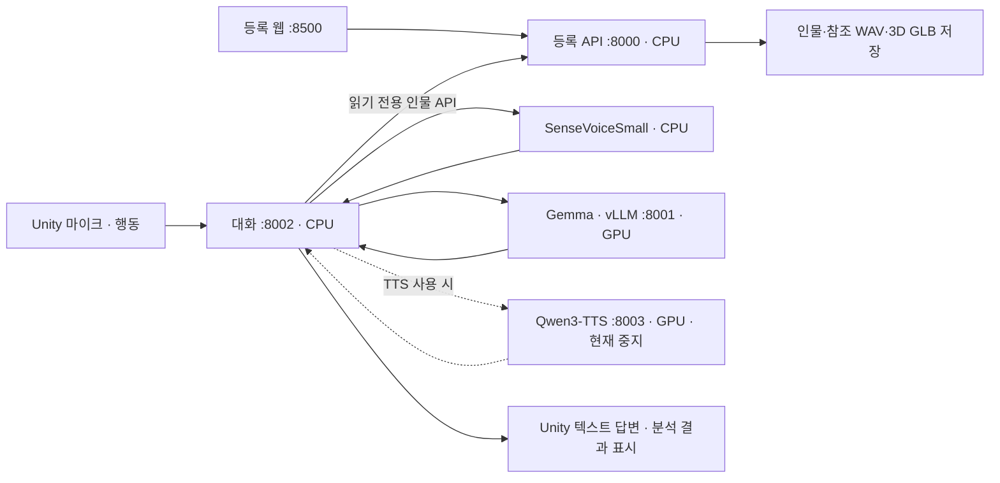

# 서버 음성 대화 구조

2026-09-11. 현재 구현·배포의 기준 문서다. Raon은 종료·삭제했고 작업 근거는
[Raon 작업 이력](Raon_작업이력_보관.md)에 보관한다.
현재 TTS를 비활성화하고 텍스트 답변으로 운영한다. [판정기 텍스트 검사](판정기_텍스트_검사.md)에
실제 모델 68개 사례, 발견한 오류와 수정, 다시 실행하는 방법을 정리했다.
2026-09-12 웹·등록·Tripo와 대화 AI의 환경·배포 경로·데이터 접근을 추가로 분리했다.
현재 운영 명령과 검증은 [서비스 분리 문서](웹_Tripo_대화AI_서비스_분리.md)를 따른다.

## 서비스 분리

| 기능 | 코드 | 실행 장치·역할 |
|---|---|---|
| 등록·현재 인물·3D·대화용 인물 조회 API | `Server/registration/app.py` | 독립 등록 환경, 추론 모델을 import하지 않음 |
| 대화 AI의 인물·참조 음성 조회 | `Server/persona_client.py` | 읽기 전용 HTTP API, 음성 해시 확인 |
| 연결·인증·입력 형식·연결 제한 | `Server/dialogue_server.py` | CPU, WebSocket `/dialogue` |
| 발화 시작/종료·STT·감정·소리 태그 | `Server/realtime_audio.py` | CPU, WebRTC VAD + sherpa-onnx SenseVoiceSmall INT8 |
| 상황·기록·응답 생명주기·끼어들기 | `Server/realtime_dialogue.py` | CPU, 음성 수신과 응답 작업 분리 |
| 끼어들기 판정 규칙·출력 검증 | `Server/interruption_policy.py` | 재개·수정·전환·대기·확인 질문 |
| 일반/추론·끼어들기 분류·LLM 스트리밍 | `Server/realtime_llm.py` | 기존 일반 모델에 JSON 판정 요청; GPU는 별도 vLLM 프로세스 |
| 문장 분할·TTS 요청·취소 | `Server/realtime_tts.py` | CPU, 모델 교체용 서비스 경계 |
| 참조 WAV·연속 구간·임시 저장 | `Server/voice_reference.py` | CPU, 원본 보존·실제 구간 전사 |
| 음성 합성 | `Server/tts_server.py` | GPU, Qwen3-TTS 독립 프로세스·가상환경 |
| 공통 대화 규칙 | `Server/persona_context.py` | 모델에 종속되지 않는 프롬프트 |

대화 실행 코드는 `~/capstone-server`, 웹·등록·Tripo 코드는 `~/webapp`에 있다. 인물 자료 경로는
`~/server/sessions`를 유지한다. 등록 API를 다시 시작해도 `current.json`으로 선택 인물을 복원한다.
새 인물 등록으로 다른 인물 자료를 자동 삭제하지 않는다. 명시적인 `/session/end`가 해당 인물만 삭제한다.

## 모델과 교체 지점

- **STT/감정**: SenseVoiceSmall INT8 ONNX, CPU 2개 스레드. 오디오는 계속 수신하지만
  인식기는 누적 음성 구간을 다시 읽는 offline 모델이다. 약 1.5초 간격 중간 결과와 발화 종료 최종 결과를 구분한다.
- **LLM**: 기존 `gemma-4-31B-qat`. API의 `exaone`은 기존 클라이언트 호환용 이름이며 실제 로드 모델명이 아니다.
  일반 응답은 thinking을 끄고, 분류기가 추론 필요로 판단하면 thinking을 켠 경로를 쓴다.
  현재는 동일 모델의 두 모드다. `DIALOGUE_REASON_URL/MODEL/EXTRA`로 별도 추론 모델도 연결할 수 있다.
- **TTS, 현재 꺼짐**: `Qwen/Qwen3-TTS-12Hz-1.7B-Base`, BF16, 참조 목소리·말투 복제.
  `create_voice_clone_prompt(..., x_vector_only_mode=False)`로 화자 임베딩·참조 코드·전사를
  함께 사용한다. 생성된 프롬프트 리스트를 연결마다 한 번 준비하고 모든 답변 구절에 재사용한다.
  등록 체험은 해당 세션의 `voice.wav`, 테스트는 업로드 WAV 또는 현재 등록 음성을 쓴다.
  3–12초 연속 구간의 실제 전사를 사용하며 테스트 화면에서 미리 듣고 전사를 수정할 수 있다.
  웹 등록에서도 내부 쉼을 삭제하지 않는다. 기존 등록 파일은 변경하지 않는다.

Qwen의 공식 Python `generate_voice_clone()`는 한 구절의 완성 음성을 반환한다.
따라서 현재 구현은 **LLM의 완성된 문장부터 합성하고 PCM 패킷으로 재생하는 스트리밍**이다.
답변 전체가 끝나기를 기다리지는 않지만 한 문장 안에서 음성 토큰을 즉시 디코딩하는 구현은 아니다.
공식 발표의 97ms 수치를 이 서버의 첫 응답 시간으로 사용하면 안 된다.
근거: [공식 모델·화자 안내](https://github.com/QwenLM/Qwen3-TTS),
[공식 Python API](https://github.com/QwenLM/Qwen3-TTS/blob/main/qwen_tts/inference/qwen3_tts_model.py).

## 음성 및 제어 프로토콜

입력은 16kHz·모노·PCM16 little endian. TTS 사용 시 참조 준비 중 `voice.preparing`을 보내고,
`ready`에 `voice_mode=reference_icl`과 실제 참조 정보를 담는다.
Unity는 준비 완료 후 마이크를 30초 링 버퍼로 열고
80ms 단위로 보낸다. 모델의 응답 중에도 마이크 수신을 계속한다. VAD 기본 무음 기준은 700ms다.

WebSocket 최초 JSON은 protocol 1의 `start`, 이후 바이너리는 마이크 PCM이다.
음성 출력 연결은 `start.interruption_policy="semantic_v1"`을 필수로 전달한다.
텍스트 모드에서도 이 기능을 요청하면 생성 중인 답변에 같은 보류·판정을 적용한다.
일시정지·재개를 지원하지 않는 구형 클라이언트는 연결 시 업데이트 안내를 받는다.
제어 JSON은 `context`, `cancel`, `reset`, `stop`, `ping`, `playback.progress/done`이다.
테스트 연결의 `text`는 서버 자동 검사에만 남겨두었으며 Unity 사용자 화면에는 글 입력 경로가 없다.

출력은 `speech.started/stopped`, `transcript.partial/final`, `response.started/delta`,
`response.audio`, `audio.boundary`, `response.done/cancelled`와
`response.paused`, `interruption.decision`, `response.resumed`다.
음성 출력은 24kHz·모노·PCM16. `response.audio.pcm`은 최대 200ms를 base64로 담고
`turn_id/response_id`로 이전 응답의 소리를 걸러낸다. 패킷 크기는 약 13KB 이하이며
Unity의 수신 큐·45초 재생 버퍼에 상한을 둔다. 넘치면 조용히 오래된 소리를 버리지 않고 연결 오류를 표시한다.

## 끼어들기 판정과 재개

VAD가 발화 시작을 알리면 `response.paused`로 Unity의 AudioSource를 일시정지한다.
재생 커서·남은 PCM·문장 경계 확인 타이머를 보존한다. 사용자의 발화가 끝나면 SenseVoice 최종 전사,
음성 감정·소리 정보, Unity 상황, 최근 대화와 보류 답변을 기존 일반 LLM에 넣어 방향을 판단한다.
판정기에는 원래 질문과 전달 확인된 답변만 넣으며 미전달 초안은 제외한다.
판정용 모델을 추가 로드하지 않으며 한 번의 짧은 JSON 요청에서 새 답변의 일반/추론 경로도 선택한다.

| 판정 | 예시 | 처리 |
|---|---|---|
| `resume` | 설명 도중 “응, 계속해” | 같은 응답 ID·생성 작업·음성을 이어서 재생 |
| `revise` | “아니, 비 오는 날 기준으로 설명해” | 남은 음성을 버리고 새 조건으로 설명을 수정·보완 |
| `switch` | “그건 됐고 고양이 얘기해 줘” | 남은 음성을 버리고 새 주제에 답변 |
| `hold` | “잠깐 기다려 줘”, “그만 말해” | 멈춘 상태 유지; 이후 명시적인 재개 요청을 기다림 |
| `clarify` | 불완전하거나 애매한 발화, 판정 실패 | 남은 음성을 버리고 이어 말할지 바꿀지 확인 질문 |

“네”를 단어만 보고 맞장구로 처리하지 않는다. AI 질문에 대한 답이면 새로운 설명이 필요한
`revise`로 분류한다. 추론이 필요한 수정·새 요청은 추론 경로로 전달한다. 현재는 Gemma의 thinking
설정 차이이며 다른 추론 모델도 설정으로 연결할 수 있다.

서버는 보류한 답변 한 개와 최신 발화 처리 작업 한 개를 구분한다. 판정 중 다시 말하면 이전
STT·판정 결과를 무효화한다. 최신 입력의 `turn_id`가 바뀌어도 재개 음성은 원래 `response_id`와
그 응답의 `turn_id`를 유지하므로 Unity도 입력 턴과 재생 턴을 별도로 추적한다.
`interruption.decision`에는 `action`, `route`, `reason`, `text`, `decision_sec`를 담는다.

보류 중에는 새 LLM 글자·PCM 전송과 다음 TTS 구절 요청을 기다리게 한다. 이미 시작한 GPU 계산을
정지시키는 기능은 아니다. 진행 중인 계산은 백그라운드에서 끝날 수 있다. 보류는 최대 120초이며
시간이 지나면 자동 재생 없이 해제한다. VAD 오탐 뒤 전사가 비어 있으면 자동 재개하되, 명시적인
`hold` 상태에서는 계속 기다린다. 판정 요청은 6.5초 상한이며 오류·잘린 JSON은 확인 질문으로 처리한다.

수정·전환 및 직접 누른 `답변 중단`, 초기화, 종료는 기존 생성 요청과 음성을 취소한다.
Qwen worker는 연결 종료를 감지해 토큰 생성 중단 조건을 설정하고 이전 GPU 작업이 종료된 뒤
다음 요청을 시작한다. 입력 처리 실패도 클라이언트와 서버의 보류 상태를 함께 해제한다.
`response.done` 이후에도 실제 재생 종료 확인 전까지 보류·재개할 수 있다.

서버 대화 기록에는 Unity가 재생을 확인한 문장까지만 넣는다. 수정에는 아직 말하지 않은 초안을
별도 참고 자료로 전달하며 이미 들은 말로 기록하지 않는다. 재개 전후에 같은 문장을 중복 기록하지 않는다.
PCM 커서는 보존하지만 서버의 전달 확인은 문장 경계 단위이므로 중간에서 끊긴 단어까지 확정하지 않는다.
TTS를 끈 텍스트 모드에서는 이미 전송한 글자를 전달된 내용으로 사용한다. 보류 중 LLM 스트림이
끝나도 재개 결정 전에는 완료 처리하지 않는다. 이미 완료된 텍스트 답변은 일반 대화 기록으로 남는다.

## SenseVoice 화면 출력

인식 문장, 중간/최종 여부, 원본 감정 태그와 한국어 설명, 소리 이벤트, 언어를 표시한다.
발화 길이와 RMS dBFS는 서버가 음성 신호에서 계산한 값이다. 감정 확률이나 정확도 점수가 아니다.
`emotion_confidence`는 모델이 제공하지 않으므로 숫자를 만들어 표시하지 않는다.
STT 문장과 관찰 정보는 함께 LLM에 들어가며 감정을 사실로 단정하지 않도록 지시한다.

## 확인된 동작과 남은 품질 확인

로컬·서버 Python 검사에서 등록 보존, 인증, 경로 검증, STT·상황 전달, 분류, 스트리밍,
TTS 작업 취소와 재생된 문장만 기록하는 동작을 검사한다. Unity 검사에서는 공개 한국어 WAV를
실제 WebSocket으로 보내 생성 음성을 AudioSource로 재생하고 화면을 확인한다.

Python 3.9(로컬)와 3.12(서버)에서 참조 연결·의미 기반 끼어들기·TTS 없는 텍스트 보류를 포함해 53개 검사를 통과했다.
2026-09-11에는 실제 모델의 텍스트 분류 68개와 TTS 없는 실제 WebSocket 보류·재개 4경로를 확인했다.
아래 음성 지연·VRAM 수치는 2026-09-10 TTS 사용 당시 기록이며 현재 TTS 프로세스는 중지 상태다.
Base 참조 모드에서 등록 음성 자동 선택·임시 WAV 업로드·Unity AudioSource 출력·끼어들기를 확인했다.
등록 음성 11.84초 참조의 첫 음성은 1.86초, 공개 WAV 4.608초 참조는 2.75초였다.
새 판정기의 실제 Gemma 호출 10개 사례에서 맞장구와 질문에 대한 답, 수정, 전환, 대기, 애매한 발화,
추론 경로와 대기 중 맞장구·명시적 재개를 예상대로 구분했다. 판정 요청 자체는 0.39–0.72초였다.
소수 기능 사례이며 정확도 평가가 아니다.
Unity 음성 검사에서도 재개·수정·전환·대기 후 재개를 모두 통과했다. 재개 시 PCM 소비 커서는
14,400→14,400, 대기 후 재개는 4,800→4,800으로 유지됐고 기존 응답 ID도 같았다.
수정·전환은 각각 이전 답변을 한 번 취소하고 새 내용으로 답했다. 음성 검사 판정 시간은 0.41–0.48초였다.
Unity 음성 보류·재개 검사의 실행 방법과 결과 파일은 [테스트 씬 문서](AI_응답_테스트_씬.md)를 참고한다.
웹 입력 변환도 8초 녹음 내부의 2초 쉼이 그대로 유지되는지 확인했다.
Base 전환·합성 후 프로세스별 GPU 사용량은 Gemma 40,464MiB,
Qwen3-TTS 5,456MiB, 다른 사용자 6,384MiB다. 측정 시점에 따라 변한다.

2026-09-10 기본 화자 사용 당시 첫 음성 왕복 검사: 인식 `조 금만 생각 을 하 면서 살 면 훨씬 편할 거야.`,
감정 `neutral`, 소리 `speech`, 언어 `ko`. 첫 글자 0.26초, 첫 음성 3.09초, 생성 완료 4.16초.
이는 **1회 기능 검사**이며 일반적인 성능이나 품질 보장이 아니다. 시간은 서버의 발화 종료
판정 이후부터여서 사용자의 발화 길이, 종료 무음, 클라이언트의 재생 버퍼·장치 지연을 포함하지 않는다.

실제 마이크·VR 헤드셋에서의 에코와 감정 정확도, 음색·억양의 청취 평가는 별도 확인이 필요하다.
전이중 전송·끼어들기는 구현했지만 음향 에코 제거(AEC)는 아직 없으므로 헤드폰으로 테스트한다.
현재 기본 동시 체험 수는 1이다. 재부팅 자동 시작 설정은 아직 하지 않았다.

사용법: [AI 응답 테스트 씬](AI_응답_테스트_씬.md). 운영: [Server/README](../Server/README.md).
