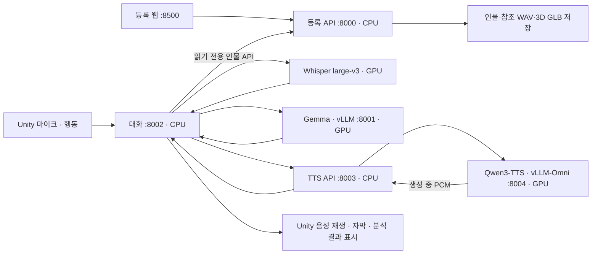

# 서버 음성 대화 구조

> 2026-09-18 운영 TTS 변경: 8003은 VoxCPM2의 참조 음성 복제·생성 중 PCM 전송을 사용하며
> 8004는 현재 미사용이다. 현재 설정·검사·복구는 [TTS 작업 인계](TTS_작업인계_20260918.md)를 따른다.
> 아래 Qwen 모델·엔진 설명은 전환 전 기록이며 대화·취소·오디오 전달 계약은 유지했다.

2026-09-15. 현재 구현·배포의 기준 문서다. Raon은 종료·삭제했고 작업 근거는
[Raon 작업 이력](Raon_작업이력_보관.md)에 보관한다.
2026-09-11에는 TTS를 비활성화하고 텍스트 답변으로 운영했다. [판정기 텍스트 검사](판정기_텍스트_검사.md)에
실제 모델 68개 사례, 발견한 오류와 수정, 다시 실행하는 방법을 정리했다.
2026-09-12 웹·등록·Tripo와 대화 AI의 환경·배포 경로·데이터 접근을 추가로 분리했다.
현재 운영 명령과 검증은 [서비스 분리 문서](웹_Tripo_대화AI_서비스_분리.md)를 따른다.
2026-09-13 연결별 핵심 기억과 근거 발췌 요약을 추가했다.
최근 원문 밖의 회상·정정·삭제·초기화·토큰 예산은 [대화 메모리](대화_메모리.md)를 따른다.
2026-09-14 Qwen3-TTS를 다시 연결했다. 현재는 음성·자막으로 답하며 [재연결 검사](TTS_재연결_검증.md)에 실행 근거를 기록한다.
이후 같은 모델의 생성 중 오디오 전송을 vLLM-Omni로 연결했다. 최신 실행·예열·실측은
[TTS 실시간 스트리밍](TTS_실시간_스트리밍.md)을 참고한다.
2026-09-15 페르소나별 대기 대사·음성을 사전 준비해 추론 답변 생성과 함께 재생한다.
준비·캐시·끼어들기·기억 분리와 실측은 [캐릭터 대기 리액션](캐릭터_대기_리액션.md)을 따른다.
2026-09-16 16:01 KST 사용자 선택으로 운영 STT를 Whisper large-v3(GPU)로 바꿔 적용했고,
같은 변경에서 음성 감정 분류 기능을 제거했다. 전환 범위·설정·되돌리기와 적용 뒤 검증 기록은
[Whisper STT 전환](Whisper_STT_전환.md), 전환 전 모델 비교는 [STT 모델 비교](STT_모델_비교.md)를 따른다.
**이 문서의 과거 실측 기록은 그때의 SenseVoiceSmall 기준이다.** 아래 구조 설명이 현재 기준이다.
2026-09-16 첫 턴 뒤 무응답 재발에 대해, WebRTC 후보가 오래 열리면 같은 CPU Silero로 최근 오디오의
비음성 꼬리를 확인해 말끝을 보완한다. 전체 검증·전사 후에만 답변을 중단하는 정책은 유지한다.
후속 검사에서 확인한 추론 생성 한도 오류는 본답변을 아직 내보내지 않은 경우에만 일반 경로로 한 번 복구한다.
현재 값·검증·복구는 [말끝 감지 보완](말끝_감지_보완.md)을 따른다.
2026-09-17 답변을 바꾸기 전에 **클라이언트가 실제로 멈춘 지점**을 기다리는 멈춤 경계 합의를 넣었고,
되묻기(`clarify`)의 고정 안내 문장을 없애 인물의 보통 생성으로 돌렸다. 계약은 아래
[멈춤 경계 합의](#멈춤-경계-합의), 안내 문장은 [캐릭터 확인 안내](캐릭터_확인_안내.md)를 따른다.
아래 "2026-09-17 멈춤 경계·되묻기"에 자동 검사와 실제 모델 검사, 남은 청취 확인을 나눠 적었다.

## 서비스 분리

| 기능 | 코드 | 실행 장치·역할 |
|---|---|---|
| 등록·현재 인물·3D·대화용 인물 조회 API | `Server/registration/app.py` | 독립 등록 환경, 추론 모델을 import하지 않음 |
| 대화 AI의 인물·참조 음성 조회 | `Server/persona_client.py` | 읽기 전용 HTTP API, 음성 해시 확인 |
| 연결·인증·입력 형식·연결 제한 | `Server/dialogue_server.py` | CPU, WebSocket `/dialogue` |
| 발화 시작/종료·STT | `Server/realtime_audio.py` | CPU WebRTC VAD + GPU faster-whisper large-v3, 되돌리기용 SenseVoice INT8 |
| 입력 후보의 음성 검증 | `Server/speech_gate.py` | CPU Silero VAD + 전사 내용 검사 |
| 상황·기록·응답 생명주기·끼어들기 | `Server/realtime_dialogue.py` | CPU, 음성 수신과 응답 작업 분리 |
| 연결별 핵심 기억·발췌 요약 | `Server/dialogue_memory.py` | 실제 사용자 근거, 답변 뒤 정리, 정정·삭제·만료 |
| 캐릭터 대기 리액션 | `Server/dialogue_reactions.py` | 준비 때 Gemma 대사·Qwen 음성을 캐시, 추론 대기 중 재사용 |
| 끼어들기 판정 규칙·출력 검증 | `Server/interruption_policy.py` | 재개·수정·전환·대기·확인 질문 |
| 일반/추론·끼어들기 분류·LLM 스트리밍 | `Server/realtime_llm.py` | 기존 일반 모델에 JSON 판정 요청; GPU는 별도 vLLM 프로세스 |
| 문장 분할·TTS 요청·취소 | `Server/realtime_tts.py` | CPU, 모델 교체용 서비스 경계 |
| 참조 WAV·연속 구간·임시 저장 | `Server/voice_reference.py` | CPU, 원본 보존·실제 구간 전사 |
| TTS 참조·인증·오디오 전송 | `Server/tts_server.py` | CPU, 기존 NDJSON·취소 계약 |
| 음성 생성·엔진 관리 | `Server/tts_omni.py`, `Server/tts_streaming.yaml` | 별도 GPU 엔진·전용 venv, 생성/디코딩 동시 수행 |
| 공통 대화 규칙 | `Server/persona_context.py` | 모델에 종속되지 않는 프롬프트 |

대화 실행 코드는 `~/capstone-server`, 웹·등록·Tripo 코드는 `~/webapp`에 있다. 인물 자료 경로는
`~/server/sessions`를 유지한다. 등록 API를 다시 시작해도 `current.json`으로 선택 인물을 복원한다.
새 인물 등록으로 다른 인물 자료를 자동 삭제하지 않는다. 명시적인 `/session/end`가 해당 인물만 삭제한다.

## 모델과 교체 지점

- **STT**: `faster-whisper` large-v3, CUDA `float16`, 한국어 고정(`language=ko`), `beam_size=5`,
  `temperature=0`, `condition_on_previous_text=False`, `vad_filter=False`, `without_timestamps=True`.
  오디오는 계속 수신하지만 인식기는 누적 음성 구간을 다시 읽는 offline 모델이다.
  모델 하나를 단일 워커 실행기가 독점하고, 세그먼트 생성기까지 그 스레드에서 소비한다.
  **소리 이벤트는 Whisper가 주지 않으므로 `unknown`이다.** 없는 값을 만들어 채우지 않는다.
  `DIALOGUE_STT_BACKEND=sensevoice`로 기존 CPU 모델을 되돌릴 수 있다. 자동 전환은 없다.
- **LLM**: 기존 `gemma-4-31B-qat`. API의 `exaone`은 기존 클라이언트 호환용 이름이며 실제 로드 모델명이 아니다.
  일반 응답은 thinking을 끄고, 분류기가 추론 필요로 판단하면 thinking을 켠 경로를 쓴다.
  현재는 동일 모델의 두 모드다. `DIALOGUE_REASON_URL/MODEL/EXTRA`로 별도 추론 모델도 연결할 수 있다.
- **TTS**: `Qwen/Qwen3-TTS-12Hz-1.7B-Base`, BF16, 참조 목소리·말투 복제.
  vLLM-Omni의 Base ICL 경로(`x_vector_only_mode=false`)로 화자 임베딩·참조 코드·전사를
  함께 사용한다. 참조는 연결마다 한 번 등록하고 엔진의 특징 캐시를 모든 답변 구절에 재사용한다.
  등록 체험은 해당 세션의 `voice.wav`, 테스트는 업로드 WAV 또는 현재 등록 음성을 쓴다.
  3–12초 연속 구간의 실제 전사를 사용하며 테스트 화면에서 미리 듣고 전사를 수정할 수 있다.
  웹 등록에서도 내부 쉼을 삭제하지 않는다. 기존 등록 파일은 변경하지 않는다.

현재 구현은 **LLM의 첫 구절부터 합성을 요청하고 음성이 생성되는 도중 PCM을 전달하는 스트리밍**이다.
같은 구절의 음성 전체가 완성될 때까지 기다리지 않는다. Qwen 기본 Python `generate_voice_clone()`는
완성된 WAV를 반환하므로 복구용 `legacy` 경로에만 남겼다. `non_streaming_mode=False`는
그 Python API를 오디오 스트리밍 API로 바꾸는 옵션이 아니다.
공식 발표의 최저 지연과 서버 실측을 구분한다. 근거와 측정은 [스트리밍 문서](TTS_실시간_스트리밍.md)에 있다.

## 시스템 프롬프트의 층

`realtime_dialogue.build_persona()` 가 아래 순서로 한 줄씩 쌓는다.

| 층 | 출처 | 언제 들어가는가 |
|---|---|---|
| 공통 규칙 | `persona_context.BASE_RULES` | 항상 |
| `[인물]` | 등록 인물의 `persona.md` 또는 테스트 인물 | 항상 |
| `[사전지식]` | 등록 인물의 `knowledge.md` | 있을 때 |
| `[인물별 추가 규칙]` | 등록 인물의 `rules.md` | 기본값을 뺀 나머지가 있을 때 |
| `[말투 예시 — 실제 대화 아님]` | 인물 원문의 `[대화 예시]` | 있을 때 |
| **`[재회]`** | `persona_context.MEMORIAL_RULES` | **등록 체험 경로에서만**(`memorial=True`). **맨 뒤** |

`[재회]` 는 이미 세상을 떠난 분을 사용자의 기억으로 다시 만나는 자리라는 **이 체험의
전제**다. 설문으로 끄고 켜는 항목이 아니라서 `dialogue_server.py` 의 등록 경로 두 곳
(인물 API·기존 파일)에서 `memorial=True` 로 넣는다. 이미 등록된 인물도 재접속만으로
적용되며 운영 인물 파일과 DB는 고치지 않는다.

**자리는 맨 뒤다** — 모든 인물 자료와 말투 예시 다음, 사용자 발화 바로 앞이다.
처음 구현은 `[인물]` 바로 다음이었다. 그 자리에서는 같은 문안으로도 인물이 사용자의
"너 …"를 그대로 베껴 **자기 죽음을 사용자의 일로 말하는** 답이 남았다(친구 15턴 × 3회 중 3턴).
문안을 한 글자도 바꾸지 않고 자리만 뒤로 옮긴 비교에서 같은 45턴이 0건이 됐다.
**자리가 유일한 원인이라고 단정하지는 않는다** — 한 변수만 바꾼 비교에서 관찰한 차이다.
근거는 `tools/_work/deceased_prompt_fix_20260917/friend-focused-report.md`.

- **`test_mode` 의 `test_persona` 에는 넣지 않는다.** 추모가 아닌 테스트 인물을 사망 처리하지 않는다.
- 대기 리액션·시스템 안내 문장은 `build_persona(persona_text)`(memorial 없음)로 만들어
  `[재회]` 와 사망 경위가 생성 입력으로 새지 않는다.
- 개별 **사망 원인·시점**은 이 층에 없다. 사용자가 설문 4-11·4-12에 적은 경우에만
  `[사전지식]` 으로 들어간다 → [설문 v2 사용법](웹_설문_v2_사용법.md) 5-1장.
- **인물 원문에 무엇이 적혀 있든 넣는다.** 자유 입력에 `[재회]` 라는 글자가 우연히
  들어 있다고 건너뛰지 않는다. 원문의 표제는 적용 여부의 표식이 아니다.

### 구형 말투 예시 처리

`memorial` 을 켜면 구형 변환기(`survey_v2_compile_1`)가 모든 인물에 넣던
"뭐 하고 있었어?" → "그냥 앉아서 텔레비전 보고 있었지." 짝을 뺀다
(`persona_context.LEGACY_PRESENT_LIFE_EXAMPLES`).

2026-09-17 실측에서 근황 질문 답변이 **두 차례 실행 각각 9/9**(3인물 × 3회)로 떠난 뒤의
생활을 말했다. 그 9건 중 이 예문과 거의 같은 문장은 첫 실행 2건("텔레비전 보고 있었지"),
두 번째 실행 2건("폰 보고 있었지")이고 나머지는 모두 "그냥 평소처럼 지냈지"였다.
**두 실행의 건수를 한 분모에 더하지 않는다.** `[말투 예시 — 실제 대화 아님]` 안내만으로는
억제되지 않았다. **예문이 유일한 원인이라고 단정하지는 않는다** — 관찰한 것은 예문과
답변의 문자열 일치, 그리고 예문·규칙을 고쳤을 때 같은 질문의 답이 달라졌다는 사실이다.

**원본 인물 파일과 참여자 자료는 고치지 않는다** — 프롬프트를 조립할 때만
정확히 일치하는 짝을 뺀다. 한 글자라도 다르면 사용자의 자유 입력일 수 있어 그대로 둔다.
신규 등록은 `Web/survey_v2.py` 의 예문 자체를 고쳤으므로 이 처리에 걸리지 않는다.

### 토큰 비용

이 블록은 일반·추론 모두 **256토큰**을 더 쓴다. 800자·카드 20개·최대 연결 기억(48건과 요약)의
최악 조건에서 추론 경로 여유가 269 → **14토큰**이다. 넘지는 않으며 `fit_messages` 도 통과한다.
경위를 적지 않은 기존 최대 입력에서는 여유 46토큰이다.

**여유가 거의 없다.** 사망 인식 문장을 더한 중간 판에서는 실제로 여유 **-4**,
`fit_messages` 실패까지 갔다. 공통 규칙과 겹치던 말을 지워 되돌렸다.
**줄을 더하기 전에 반드시 실제 `/tokenize` 로 다시 잰다.** 여유가 더 필요하면
`Web/survey_v2.MAX_AI_TEXT`(800자)를 내리는 쪽을 먼저 본다 — 이것은 사용자에게 보이는
계약이라 메인이 정할 일이다.

### 사망 인지와 경위의 분리

블록의 첫 문장은 **인물이 이미 아는 자기 사실**로 적는다 — "당신은 이미 세상을 떠났고,
그 사실을 사용자에게 들어서가 아니라 처음부터 압니다." 경위 줄 끝에는 "원인을 몰라도
떠난 사실은 압니다."를 둔다.

이 구조가 없던 중간 판에서는 "알려줘서 고마워", "이제야 네 입으로 듣게 되네",
"너한테 들으니까 이제 알겠네"처럼 **자기 죽음을 그 자리에서 처음 아는** 답이 나왔다.
'안 죽었다'를 말하지 않는다는 것만으로는 부족하다. 사망 인지와 경위 모름은 따로 판정한다.

## Gemma 호출 지점

각 역할은 기존 8001의 같은 모델을 사용한다. 매 발화마다 아래 여섯 요청을 모두 실행하는 것은 아니다.

| 역할 | 호출 시점 | 구현 |
|---|---|---|
| 새 발화의 일반/추론 선택 | 보류된 답변이 없는 일반 응답 경로 | `LLMClient.route()` |
| 본답변 생성 | 선택한 일반 또는 추론 모드로 답할 때 | `LLMClient.stream()` |
| 끼어들기 의도와 모드 선택 | 답변을 보류한 뒤 사용자 전사가 확정됐을 때 | `decide_interruption()` |
| 핵심 기억 정리 | 답변 후 사용자 발화 3개 누적 또는 우선 정리 신호 | `extract_memory()` |
| 기억 삭제 대상 선택 | 삭제 의도로 보이는 요청이 들어왔을 때 | `resolve_memory_forget()` |
| 캐릭터 대기 대사 준비 | 대화 연결 준비 중 해당 페르소나 대사 캐시가 없을 때 | `generate_reactions()` |

끼어들기 판정이 새 답변의 모드까지 선택하므로 같은 입력에 일반 모드 선택을 다시 호출하지 않는다.
기억 정리는 새 사용자 입력이 시작되면 취소하며, 리액션은 대화 중 캐시만 재생한다.
입력 예산 확인용 `/tokenize` 요청은 답변을 생성하는 추론 호출과 구분한다.

## 음성 및 제어 프로토콜

입력은 16kHz·모노·PCM16 little endian. TTS 사용 시 참조와 대기 리액션 준비 중 `voice.preparing`을 보내고,
`ready`에 `voice_mode=reference_icl`, 실제 참조 정보와 인물별 `reactions` 준비 결과를 담는다.
Unity는 준비 완료 후 마이크를 30초 링 버퍼로 열고
80ms 단위로 보낸다. 모델의 응답 중에도 마이크 수신을 계속한다. VAD 기본 무음 기준은 700ms다.

WebSocket 최초 JSON은 protocol 1의 `start`, 이후 바이너리는 마이크 PCM이다.
음성 출력 연결은 `start.interruption_policy="semantic_v1"`을 필수로 전달한다.
텍스트 모드에서도 이 기능을 요청하면 생성 중인 답변에 같은 보류·판정을 적용한다.
일시정지·재개를 지원하지 않는 구형 클라이언트는 연결 시 업데이트 안내를 받는다.
제어 JSON은 `context`, `cancel`, `reset`, `stop`, `ping`, `playback.progress/done`과
멈춘 지점 보고 `playback.paused`다.
테스트 연결의 `text`는 서버 자동 검사에만 남겨두었으며 Unity 사용자 화면에는 글 입력 경로가 없다.

출력은 `speech.started/stopped`, `transcript.partial/final`, `response.started/delta`,
`response.audio`, `audio.boundary`, `response.done/cancelled`와
`response.paused`, `interruption.decision`, `response.resumed`다.
음성 출력은 24kHz·모노·PCM16. `response.audio.pcm`은 최대 200ms를 base64로 담고
`turn_id/response_id`로 이전 응답의 소리를 걸러낸다. 패킷 크기는 약 13KB 이하이며
Unity의 수신 큐·45초 재생 버퍼에 상한을 둔다. 넘치면 조용히 오래된 소리를 버리지 않고 연결 오류를 표시한다.

대기 리액션은 같은 응답 ID·재생 대기열을 사용하며 `response.delta/audio`, `audio.boundary`에
`kind=reaction`을, 본답변에는 `kind=answer`를 추가한다. 자막·재생 확인에는 모두 포함하고 최근 대화·기억에는
본답변만 기록한다. 기존 Unity는 추가 필드를 무시해도 재생·끼어들기가 동작한다.
`response.done.timing.first_audio_sec`와 Unity의 '첫 음성' 표시는 **본답변 첫 PCM** 기준을 유지한다.
리액션은 `first_reaction_audio_sec`, 가장 먼저 보낸 소리는 `first_any_audio_sec`로 별도 측정한다.

## 입력 검증: 확인된 말에만 멈춘다

기준일 2026-09-16. WebRTC VAD의 발화 시작은 **입력 후보**일 뿐이며 그것만으로는
보류·취소·턴 증가·화면 전사·기억 정리 중지를 하지 않는다. 잡음이 들어오는 동안에도
진행 중인 라우팅·생성·TTS·재생은 그대로 이어진다.

발화가 끝나면(무음 700ms) 후보를 한 번에 검증한다.

1. **음향 검증** — 별도 CPU Silero VAD로 사람 말 구간이 있는지 확인한다.
2. **전사 검증** — STT 최종 전사에 표기 문자(문자·숫자)가 하나라도 있는지 본다.
3. **약한 전사 거절** — 표기 문자가 있어도 Whisper가 같은 전사 호출에서 준 세그먼트 지표가
   비음성을 가리키면 버린다. 자세한 내용은
   [말버릇·잡음 응답 개선](말버릇_잡음_응답_개선.md)을 따른다.

셋 다 통과할 때만 기존 `begin_input` 정책을 적용해 `response.paused`와
`speech.started`를 보낸다. 통과하지 못하면 **아무 이벤트도 보내지 않고** 조용히 버린다.
인식이 실패한 경우도 마찬가지로 기존 답변을 건드리지 않는다.
어휘 목록(블랙리스트)은 쓰지 않는다. **짧다는 이유나 단어 목록만으로 버리지 않는다.**
"네", "응", "아니요", "잠깐", 짧은 이름·숫자는 그 자체로는 거절 대상이 아니다. 다만 음향 검증과
전사 지표에 따라 놓칠 수는 있다. 합성 "네" 단독 3건은 이번 변경 전후 모두 기존 Silero 단계에서
누락됐으며, 이는 그대로 남은 한계다.
글자 수·단어 수·같은 음절 반복·RMS로는 아무것도 거절하지 않는다.

| 항목 | 값 | 근거 |
|---|---|---|
| Silero `threshold` | 0.7 | 0.5·0.6은 잡음을 통과시켰다 |
| Silero `min_speech_duration` | 0.2초 | 0.05는 hum·white·clicks를 통과시켰다 |
| 구간 합계 하한 `min_speech_ms` | 200 | 위 native 값과 맞춘 일관성 하한 |
| 검증 대기 후보 상한 | 3개 | 넘으면 가장 오래된 후보부터 버린다 |
| 약한 전사 `no_speech_prob` | 0.75 이상 | 잘린 후보의 정상 맞장구와 잡음 관측 범위 사이 |
| 약한 전사 `avg_logprob` | -0.35 이하 | 같은 세그먼트에서 위 조건과 **함께** 성립할 때만 거절 |

`speech.started`의 `speech` 필드에 실측값을 담는다. `segment_sec`은 **Silero가 돌려준
구간 길이의 합**이며 모델이 붙이는 패딩이 포함되므로 순수 발성 시간이 아니다.
모델이 주지 않는 신뢰도를 만들어 붙이지 않는다.
`/health`의 `input_gate`에 버전·threshold·최소 길이와 `weak_text` 임계값을 보고한다.
세그먼트 지표는 서버 내부 판정 전용이며 `Observation.metadata()`가 제외하므로
프롬프트·자막·Unity로 나가지 않는다.

### 이 방식의 대가

- **끼어들기 반영이 말끝 이후로 밀린다.** 발화 중에는 멈추지 않고, 말끝 무음 700ms +
  Silero + STT 전사를 마친 뒤에 보류가 일어난다. 말하는 동안 캐릭터 음성이 겹쳐 들린다.
- **실시간 부분 자막이 나가지 않는다.** 채택 전 전사를 화면에 흘리지 않기 위한 선택이며,
  발화 중에는 채택된 후보가 없으므로 `transcript.partial`은 발생하지 않는다.
- **30초 길이 상한을 넘은 입력은 조용히 버린다.** 검증할 원본이 남지 않고, 오류 이벤트를
  보내면 확인되지 않은 잡음으로 클라이언트 재생을 멈추게 되므로 안내를 보내지 않는다.
- Silero에서 거절한 후보에는 STT를 실행하지 않는다. Silero를 통과한 후보의 최종 전사가
  Whisper 단일 실행기를 사용하므로, 후보가 연속으로 통과하면 STT 대기가 늘어날 수 있다.

### 시간 값을 읽을 때

검증을 마친 뒤에 응답 작업이 시작되므로 `response.done.timing`의 `first_text_sec`,
`first_audio_sec`, `total_sec`는 **응답 작업 시작 시각 기준**이다.
말끝 무음 700ms 감지와 Silero·STT 검증 대기는 여기에 포함되지 않는다.
따라서 서버 측 0.5초 같은 값을 사용자가 기다린 전체 음성 대기 시간으로 설명하면 안 된다.
사용자 체감은 **실제 발화 끝 → 실제 첫 재생**으로 따로 재야 한다.
QA WebSocket의 `pause_after_send_start_seconds`도 파일 전송 시작 기준이며 발화 끝 기준이 아니다.

### 미해결 한계

음량을 0.25배로 줄인 숫자 "삼" 3회가 채택되지 않았다. threshold를 내려 보는 단일변수 비교에서
**0.64·0.66은 충격형 잡음이 통과했고, 0.68은 잡음 차단은 유지했지만 작은 숫자 누락을 개선하지
못했다.** 낮춰서 얻는 것이 없으므로 **기본값 0.7을 유지한다.** 작은 소리의 짧은 숫자는 현재
설정에서 놓칠 수 있다.

검증은 모두 파일 입력으로 했다. **실제 PC·Quest 마이크 입력, 스피커 반향(AEC 없음),
사람의 청취 평가는 아직 하지 않았다.** 실기 마이크에서의 감도와 오탐은 다시 재야 한다.

## 끼어들기 판정과 재개

검증을 통과한 발화가 확인되면 `response.paused`로 Unity의 AudioSource를 일시정지한다.
재생 커서·남은 PCM·문장 경계 확인 타이머를 보존한다. 같은 시점의 최종 전사와
소리 정보, Unity 상황, 최근 대화와 보류 답변을 기존 일반 LLM에 넣어 방향을 판단한다.
판정기에는 원래 질문과 전달 확인된 답변만 넣으며 미전달 초안은 제외한다.
판정용 모델을 추가 로드하지 않으며 한 번의 짧은 JSON 요청에서 새 답변의 일반/추론 경로도 선택한다.

| 판정 | 예시 | 처리 |
|---|---|---|
| `resume` | 설명 도중 “응, 계속해” | 같은 응답 ID·생성 작업·음성을 이어서 재생 |
| `revise` | “아니, 비 오는 날 기준으로 설명해” | 남은 음성을 버리고 새 조건으로 설명을 수정·보완 |
| `switch` | “그건 됐고 고양이 얘기해 줘” | 남은 음성을 버리고 새 주제에 답변 |
| `hold` | “잠깐 기다려 줘”, “그만 말해” | 멈춘 상태 유지; 이후 명시적인 재개 요청을 기다림 |
| `clarify` | 불완전하거나 애매한 발화, 판정 실패 | 보고된 정지 지점까지만 남기고 인물의 보통 생성(`CLARIFY_GUIDANCE`)으로 되묻는다. 고정 진행 안내 문장은 없다 |

“네”를 단어만 보고 맞장구로 처리하지 않는다. AI 질문에 대한 답이면 새로운 설명이 필요한
`revise`로 분류한다. 추론이 필요한 수정·새 요청은 추론 경로로 전달한다. 현재는 Gemma의 thinking
설정 차이이며 다른 추론 모델도 설정으로 연결할 수 있다.

서버는 보류한 답변 한 개와 최신 발화 처리 작업 한 개를 구분한다. 판정 중 다시 말하면 이전
STT·판정 결과를 무효화한다. 다만 **새 raw 후보가 시작됐다는 이유만으로는** 앞선 정상 발화를
버리지 않는다. 더 새로운 후보가 실제로 검증을 통과해 채택됐을 때만 이전 것이 무효가 된다.
채택 적용은 하나의 직렬화된 상태 전이이며, reset/close/외부 취소와 구별한다. 최신 입력의 `turn_id`가 바뀌어도 재개 음성은 원래 `response_id`와
그 응답의 `turn_id`를 유지하므로 Unity도 입력 턴과 재생 턴을 별도로 추적한다.
`interruption.decision`에는 `action`, `route`, `reason`, `text`, `decision_sec`를 담는다.

### 멈춤 경계 합의

기준일 2026-09-17. 답변을 바꾸기 전에 사용자가 어디까지 들었는지를 **추정하지 않고 보고로 확인**한다.

- 연결 시작 메시지(`type=start`)에 `pause_ack=true`를 보낸 클라이언트에만 적용한다. 보내지 않으면 예전처럼
  `response.paused` 하나로 즉시 멈추고 보고도 주고받지 않는다.
- `response.paused`에 연결 단위로 증가하는 양수 `pause_id`, `grace_ms`(기본 1200, 상한 1500),
  `pause_mode`(`phrase` | `immediate`)를 담는다. 번호는 재개해도 되돌아가지 않는다.
- 클라이언트가 아는 정지 지점은 서버가 보낸 구절 경계(`audio.boundary`의 `samples`)뿐이다.
  낱말 타임스탬프는 없고 글자 수로 시각을 추정하지 않는다. 경계에서 멈춘 뒤 출력 버퍼에 이미 넘긴
  소리가 빠지기를 기다렸다가 `playback.paused`(`response_id`, `pause_id`, `text_chars`, `reason`)로 보고한다.
  **낱말 단위로 정확히 멈춘다고 말하지 않는다.**
- 상한 안에 경계가 없으면 짧은 감쇠(60 ms)로 멈추고 `grace_expired`로 보고한다. 출력이 진행되지
  않아 감쇠가 끝나지 못하면 벽시계 상한으로 강제로 멈춘다. 잘린 구절은 전달된 글자로 세지 않는다.
- 판정은 멈춤과 **동시에** 돌아간다. 멈춘 동안에는 이미 시작한 구절만 절대 기한 안에서 마저 나가고
  다음 구절 전송은 막는다. `revise`·`switch`·`clarify`는 요청 시각 + `grace_ms` + 0.6초까지 같은 회차의
  보고나 자연 종료를 기다린 뒤에 답변을 바꾼다. 기한이 지나면 `pause_timeout`을 세고 같은 회차로
  즉시 멈춤을 한 번 더 보낸 뒤 진행한다.
- `resume`은 예약을 지우고 같은 PCM을 틈 없이 이어 재생한다. `hold`는 같은 `pause_id`로 그 자리에서
  멈춘다(새 왕복을 기다리지 않는다). 명시적 취소·초기화·종료는 예전처럼 즉시 멈춘다.
- 회차 번호가 다르거나 0인 늦은 보고는 `pause_stale`로 세고 위치도 읽지 않는다. 같은 회차의 두 번째
  보고는 다시 세지 않는다.
- `/health`와 `ready`의 `pause_boundary`에 `grace_ms`·ACK 사건·모드를 알린다.
  연결별 협상 결과 `enabled`는 `ready`에만 있다.
- 관측: 서버는 `playback.ack`에 `reason=paused`와 `pause_id`를 남기고 연결 계수
  `pause_boundary`·`pause_cut`·`pause_stale`·`pause_timeout`을 센다. Unity는 `response.paused`,
  `playback.paused`, `playback.pause_forced`에 `pause_id`와 예약한 경계·실제로 멈춘 표본을 남긴다.
  양쪽 모두 고정 코드와 숫자뿐이고 답변 원문·자막은 남기지 않는다.

보류 중에는 새 LLM 글자와 다음 TTS 구절 요청을 기다리게 한다. 위 합의를 사용하는 연결은
진행 중인 구절의 PCM만 기한 안에 마저 보내며, 정지 ACK 뒤에는 그 전송도 기다린다. 이미 시작한 GPU 계산을
정지시키는 기능은 아니다. 진행 중인 계산은 백그라운드에서 끝날 수 있다. 보류는 최대 120초이며
시간이 지나면 자동 재생 없이 해제한다. VAD 오탐은 검증 단계에서 걸러지므로 보류 자체가
일어나지 않는다. 명시적인 `hold` 상태에서는 계속 기다린다. 판정 요청은 6.5초 상한이며 오류·잘린 JSON은 확인 질문으로 처리한다.

수정·전환 및 직접 누른 `답변 중단`, 초기화, 종료는 기존 생성 요청과 음성을 취소한다.
Qwen worker는 연결 종료 시 엔진으로 이어지는 HTTP 스트림을 닫아 생성 요청을 취소한다.
엔진은 동시 생성 1개로 제한하고 취소된 요청을 해제한다. 구형 `legacy` 경로는 기존 중단 조건을 유지한다.
입력 처리 실패도 클라이언트와 서버의 보류 상태를 함께 해제한다.
`response.done` 이후에도 실제 재생 종료 확인 전까지 보류·재개할 수 있다.

서버 대화 기록에는 Unity가 재생을 확인한 문장까지만 넣는다. 수정에는 아직 말하지 않은 초안을
별도 참고 자료로 전달하며 이미 들은 말로 기록하지 않는다. 재개 전후에 같은 문장을 중복 기록하지 않는다.
PCM 커서는 보존하지만 서버의 전달 확인은 문장 경계 단위이므로 중간에서 끊긴 단어까지 확정하지 않는다.
TTS를 끈 텍스트 모드에서는 이미 전송한 글자를 전달된 내용으로 사용한다. 보류 중 LLM 스트림이
끝나도 재개 결정 전에는 완료 처리하지 않는다. 이미 완료된 텍스트 답변은 일반 대화 기록으로 남는다.

## 인식 결과 화면 출력

인식 문장, 중간/최종 여부, 소리 이벤트, 언어를 표시한다. 관측(`Observation`)이 담는 것은
전사 `text`와 `audio_event`·`language`·`prosody`뿐이다.
**Whisper에서는 소리 이벤트가 `unknown`이고 언어는 요청에서 고정한 `ko`다.** 모델이 판정한 값처럼 읽으면 안 된다.
발화 길이와 RMS dBFS는 서버가 원본 음성 신호에서 계산한 값이다. 정확도 점수가 아니다.
STT 문장과 관찰 정보는 함께 LLM에 들어가며, 관찰 정보보다 실제 발화와 맥락을 우선하도록 지시한다.

## 확인된 동작과 남은 품질 확인

### 2026-09-17 멈춤 경계·되묻기

- 로컬 표적 서버 검사: 멈춤 경계 17개, 끼어들기 17개 통과
  (`Server/tests/test_pause_boundary.py`, `Server/tests/test_interruption.py`).
- `python tools/check.py --area all`: 492개 통과, 생략 0개.
  보고서: `tools/_work/checks/20260916T184330Z-all-a6d1d51c/report.json`.
- 연결된 Unity 2022.3.62f2에서 컴파일 및 메뉴 검사: 멈춤 경계 28개, 기존 리샘플러 38개 통과.
  결과: `tools/_work/interruption_flow_20260917/pause-boundary-5.json`,
  `tools/_work/audio_incident_20260916/resampler-core-6.json`.
  합성 PCM을 실제 렌더러·클라이언트 코드로 검사한 것이며 장치 청취 검사는 아니다.
- 실제 Gemma가 CLARIFY로 판단한 불완전 발화 6건에서 진행 방식 선택지 없이 짧은 캐릭터 반응을 생성했다.
  별도 강제 CLARIFY 스트레스 사례 3건은 실제 판정이 revise였다. 그중 1건은 새 제안을 하므로
  불완전 발화 전체에 대한 품질 보장을 뜻하지 않는다.
- 운영 API 파일 4개를 백업·해시 대조 후 적용했다. 백업:
  `backups/interruption_flow_20260916T184411Z`. LLM·TTS·웹은 재시작하지 않았다.
- 운영 WS·Gemma·Qwen-TTS에서 합성 인물 3종 × clarify/revise/switch 9회 통과.
  별도 3회는 재생 정지 ACK를 1.3초 늦췄다. 판정은 0.945~1.094초에 끝났지만
  새 답변은 ACK 뒤 약 1.303초에 시작했다. 총 12회 모두 제어 순서·PCM 계약을 통과했다.
  결과: `tools/_work/interruption_flow_20260917/live-transitions.json`,
  `tools/_work/interruption_flow_20260917/live-transitions-delayed.json`.
  이는 합성 텍스트 입력·가상 재생 ACK 검사이며 STT·VR 청취 검사는 아니다.
- 최종 서버 health ready, 연결 0, LLM/TTS ready, 배포 해시 일치. 재시작 후 API 오류·경고 0,
  진단 정지 ACK 12건, 턴 오류 0건. 테스트용 참조 음성은 정리했다.
- **VR에서 사람의 청취 확인은 아직 하지 않았다.** Scene_2에서 새 체험으로 확인한다.

### 2026-09-16 Whisper 전환 적용

16:01 KST에 대화 API 8002만 다시 시작해 Whisper large-v3(cuda/float16)를 적용했다.
`/health`는 `status=ready`, `stt=faster-whisper whisper-large-v3 cuda/float16`, LLM·TTS `ready`이고
입력 검증 `verified_input_v1`(0.7 / 200 ms)과 `semantic_v1`은 값까지 그대로다.
`python tools/check.py --area all` **319개 통과, 건너뜀 0**(하네스 94 + 서버 176 + 작업자 5 + 웹 44).

실제 모델 왕복은 공개 1개·합성 2개 대본을 3회씩 보내 **9/9 성공**했고, 9회 모두 감정 필드 없이
`audio_event=unknown`·`language=ko`로 왔으며 24 kHz PCM 답변을 받았다. 무음·백색 잡음 대조 2/2는
**답변이 없는 대기 상태**의 결과이며 재생 중 끼어들기 거절을 잰 것이 아니다.
진단 로그의 이번 9회 STT 소요는 평균 85.0 ms, 최대 100.1 ms다.
**왕복 성공은 문장 정확도 100%가 아니며**(합성 대본 1회에서 어미 오인),
실제 마이크·사용자 목소리·청취 판정과 Unity 실사용 확인은 아직 하지 않았다.
자세한 기록과 한계는 [Whisper STT 전환](Whisper_STT_전환.md) §6에 있다.

### 그 밖의 실측 기준

아래 실측은 모두 **당시 운영 STT인 SenseVoiceSmall** 기준이다.

### 2026-09-16 입력 검증 적용

`python tools/check.py --area all` **197개 통과, 건너뜀 0개**
(하네스 14, 서버 134, Tripo 작업자 5, 웹 44). 결과: `tools/_work/checks/gate-final/report.json`.
새 입력 검증 회귀는 `Server/tests/test_input_gate.py`이며 raw 후보 무영향,
무의미 전사 거절, 짧은 정상 단답 보존, 인식 실패·reset·close·길이 상한·대기 한도,
늦게 끝난 옛 채택이 새 입력을 덮어쓰지 않는 경합 4종을 포함한다.
메인의 독립 상태 경합 재현도 4/4 통과했다.
모의 검사의 Gate는 표식 프레임만 세는 대역이며 실제 모델의 잡음 판별 성능이 아니다.

**실제 Silero + SenseVoice 확장 검사 132회 중 129회 성공.** 최종 gate 소스(합계 1ms 여유 포함)로
다시 측정한 결과다. 기본 정상 발화 33/33 채택, 기본 잡음 27/27 거절,
미달 3회는 위 미해결 한계에 적었다.
설정을 고르던 단계에서 0.7초 단위 중간 구간 잡음 53/53 거절도 따로 확인했는데, 이는 임계값
선정을 위한 추가 음향 실험이며 최종 구조가 부분 전사를 확인한다는 뜻이 아니다(현재 final-only).
검증기 CPU 실행 시간은 141개 구간에서 평균 4.1ms·최대 10.51ms이며 전체 입력 대기 시간과는 구별한다.
근거: `acoustic-check-extended.json`, `ready.json`.

**실제 QA WebSocket 4/4 통과.** 격리한 가상 등록 인물에 실제 CPU VAD·SenseVoice·Gemma·Qwen TTS를
연결해 확인했다. 대기 중 잡음 무시, 기존 TTS 응답이 재생 대기 중일 때의 잡음 무시,
실제 "잠깐"의 hold 유지, "계속 말해 줘"의 같은 `response_id` 재개다.
재생 확인(`playback` ack)은 모의이며 실제 스피커 재생과 구별한다. 근거: `live-ws-check.json`.

**실제 Unity Scene_2 Play 통과.** 등록된 가상 인물, `protocolTestMode=false`,
공개 음성 파일 입력으로 입력 → STT → Gemma → Qwen TTS까지 이어졌고
153,600 샘플(6.4초)을 수신·소비해 자막과 재생 종료까지 확인했다.
마이크는 파일 주입으로 대체했다. 근거: `scene2-grandmother.json`.

**운영 적용 2026-09-16 01:59:04 UTC(10:59 KST).** 대화 API만 재시작했다.
새 Silero 모델을 고정 해시로 설치하고 배포 소스 해시 일치를 확인했다.
`/health`는 `status=ready`, `tts_ready=true`, `input_gate.version=verified_input_v1`이다.
운영 등록 자료와 설정 해시는 그대로이며 웹·등록·Tripo·TTS 프로세스도 재시작하지 않았다.
백업은 서버의 `checks/speech_gate_20260916/deploy-20260916T015904Z/backup`에 있다.
로그에 Traceback·오류는 없었다. 근거: `deployment-report.json`.

위 결과 파일은 모두 `tools/_work/speech_gate_20260916/`에 있고 Git에서 제외한다.
키·참여자 정보·운영 세션 식별자는 문서에 옮기지 않는다.

### 2026-09-15 현재 구현

웹 설문 재작성·자동 ID를 반영한 최신 전체 회귀 검사는 135개 통과다.
등록 계약과 실제 Edge·서버 적용 범위는 [웹 등록 흐름 개선](웹_등록_흐름_개선.md)을 따른다.
웹 수정 전 같은 대화 구현을 다시 측정한 [전체 검증](전체_검증_20260915.md)에서는 일반 본답변 평균 1.15초,
추론 리액션 평균 1.29초·본답변 평균 6.81초였다. 입력 WAV의 마지막 패킷 전송부터 첫 PCM 수신까지이며
Unity·Quest 출력 지연은 포함하지 않는다. 추론 본답변은 3.64~9.55초로 편차가 있었다.

### 2026-09-15 대기 리액션 적용 당시 측정

`python tools/check.py --area all` 125개 통과, 실제 PC 음성 경로 9회 통과,
Unity 참조 WAV 왕복과 리액션 도중 재개·수정·전환·대기 후 재개 4개 경로 통과를 확인했다.
Gemma·TTS·웹·등록·Tripo의 기존 프로세스를 유지하고 대화 API에 리액션을 반영했다.

| 모드 | 횟수 | 입력 전송 종료 → 첫 리액션 | 입력 전송 종료 → 본답변 첫 PCM |
|---|---:|---:|---:|
| 일반 | 6 | 생략 | 평균 1.14초 |
| 추론 | 3 | 평균 1.29초 | 평균 4.93초 |

PC 수신 기준이며 실제 스피커·Quest 재생 지연을 포함하지 않는다. 연결 준비 시간은 턴 지연과 분리한다.
리액션의 빠른 시작이 본답변 생성 속도의 개선을 뜻하지 않는다. 원본 결과·캐시·배포·복구는
[캐릭터 대기 리액션](캐릭터_대기_리액션.md), TTS 자체의 변경 전후 비교는 [스트리밍 기록](TTS_실시간_스트리밍.md)에 있다.

### 이전 구현의 검사 이력

로컬·서버 Python 검사에서 등록 보존, 인증, 경로 검증, STT·상황 전달, 분류, 스트리밍,
TTS 작업 취소와 재생된 문장만 기록하는 동작을 검사한다. Unity 검사에서는 공개 한국어 WAV를
실제 WebSocket으로 보내 생성 음성을 AudioSource로 재생하고 화면을 확인한다.

Python 3.9(로컬)와 3.12(서버)에서 참조 연결·의미 기반 끼어들기·TTS 없는 텍스트 보류를 포함해 53개 검사를 통과했다.
2026-09-11에는 실제 모델의 텍스트 분류 68개와 TTS 없는 실제 WebSocket 보류·재개 4경로를 확인했다.
아래 음성 지연·VRAM 수치는 2026-09-10 기록이며 2026-09-14 재연결 측정과 구분한다.
Base 참조 모드에서 등록 음성 자동 선택·임시 WAV 업로드·Unity AudioSource 출력·끼어들기를 확인했다.
등록 음성 11.84초 참조의 첫 음성은 1.86초, 공개 WAV 4.608초 참조는 2.75초였다.
새 판정기의 실제 Gemma 호출 10개 사례에서 맞장구와 질문에 대한 답, 수정, 전환, 대기, 애매한 발화,
추론 경로와 대기 중 맞장구·명시적 재개를 예상대로 구분했다. 판정 요청 자체는 0.39–0.72초였다.
소수 기능 사례이며 정확도 평가가 아니다.
Unity 음성 검사에서도 재개·수정·전환·대기 후 재개를 모두 통과했다. 재개 시 PCM 소비 커서는
14,400→14,400, 대기 후 재개는 4,800→4,800으로 유지됐고 기존 응답 ID도 같았다.
수정·전환은 각각 이전 답변을 한 번 취소하고 새 내용으로 답했다. 음성 검사 판정 시간은 0.41–0.48초였다.
Unity 음성 보류·재개 검사의 실행 방법과 결과 파일은 [테스트 씬 문서](AI_응답_테스트_씬.md)를 참고한다.
웹 입력 변환도 8초 녹음 내부의 2초 쉼이 그대로 유지되는지 확인했다.
Base 전환·합성 후 프로세스별 GPU 사용량은 Gemma 40,464MiB,
Qwen3-TTS 5,456MiB, 다른 사용자 6,384MiB다. 측정 시점에 따라 변한다.

2026-09-10 기본 화자 사용 당시 첫 음성 왕복 검사: 인식 `조 금만 생각 을 하 면서 살 면 훨씬 편할 거야.`,
소리 `speech`, 언어 `ko`. 첫 글자 0.26초, 첫 음성 3.09초, 생성 완료 4.16초.
이는 **1회 기능 검사**이며 일반적인 성능이나 품질 보장이 아니다. 시간은 서버의 발화 종료
판정 이후부터여서 사용자의 발화 길이, 종료 무음, 클라이언트의 재생 버퍼·장치 지연을 포함하지 않는다.

실제 마이크·VR 헤드셋에서의 에코, 음색·억양의 청취 평가는 별도 확인이 필요하다.
전이중 전송·끼어들기는 구현했지만 음향 에코 제거(AEC)는 아직 없으므로 헤드폰으로 테스트한다.
현재 기본 동시 체험 수는 1이다. 재부팅 자동 시작 설정은 아직 하지 않았다.

사용법: [AI 응답 테스트 씬](AI_응답_테스트_씬.md). 운영: [Server/README](../Server/README.md).
