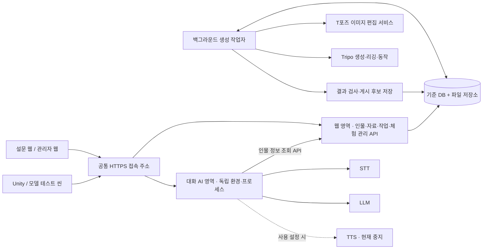
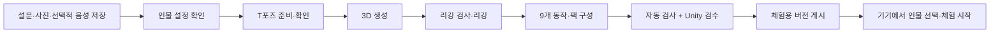

# 설문·인물·3D·대화·관리자 설정 통합 설계안

작성: 2026-09-12. **구현 전 제안**이다. `jw`의 현재 작업 파일과 기존 실험 문서를 기준으로 작성했다.
현재 구현에는 커밋되지 않은 음성 대화 개편도 포함된다. 아래 현황 표는 설계 작성 시점의 관찰 기록이다.
2026-09-12 후속 작업으로 **웹·등록·Tripo와 대화 AI의 서비스 분리**를 구현·서버 적용했다.
실제 적용 범위·운영 명령·검증은 [서비스 분리 문서](웹_Tripo_대화AI_서비스_분리.md)를 기준으로 본다.
이 문서의 통합 등록 화면, 게시 버전, T포즈 자동화 등 나머지 항목은 구현 전 제안이다.

## 1. 목표와 범위

**인물 한 명을 등록하면 설문, 사진, 음성, 3D 생성 진행, 리깅, 애니메이션, Unity 체험을 같은 화면과 기록으로 관리한다.**
관리자는 같은 웹에서 로그인 계정, 외부 API 연결, AI 모델 설정, Unity 기기 연결을 관리한다.

우선 구현 범위는 웹 등록 → T포즈 준비 → Tripo 생성·리깅·9개 동작 → 검수 → Unity 체험이다.
STT·LLM·TTS는 기존 서비스 경계를 활용해 여기에 연결한다. 현재 중지된 TTS는 그대로 두고 텍스트 답변으로 먼저 연결을 검증한다.
사진, 인물 설정, 참조 음성을 각각 등록할 수 있게 하고, 선택한 체험 방식에 필요한 자료가 갖춰졌는지 따로 판단한다.

## 2. 현재 따로 움직이는 지점

아래 구조는 코드에서 확인했다. 장애 발생 빈도나 실제 무단 접근은 이번 점검에서 측정하지 않았다.

| 우선순위 | 확인한 현재 구조 | 설계에 미치는 영향 | 근거 |
|---|---|---|---|
| 높음 | 웹 설문은 SQLite·Survey 파일 폴더, 실행용 인물은 등록 서버 파일 폴더에 저장 | 같은 `session_id`를 쓰지만 저장·삭제·완료 판단의 주체가 둘이다. 등록 서버 저장 후 설문 기록이 실패할 수 있다. | [Web/app.py](../Web/app.py)의 `publish`, `publish_direct`, `_record_and_model`; [database.py](../Survey/core/database.py) |
| 높음 | 웹은 원본 사진을 Tripo로 보내며 기본 생성 설정은 v2.5·3만 면, 기본 동작은 앉기 | 성공했던 T포즈·v3.1·9개 동작 실험과 운영 등록 결과가 다를 수 있다. | [jobs.py](../Survey/core/jobs.py)의 `_run_meshy_job`; [tripo.py](../Survey/core/tripo.py)의 `submit_image_to_3d`; [T포즈 실험](Tripo_T포즈_전처리_실험.md) |
| 높음 | 리깅·앉기 실패 시 원본 정적 GLB로 대체하고 `model_status=ready`로 표시 | 파일 생성 완료만으로 사용자가 요구한 리깅·애니메이션 완료를 판단할 수 없다. | [jobs.py](../Survey/core/jobs.py)의 `_seated_or_original` |
| 높음 | 생성과 GLB 전달이 웹 프로세스의 daemon thread에서 실행 | 서버 재시작 시 작업 복구가 어렵다. GLB 전달 실패도 웹의 생성 완료 상태에 반영되지 않는다. | [jobs.py](../Survey/core/jobs.py)의 `dispatch_model_job`; [Web/app.py](../Web/app.py)의 `_push_model_when_ready` |
| 높음 | 인물 등록이 전역 `current.json`을 바꾸고 Unity는 인물 ID 변경을 기준으로 모델 로드 | 다른 인물 등록이 체험 선택을 바꿀 수 있고, 같은 인물의 모델 교체는 버전 정보가 없어 감지하지 못한다. | [session_server.py](../Server/session_server.py)의 `start`; [PersonaSpawner.cs](../Assets/Scripts/Persona/PersonaSpawner.cs)의 `WatchSession` |
| 높음 | 관리자 비밀번호를 브라우저 `sessionStorage`에 보관하고 요청마다 재전송 | 로그인 세션 만료·폐기와 비밀번호 관리가 분리되어 있지 않다. | [admin.html](../Web/static/admin.html)의 `login`, `auth`; [Web/app.py](../Web/app.py)의 `admin_login`, `_admin` |
| 높음 | `/gate`는 코드 일치 여부만 반환하고 등록·삭제 API에 사용할 인증 세션을 발급하지 않음 | 설문 화면의 입장 확인을 서버의 자료 접근 권한으로 연결해야 한다. | [Web/app.py](../Web/app.py)의 `gate_check`, `publish`, `publish_direct`, `purge_mine` |
| 중간 | 웹 관리자의 자료 삭제와 등록 서버 자료 삭제 경로가 다름. `/session/end`는 인물 파일을 삭제 | 체험 종료, 인물 보관, 자료 삭제의 의미와 처리 결과를 분리해야 한다. Unity의 `ExperienceControl.Finish`가 이 삭제 API를 호출한다는 뜻은 아니다. | [Web/app.py](../Web/app.py)의 `admin_action`, `purge_mine`; [session_server.py](../Server/session_server.py)의 `end`; [ExperienceControl.cs](../Assets/Scripts/Dialogue/ExperienceControl.cs) |
| 중간 | Unity 런타임은 기본적으로 자세를 고정하며, 9개 동작 검사는 로컬 도구에 있음 | 팩 다운로드 이후 실제 대화에서 동작을 선택·전환하는 계층이 필요하다. | [PersonaSpawner.cs](../Assets/Scripts/Persona/PersonaSpawner.cs)의 `ApplyPose`; [모델 테스트 씬](Tripo_모델_테스트_씬.md) |

유지할 기반도 있다. CPU 등록·대화와 GPU 추론 서비스가 분리되어 있고, Tripo 호출 클라이언트와 작업 ID 재사용 도구,
Unity GLB 로더와 상설 테스트 씬도 있다. 이들을 연결하는 데이터와 작업 흐름을 정리한다.

## 3. 권장 구성

같은 서버 안에서 웹·등록·Tripo 제작과 대화 AI를 독립 실행·개발·배포 단위로 나눈다.
등록 데이터와 모델 생성 작업은 웹 영역이 소유한다. 대화 AI는 정해진 API로 인물 정보를 받아
체험 동안 사용하고, 응답·음성·대화 상태를 관리한다. Tripo 키는 웹 영역에만 제공한다.

- 기존 `Server/session_server.py`를 인물·자료 관리 API의 출발점으로 삼는다. 웹은 이 API를 통해 등록·조회·삭제한다.
- 처음에는 한 서버의 SQLite와 파일 저장소, 별도 생성 작업자 프로세스로 시작한다. 메시지 브로커나 여러 DB 도입을 전제로 하지 않는다.
- DB와 파일의 관리 책임은 인물 관리 서비스에 둔다. 작업자는 같은 저장 규약을 사용하고 웹은 별도 설문 원본 DB를 계속 갱신하지 않는다.
- Unity와 브라우저는 환경별 공통 접속 주소를 사용한다. 기존 서비스 포트는 게이트웨이 뒤에서 연결하고 WebSocket도 전달한다.
- LLM·TTS 모델 로딩과 GPU 실행은 기존 서비스가 담당한다. 관리자 화면은 설정·상태를 제공하며 모델 교체 시 필요한 적용·재시작 상태를 명시한다.

## 4. 데이터의 기준

| 개념 | 역할과 핵심 정보 |
|---|---|
| 인물 `person_id` | 설문·동의·인물 설정·사전지식의 기준. 설문 및 인물 설정 수정 버전을 보관 |
| 자료 `asset_id` | 원본 사진·T포즈 이미지·참조 음성·GLB·검사 기록. 종류, 내부 저장 위치, 해시, 출처 자료 ID, 생성 설정 |
| 생성 결과 `avatar_build_id` | 입력 사진/T포즈 버전, 생성·리깅 공급자와 버전, 동작 목록, 검사 결과. 같은 인물에 여러 후보 허용 |
| 작업 `job_id` | 각 단계의 요청·상태·외부 task ID·시도 횟수·오류·비용·진행 시각. 작업자 재시작 후 복구 |
| 게시 버전 `release_id` | 검수한 인물 설정 버전 + 모델 생성 결과 + 선택적 음성 자료를 묶은 변경 불가 버전 |
| 체험 `experience_id` | 어느 Unity 기기가 어떤 게시 버전으로 언제 체험했는지. 시작·종료가 인물 등록·삭제와 별개 |
| 운영 설정 | 관리자 계정, 공급자 연결 정보, 생성 프리셋, 모델 설정, 등록된 Unity 기기. 개발/서버 환경을 구분 |

기존 `session_id`는 이관 시 인물 ID의 별칭으로 보존한다. ID를 새로 만드는 것보다 저장과 상태 변경의 책임을 하나로 만드는 것이 핵심이다.
원본 자료는 덮어쓰지 않고 파생 자료가 출처와 설정을 참조한다. API에는 로컬 PC의 절대 경로 대신 권한 검사 가능한 자료 ID/다운로드 경로를 반환한다.

**수정에 따른 재작업 범위**

- 설문·말투·추억 수정: 인물 설정 버전만 갱신한다. 기존 모델을 새 게시 버전에서도 재사용한다.
- 사진 또는 T포즈 변경: 새 모델 생성 후보를 만든다. 현재 체험 중인 버전은 유지한다.
- 음성 변경: 새 참조 음성을 등록·검사한다. 3D 생성과 리깅은 재실행하지 않는다.
- 특정 동작 추가·실패: 호환되는 기존 리깅을 재사용하고 해당 동작만 처리한다.

## 5. 등록과 생성 흐름

**T포즈 준비**: 현재 `image_gen`은 대화에서 사용한 편집 도구이며 서버에 연결된 API가 아니다.
첫 구현은 준비된 T포즈 이미지를 업로드하는 경로를 포함한다. 자동화에는 서버에서 호출할 수 있는 이미지 편집 서비스와 별도 인증·비용 처리가 필요하다.
얼굴·복장 유사도, 팔과 몸통 분리, 손발 포함 여부를 확인한 뒤 유료 3D 생성을 시작하도록 한다.

**생성 프리셋**: 검증된 로컬 실험 설정을 이름과 버전이 있는 프리셋으로 이관한다.
초기 후보는 v3.1·5만 면 목표·기존 PBR/텍스처 설정·리깅 v1.0·9개 동작이다. 외부 API의 최신 기본값에 맡기지 않고 실제 사용한 요청 설정을 저장한다.
이는 두 인물에서 확인한 출발점이며 모든 사진에서 동일한 품질을 보장하지 않는다.

**검사와 게시**: GLB 헤더뿐 아니라 스킨·관절·클립 목록·파일 해시와 로드 가능 여부를 검사한다.
검수 화면에서 원본/T포즈/정적 모델/리깅/동작을 비교한다. 심한 팔 변형, 발 미끄러짐, 의자와의 접촉은 시각 검사 항목으로 남긴다.
생성 작업이 성공해도 검수 전에는 게시 후보이며, 정적 모델만 나온 결과를 애니메이션 완료로 표시하지 않는다.

**상태 표현**: 단계별 작업 상태와 실제 사용 가능 기능을 나눈다.

- 작업: `queued`, `running`, `needs_review`, `succeeded`, `failed`, `blocked`, `cancelled`, `submission_unknown`.
- 자료 준비: `profile_ready`, `rig_ready`, `animations_ready`, `voice_reference_ready`.
- 서비스 준비: STT/LLM 연결, 이미지 편집/Tripo 인증, TTS 사용 설정과 실제 응답 여부.
- 사용자 화면 예시: “T포즈 확인 필요”, “리깅 완료 · 동작 6/9개”, “생성 완료 · 검수 대기”, “Tripo 연결 설정 필요”.

3D 미리보기에는 사진·모델만, 캐릭터와 텍스트 답변 체험에는 인물 설정·게시된 모델·STT/LLM이 필요하다.
참조 목소리 답변을 선택한 경우에만 참조 음성과 TTS 준비를 추가로 요구한다. TTS 중지는 관리자에게 의도된 상태로 표시한다.

**작업 복구와 비용**

작업 생성과 실행 대기를 DB 트랜잭션으로 기록하고, 작업자는 실행 권한 만료 시각과 heartbeat로 중단된 작업을 회수한다.
파일은 임시 위치에 받고 검사 후 확정한다. DB에는 실제 파일 확정 뒤에 완료를 기록하며, 중간 중단 시 남은 파일과 상태를 대조한다.
다운로드나 게시 실패를 생성 실패와 구분해 해당 단계만 재시도한다.

외부 요청 전에 입력 해시·프리셋 버전·요청 의도를 기록하고 응답의 task ID를 보존한다.
같은 요청이 반복되면 기존 작업을 반환한다. 외부 POST 뒤 응답이 유실되면 `submission_unknown`으로 멈추고 공급자 작업을 확인한다.
Tripo가 서버의 중복 방지 키를 처리한다고 가정하거나, task ID 없이 자동 재제출하여 중복 과금을 감수하지 않는다.

기존 두 T포즈 실험의 실제 사용량은 인물당 155 Tripo 크레딧이었다. 이미지 편집 비용은 별도이며 향후 고정 가격이라는 뜻은 아니다.
화면에는 신규 생성/기존 리깅 재사용 여부, 실행 전 예상량, 단계별 실제 사용량과 적용한 키 버전을 표시한다.
근거: [T포즈 실험의 비용·재시도 기록](Tripo_T포즈_전처리_실험.md), [tripo_motion_pack.py](../tools/tripo_motion_pack.py)의 `main`.

## 6. Unity와 애니메이션 연결

Unity는 인물 ID만 조회하는 대신 체험에 지정된 `release_id`의 manifest를 받는다.
manifest에는 규격 버전, 인물 설정 버전, GLB 자료 ID·해시, 리깅 정보, 클립별 이름·길이·자세 조건·반복 설정을 포함한다.
허용된 게시 버전과 파일 해시가 바뀌면 다시 내려받고, 로드가 끝난 뒤 화면을 교체한다. 체험 중 버전은 고정하고 변경은 명시적으로 적용한다.

모델 테스트 씬도 같은 manifest와 로더를 사용한다. 로컬 파일을 테스트할 때에는 같은 형식의 로컬 manifest를 사용한다.
현재 T포즈 결과를 새 유료 생성 없이 가져와 검사할 수 있으며, 기존 인물과 연결할 때에는 운영자가 인물을 확인한다.

**동작 재생은 별도 담당 컴포넌트로 둔다.** 생성 API가 동작을 제공하고 Unity가 재생 상태와 전환을 관리한다.
처음에는 9개 동작을 직접 선택해 검사하고, 이후 체험 시작/종료와 대화 이벤트에 연결한다.
대화 서비스가 반환하는 동작 ID는 제한된 목록에서 선택하게 하고, Unity는 현재 자세에서 허용되는 동작인지 확인한다.
응답에 연결된 동작은 기존 `response_id`와 중단·전환 이벤트를 따라 관리하여 취소된 답변의 동작이 뒤늦게 재생되지 않게 한다.

현재 팩의 동작은 앉기, 주변 둘러보기, 인사, 작별인사, 동의, 박수, 포옹, 웃기, 흐느끼기다.
모두 앉아서 수행하는 제스처는 아니다. 앉은 상태를 유지하려면 해당 자세의 동작 확보 또는 상체 레이어/마스킹을 별도 검증해야 한다.
클립별 시작·종료 자세, 루트 이동, 반복과 복귀 자세를 정의하고 자연스러운 전환을 검사한다.
얼굴 표정·개별 손가락, 두 사람의 접촉을 맞추는 포옹은 현재 결과의 기능으로 표시하지 않는다.

## 7. 관리자 비밀번호·키·토큰 설계

같은 관리자 웹에서 관리하되, 비밀번호·외부 API 키·기기 접속 권한은 사용 목적에 맞게 저장하고 접근을 제한한다.

| 항목 | 보관·사용 방식 | 관리자 화면 |
|---|---|---|
| 관리자 비밀번호 | 계정 DB에 Argon2id 해시 저장. 로그인 후 서버가 관리하는 세션 사용 | 계정 생성, 비밀번호 변경/재설정, 로그인 세션 종료 |
| 설문 참여 권한 | 초대 코드/링크를 제한된 등록 세션으로 교환. 서버가 본인 자료 범위와 만료 확인 | 초대 발급·만료·폐기, 등록 진행 확인 |
| Tripo·이미지 편집 API 키 | 서버의 보호된 비밀 저장소에 보관하고 해당 작업자만 읽음 | 등록/교체/삭제, 연결 확인, 키 별칭·갱신 시각·오류 상태 |
| Unity 기기 인증 | 기기 등록 후 만료·폐기 가능한 인증 수단 사용. 체험 시 인물/버전 범위의 단기 토큰 발급 | 기기 연결 상태, 체험 인물 지정, 기기 권한 폐기 |
| 서비스 간 인증 | 등록·대화·TTS 등 용도별 서버 자격증명. 클라이언트용 토큰과 권한 구분 | 연결 상태와 교체 결과. 비밀 원문 조회는 제공하지 않음 |
| 일반 설정 | 서버 URL, LLM 실제 모델·API 별칭, STT/TTS 설정, 3D 생성 프리셋, 환경 이름 | 현재 값과 적용 여부, 연결 검사, 변경 이력 |

관리자 로그인은 전체 HTTPS 연결과 `HttpOnly`, `Secure`, `SameSite` 쿠키를 사용한다.
비밀번호를 JS 저장소에 남기지 않고 서버에서 세션 만료·로그아웃을 처리한다. 상태 변경 요청에는 CSRF 검증, 로그인에는 시도 제한을 적용한다.
관리자 비밀번호 해시는 [OWASP Password Storage](https://cheatsheetseries.owasp.org/cheatsheets/Password_Storage_Cheat_Sheet.html),
로그인 세션은 [OWASP Session Management](https://cheatsheetseries.owasp.org/cheatsheets/Session_Management_Cheat_Sheet.html)의 권고를 따른다.

외부 API 키는 호출 시 원문이 필요하므로 비밀번호처럼 단방향 해시만 저장할 수 없다.
초기 서버에서는 전용 서비스 계정이 읽는 보호된 비밀 파일로 시작할 수 있다. DB에 저장할 때에는 암호화하고 복호화 키는 DB·저장소와 분리해 보관한다.
웹에는 입력·교체 기능과 설정 상태만 제공하고 원문을 다시 반환하지 않는다. 키를 로그·작업 결과·Git에 복사하지 않는다.
중앙 관리, 최소 접근 권한과 키 수명주기 원칙은 [OWASP Secrets Management](https://cheatsheetseries.owasp.org/cheatsheets/Secrets_Management_Cheat_Sheet.html)를 참고한다.

현재 `admin_tripo_get`의 원문 미반환 동작은 유지할 기반이다. `admin_tripo_set`의 웹 `.env` 수정은 향후 비밀 저장소 호출로 옮긴다.
`ServerStatusWindow`의 관리자 비밀번호·Tripo 키 입력은 관리자 웹 설정 화면으로 안내하도록 바꾸고 Unity에는 서비스 상태와 기기 연결을 남긴다.
현재 Editor 입력 필드가 플레이어 저장소에 비밀번호를 영구 저장한다는 뜻은 아니다.

현재 설정은 웹의 `.env`, 등록·대화·TTS의 환경 파일, Unity의 서버 주소/토큰 등으로 나뉘어 있다.
이관 시 변수 이름·사용 서비스·설정 위치만 목록화하고 비밀 값은 문서에 쓰지 않는다. 기존 운영 키를 임의로 교체하지 않는다.
키 교체는 새 값 검증 → 활성 버전 전환 → 적용 확인 → 기존 값 폐기 순서로 처리하고, 수행자·대상·결과를 기록한다.
Unity 기기 자격증명도 씬·프리팹·`PlayerPrefs`에 공통 운영 비밀로 넣지 않고 OS 보호 저장소 등 기기별 보관 방식을 사용한다.

설정 화면은 “값 있음”, “인증 확인됨”, “서비스 응답 없음”, “사용 안 함”을 구분한다.
예를 들어 Tripo는 기존 도구가 사용하는 잔액 조회로 연결을 확인하고 유료 생성 버튼과 구분한다.
LLM은 실제 로드 모델과 API 별칭을 함께 표시한다. 현재 `exaone` 별칭만으로 실제 모델을 판단하지 않도록 한다.
직전 서버 조회(2026-09-12 13:48 KST)에서는 웹의 Tripo 설정 플래그가 꺼져 있었고 TTS는 의도적으로 중지되어 있었다. 이는 당시 관찰값이다.

## 8. 화면과 API의 첫 범위

**참여자 웹**: 초대 확인 → 동의/자료 등록 → 인물 설정 확인 → 제출 상태 확인.
음성 화자 분리 기능의 가용성과 대화 STT의 가용성은 별도로 표시한다.

**관리자 웹**은 다음 네 화면으로 시작한다.

1. 인물 목록/상세: 설문, 원본 자료, T포즈, 모델 후보, 리깅·동작 검사, 게시 버전.
2. 생성 작업: 단계별 상태, 실패 이유, 재개 가능한 단계, 과금 여부와 실제 사용량.
3. 체험/기기: Unity 연결, 선택한 인물·버전, 텍스트/음성 모드, 체험 시작·종료.
4. 설정: 관리자 계정, 참여 초대, 공급자 키, AI 모델·프리셋, 서비스 연결 상태.

API 이름은 구현 전 확정할 초안이다.

| 범위 | 예시 계약 |
|---|---|
| 인증 | `/auth/login`, `/auth/logout`, `/invites/redeem`, `/devices/pair` |
| 인물·자료 | `/persons`, `/persons/{id}`, `/persons/{id}/assets` |
| 생성 | `/persons/{id}/avatar-builds`, `/jobs/{id}`, `/jobs/{id}/resume` |
| 검수·게시 | `/avatar-builds/{id}/review`, `/persons/{id}/releases`, `/releases/{id}/manifest` |
| 체험 | `/experiences`, `/experiences/{id}/end`, 체험 권한을 확인하는 대화 WebSocket |
| 운영 | `/admin/settings`, `/admin/providers/{provider}/credential`, `/admin/providers/{provider}/check` |

기존 API는 전환 기간에만 호환 어댑터로 유지한다. 기존 `/session/end`를 새 체험 종료로 조용히 재해석하지 않는다.
인물 삭제는 별도 권한으로 실행하고, 새 체험 차단·진행 작업 취소·자료 제거 결과를 같은 서비스가 추적한다.
원본·파생 파일·기존 저장 위치·로그/백업의 보존 정책을 함께 다룬다. 외부 공급자의 자료는 실제 삭제 기능과 보존 정책을 확인한 범위만 완료 처리한다.

## 9. 구현 순서와 완료 기준

| 단계 | 작업 | 확인할 결과 |
|---|---|---|
| 1 | 인물/자료/게시/체험 계약 확정, 관리자 로그인·서버 권한 검사·설정 관리 기반 | 관리자 로그인으로 인물과 서비스 설정을 조회. 참여자는 허용된 자료만 접근. 기존 설정은 보호된 방식으로 연결 |
| 2 | 기준 저장소 및 호환 API 구축, 기존 T포즈 모델을 게시 후보로 가져오기, Unity manifest 로드 | 추가 Tripo 과금 없이 기존 모델을 관리자 웹에서 지정하고 Unity에서 같은 인물·9개 동작 확인 |
| 3 | T포즈 업로드/전처리 연결, 영속 작업자, Tripo 단계별 복구·검수·게시 | 새로운 사진 한 장을 등록해 리깅과 9개 동작까지 같은 진행 화면에서 추적 |
| 4 | 대화와 동작 전환, 기기 체험 상태 연결 | 시작·종료·대화 이벤트에 맞는 동작 실행, 취소된 응답 동작 제거, 체험 종료 후 인물 자료 유지 |
| 후속 | 참조 음성/TTS 활성화와 얼굴·손가락 확장 여부 검토 | 현재 중지 설정을 유지한 상태에서 별도 범위와 품질 목표를 결정 |

기존 자료는 Survey DB, 등록 서버 폴더, 로컬 실험 파일을 먼저 대조하고 ID·파일 해시·동의 기록을 보존한다.
백업과 이관 결과 비교 뒤 기준 쓰기 경로를 전환한다. 이관을 위해 인물 파일을 먼저 삭제하거나 새 Tripo 생성을 실행하지 않는다.

첫 연결 검증은 **기존 T포즈 모델 → 인물 상세 → 검수/게시 → Unity 선택·동작 재생 → 체험 종료**로 한다.
이 흐름이 통과한 뒤 새 사진의 유료 생성까지 확장한다.

완료 판정에는 다음 사례를 포함한다.

- 같은 인물의 모델 B를 생성하는 동안 실행 중인 모델 A 체험이 유지되고, B 적용 시 파일 해시와 화면 모델이 함께 바뀐다.
- 웹/작업자 재시작과 파일 전달 실패 뒤 작업을 이어가며, 제출 결과를 모르는 유료 요청은 자동 재제출하지 않는다.
- 정적 모델만 나온 경우 리깅/애니메이션 완료로 표시되지 않는다. 특정 동작 실패는 성공한 모델·리깅을 재사용해 복구한다.
- 설문 문구만 수정해도 3D를 재생성하지 않는다. 동일 생성 버튼의 중복 요청은 하나의 작업으로 연결된다.
- 키 미설정과 인증 실패를 구분하고 설정할 환경을 안내한다. 관리자 비밀번호/API 키가 클라이언트 저장소·응답·로그에 남지 않는다.
- 인증 없는 설정 변경과 타인 자료 접근은 거절된다. 기기 권한 폐기가 실제 모델 조회·대화 접속에 반영된다.
- 체험 종료는 인물 보존, 인물 삭제는 관련 자료 처리 결과 확인이라는 서로 다른 결과를 가진다.

이 문서는 정적 코드 대조와 기존 실험·서버 조회 기록을 바탕으로 작성했다.
서비스 분리는 후속 구현·검증을 완료했으며, 나머지 제안의 검증 여부는 실제 구현 단계에서 갱신한다.
