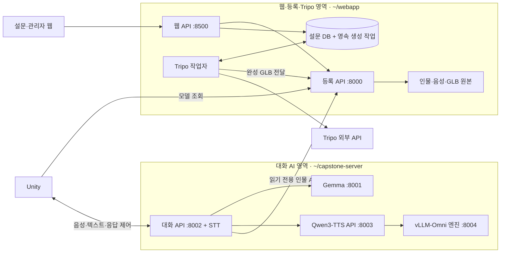

# 웹·Tripo와 대화 AI 서비스 분리

기준일: 2026-09-15. 서비스 분리는 2026-09-12에 **구현·서버 적용·검증을 완료**했다.
같은 서버에서 웹·인물 등록·Tripo 제작과 대화 AI를 각자 개발·배포·재시작할 수 있도록 분리했다.
이후 대화 TTS를 재연결하고 생성 스트리밍·대기 리액션을 추가했으며, 등록 웹은 설문 재작성·자동 ID를 적용했다.
전체 제품 흐름의 후속 설계는 [설문·인물·3D 통합 설계안](설문_인물_3D_통합_설계안.md)을 참고한다.

## 1. 현재 구성



| 서비스 | 실제 코드 위치 | Python 환경 | 상태 |
|---|---|---|---|
| 웹 8500 | `~/webapp/Web` | `~/venv/web` | 실행 중 |
| 등록 8000 | `~/webapp/Server/registration` | `~/venv/registration` | 실행 중 |
| Tripo 작업자 | `~/webapp/Survey/model_worker.py` | `~/venv/tripo` | 실행 중, API 인증 확인 |
| 대화 8002 | `~/capstone-server` | `~/venv/dialogue` | 실행 중, 인물 조회 방식 `http` |
| LLM 8001 | 기존 Gemma/vLLM 프로세스 | `~/venv/vllm` | 기존 프로세스 유지 |
| TTS API 8003 | `~/capstone-server/tts_server.py` | `~/venv/qwentts` | 실행 중, loopback·PCM 스트리밍 |
| TTS 엔진 8004 | `~/capstone-server/tts_streaming.yaml` 설정 | `~/venv/qwentts-stream` | TTS API가 관리, 두 단계 생성·디코딩 |

상태는 2026-09-15 검증 시점 기준이다. TTS의 설치·예열·복구는 [실시간 스트리밍](TTS_실시간_스트리밍.md)을 따른다.

3D 생성·리깅 연산은 Tripo가 수행한다. 서버 작업자는 API 요청·진행 관리·파일 다운로드·결과 전달을 담당한다.
등록 API와 작업자는 대화용 STT/GPU 패키지를 설치하지 않은 환경에서도 실행된다.

## 2. 각각 작업할 코드

| 웹·등록·Tripo 담당 | 대화 AI 담당 |
|---|---|
| `Web/` — 설문, 관리자 UI, 인물 설정 구성 | `Server/dialogue_server.py` — 대화 연결·인증 |
| `Server/registration/` — 인물 원본·GLB·인물 조회 API | `Server/persona_client.py` — 인물 조회 클라이언트 |
| `Survey/core/model_queue.py` — 영속 작업·작업자 상태 | `Server/realtime_*` — STT·LLM·TTS·응답 생명주기 |
| `Survey/core/model_pipeline.py` — Tripo 단계 실행·복구 | `Server/interruption_policy.py` — 끼어들기 판정 |
| `Survey/model_worker.py` — 별도 작업자 프로세스 | `Server/persona_context.py`, `voice_reference.py`, `tts_server.py` |

`Server/session_server.py`는 기존 import를 위한 얇은 호환 진입점이다. 등록 기능의 구현은 `Server/registration/app.py`에 있다.
양쪽을 연결하는 인물 API 규격을 변경할 때에는 제공자·소비자 계약 테스트를 함께 실행한다.
웹 DB나 Tripo 구현을 대화 코드에서 import하지 않는다.

## 3. 독립 실행 명령

아래 명령은 해당 서비스 하나만 제어한다. `start`를 `stop` 또는 `status`로 바꿔 사용할 수 있다.

```bash
# 웹·등록·Tripo 영역
ssh raon bash /home/crc_unity/webapp/Server/platform.sh web start
ssh raon bash /home/crc_unity/webapp/Server/platform.sh session start
ssh raon bash /home/crc_unity/webapp/Server/platform.sh tripo start

# 대화 AI 영역
ssh raon bash /home/crc_unity/capstone-server/dialogue.sh api start
```

대화 API는 `DIALOGUE_TTS_URL=http://127.0.0.1:8003`으로 TTS를 사용한다.
대화 API의 재시작이 LLM이나 TTS를 자동으로 재시작하지 않는다. 웹·Tripo 작업에서 TTS 설정을 변경하지 않는다.
PID 파일의 프로세스 명령행이 대상 서비스와 일치할 때만 종료 신호를 보낸다.

기존 `~/capstone-server/service.sh session ...`과 `start.sh`·`stop.sh`·`status.sh`는
`service-paths.env`를 통해 새 등록 API 위치로 연결한다.
기존 `~/webapp/web_start.sh`·`web_stop.sh`도 새 웹 제어 명령으로 연결한다.

## 4. 인물 정보 전달 계약

대화는 시작 시 인물 정보를 받아 해당 연결에서 사용한다. 운영 설정은 `DIALOGUE_PERSONA_URL=http://127.0.0.1:8000`이다.
URL이 설정된 운영 경로에서는 API 오류를 로컬 파일 읽기로 우회하지 않는다. 로컬 파일 방식은 기존 격리 테스트의 호환 경로다.

| API | 용도 |
|---|---|
| `GET /internal/current-persona` | 현재 선택된 인물의 대화 정보 |
| `GET /internal/personas/{sid}` | 지정 인물의 대화 정보 |
| `GET /internal/personas/{sid}/voice.wav?sha256=...` | 조회했던 버전과 일치하는 참조 음성 |

인증은 `X-Persona-Token`이다. 이 토큰은 등록·삭제·모델 업로드 권한으로 사용할 수 없다.
응답은 `schema_version=1`, `session`, `revision`, `persona`, `knowledge`, `rules`, `voice_sha256`을 제공한다.
`revision`은 인물 텍스트와 참조 음성 해시로 계산한다. Unity의 대화 `ready` 이벤트에도 `persona_revision`을 반환한다.
참조 음성이 바뀌면 이전 해시로 받는 요청은 409가 되어 서로 다른 버전의 인물과 음성이 섞이지 않게 한다.

이 계약의 revision은 현재 인물 자료의 스냅샷 식별자다. 통합 설계안의 모델·인물·음성을 묶는 게시 버전 전체를 구현한 것은 아니다.
GLB는 기존 등록 API에서 Unity가 직접 받으며, 대화 AI에 전달하지 않는다.

2026-09-15부터 신규 `POST /session/start`는 UUID4 세션 ID를 서버에서 발급한다.
비어 있지 않은 `session` 입력은 400으로 거부하고, 호출자는 응답 ID를 이후 조회·모델 전달에 사용한다.
웹의 `/publish`·`/publish_direct`는 `/persona`가 반환한 `survey_revision`과 같은 설문을 요구한다.
이 해시는 설문 일치 검사이며 위 인물 조회 `revision`과 구분한다. 기존 ID의 조회·현재 인물 선택은 유지한다.
설문 변경·작성 실패·부분 실패의 처리는 [웹 등록 흐름 개선](웹_등록_흐름_개선.md)에 있다.

## 5. Tripo 작업의 저장과 복구

웹은 `model_jobs` 테이블에 작업을 등록한다. 별도 작업자가 실행 권한과 heartbeat를 갱신하며 작업을 가져간다.
웹 재시작과 생성 작업의 수명이 분리되었고, 모델 전달용 웹 내부 thread도 제거했다.

- 같은 인물의 중복 생성 요청은 기존 작업 상태를 반환한다.
- 외부 작업 제출 전에 상태를 저장하고, 응답을 받으면 Tripo task ID를 기록한다.
- 중단된 작업은 저장된 ID로 이어간다. 제출 응답을 잃어 ID가 없으면 `submission_unknown`으로 멈춰 자동 재제출을 막는다.
- 다운로드한 GLB는 해시를 저장한다. 등록 API 전달만 실패했다면 재시도 시 그 파일을 사용한다.
- 등록 API가 GLB를 받은 뒤 `model_status=ready`가 된다.
- 리깅·동작 처리가 실패하면 실패를 표시한다. 정적 모델로 대체하면서 애니메이션 완료로 표시하지 않는다.

`/status`의 `model_worker`에 `online`, `configured`, `active_jobs`, 상태별 `jobs` 수가 포함된다.
작업자 로그는 `~/webapp/Server/tripo.log`다. API 키·서명된 다운로드 URL을 작업 기록이나 오류 로그에 복사하지 않는다.

현재 작업자는 기존 웹의 이미지 생성·리깅·`TRIPO_POSE` 처리를 분리한 것이다. 기본 동작은 `preset:sit`이다.
T포즈 자동 전처리와 웹에서의 9개 동작 팩 구성은 통합 설계안의 후속 기능이다. 기존 Unity 로컬 T포즈·9개 동작 결과는 보존했다.
관리자의 재시도는 기존 task ID를 보존한다. 공급자가 이미 실패 처리한 작업의 재생성이나 제출 결과 불명 작업의 해소는 별도 확인이 필요하다.

## 6. 비밀번호와 키의 관리 위치

| 설정 | 위치·용도 |
|---|---|
| 관리자 비밀번호·Tripo 키 | `~/webapp/Web/.env` — 웹·제작 영역 |
| 등록 API 접속 토큰·인물 조회 전용 토큰 | `~/webapp/Server/session.env`의 `SESSION_TOKEN`, `PERSONA_READ_TOKEN` |
| 대화 연결·인물 조회·LLM·TTS 설정 | `~/capstone-server/dialogue.env` — 대화 AI 영역 |
| TTS 내부 설정 | `~/capstone-server/tts.env` — Qwen3-TTS API·스트리밍 엔진 설정 |
| 호환 명령의 목적지 | `~/capstone-server/service-paths.env` — 비밀 값 없는 경로 설정 |

`PERSONA_READ_TOKEN`과 `DIALOGUE_PERSONA_TOKEN`은 새 인물 조회 전용 인증이다.
기존 관리자 비밀번호와 Unity 접속 설정은 보존했다. 관리자 비밀번호가 비어 있으면 관리자 API를 사용할 수 없다.
로컬 실험에서 사용하던 Tripo 키를 웹 영역에 등록하고 잔액 조회로 인증을 확인했다. 키 원문은 이 문서나 Git에 기록하지 않는다.
Tripo 작업자는 웹 앱을 import하지 않고 필요한 설정만 읽으며, 다음 작업 시작 시 키 변경을 반영한다.

## 7. 배포와 검증

```powershell
python tools/service_bundle.py platform
python tools/service_bundle.py dialogue
```

번들은 `tools/_work/service_split_20260912/`에 생성된다. platform은 `~/webapp`, dialogue는 `~/capstone-server`에 대응한다.
명시된 코드 파일과 해시 manifest만 담는다. 실제 `.env`, 인물 자료, 모델 가중치, 작업 DB는 제외한다.
기존 서버 갱신용이며, 가상환경 설치와 설정은 각각 별도로 관리한다. 적용 전에 대상 파일 해시를 대조하고 해당 영역 파일을 백업한다.

2026-09-15 최신 등록 개선은 전체 회귀 검사 135개·실제 Edge 흐름·서버 적용을 확인했다.
[등록 흐름 개선](웹_등록_흐름_개선.md)에 검사 범위와 백업을 기록했다. 웹·등록만 재시작했고
대화 AI·TTS·Tripo 작업자 프로세스와 현재 인물 자료는 유지했다.
대화·Unity의 실제 전체 검사는 [별도 검증 기록](전체_검증_20260915.md)에 있다.

2026-09-12 분리 적용 당시의 검증 결과:

- 기존 대화·음성·등록 회귀 검사와 인물 API 계약·연결 검사: 58개 통과.
- Tripo 작업자 독립 검사: 5개 통과. 중복 요청, 전달 실패 후 복구, 제출 응답 유실, 리깅 불가, 삭제된 인물의 실행 권한을 확인했다.
- 등록 전용 환경에서 등록 검사 2개·인물 계약 검사 4개, Tripo 전용 환경에서 작업자 검사 5개 통과.
- 실제 서버에서 등록 인물 API 조회·참조 음성 해시·대화 시작을 확인했다.
- 실제 웹 재시작 중 대화 연결과 대화·Tripo 작업자 PID가 유지됐다.
- 실제 Gemma 텍스트 응답과 종료를 확인했다. 당시 TTS는 꺼진 상태였다.
- 기존 인물 파일 해시·설문 행과 LLM PID/시작 시각이 보존됐다.
- Tripo API 인증 확인에 생성 요청은 사용하지 않았다. 새 유료 생성 작업은 0건이다.

서버 백업은 `~/capstone-backups/service-split-20260912-171341`에 있다.
실제 연결 검사 기록은 서버 `~/.cache/capstone-service-split/20260912/`, 로컬 작업 기록은 `tools/_work/service_split_20260912/`에 보관한다.
