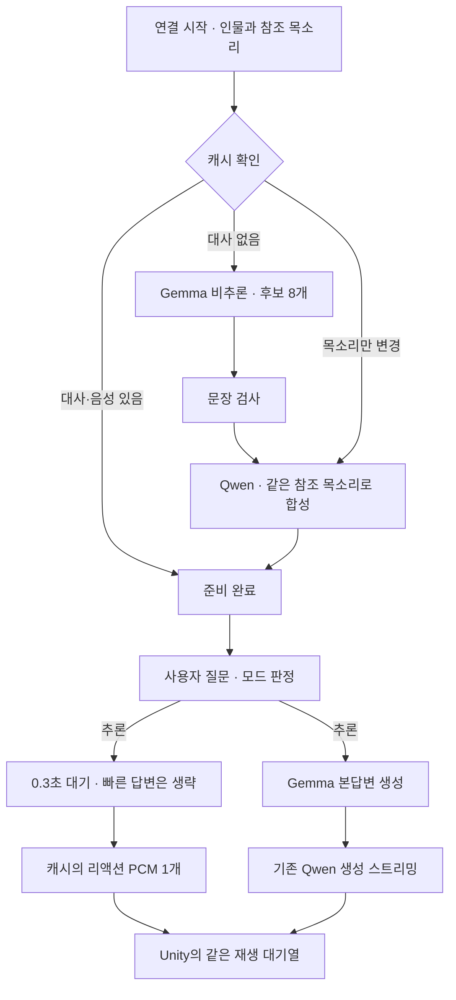

# 캐릭터의 추론 대기 리액션

2026-09-15. `persona_reaction_v1`은 페르소나에 맞는 짧은 대사와 참조 목소리의 음성을 미리 준비해,
추론 답변을 기다리는 동안 한 번 재생한다. 대화 서버에 구현했으며 Unity 소스·씬과 Web·Survey·Tripo는 수정하지 않았다.

## 사용 방법

`AI_Response_Test`에서 평소처럼 테스트 인물과 참조 WAV를 선택하고 체험을 시작한다.
처음에는 참조 목소리에 이어 **캐릭터의 짧은 리액션을 준비하고 있습니다**가 표시된다.
계산·조건 비교·여러 단계 설명을 요청하면 자동 모드 판정에 따라 리액션이 나온다.
예: “A 코스는 40분에 2천 원, B는 25분에 5천 원이야. 30분 안에 돌아오려면 어느 쪽이 나을까?”

실제 시험에서는 반말 인물의 “생각 좀 해볼게.”, 정중한 인물의 “잠깐만요, 생각 중이에요.” 등이 생성됐다.
고정된 대사 목록이 아니며 인물 설정에 따라 다시 만든다. 일반 모드와 0.3초 이내에 첫 답변 글자가 나오는 추론은 생략한다.

## 준비·재생 구조



- 인물 설정·말투 규칙·예시를 Gemma에 전달한다. 운영 HTTP 경로는 별도 사전 지식과 실제 대화 기억을 제외한다.
  구형 로컬 파일 경로는 기존 시스템 설정을 사용하므로 사전 지식이 포함될 수 있다.
- 질문형, 제어 태그, 숫자, 검색·조회·계산 완료 주장, 긴 문장, 동일 문구 등을 검사해 5~8개 대사를 채택한다.
  형식·표현 검사이며 모든 의미 오류를 판정하지는 않는다.
- 음성은 24kHz 모노 PCM16, 0.25~2.5초만 채택한다. 긴 음성을 잘라 쓰지 않고 후보 전체를 제외한다.
  유효 음성이 최소 3개 남아야 리액션을 활성화한다.
- 준비는 최대 35초다. 실패하면 리액션 없이 기존 음성 대화를 시작하고 다음 연결에서 재시도한다.
- 실시간에는 리액션용 Gemma·Qwen 호출이 없다. 본답변 생성과 캐시 음성 전송을 동시에 진행한다.
- 한 응답에 최대 한 번 사용하고 같은 연결에서 최근 사용한 2개 문구를 제외한다.
  같은 재생 대기열을 사용해 본답변 음성과 겹치지 않는다.

## 캐시와 변경 반영

| 변경 | 다음 연결에서의 동작 |
|---|---|
| 페르소나·말투 규칙·예시 | 대사와 음성을 새로 준비 |
| 참조 PCM·샘플레이트·수정 전사 | 대사를 재사용하고 음성만 새로 준비 |
| LLM 모델/요청 설정·TTS 모델/방식·리액션 버전 | 해당 캐시 키를 갱신 |
| 동일 인물·목소리로 재접속 | 준비된 결과 재사용 |

연결 중에는 시작할 때 읽은 인물 자료를 유지한다. 등록 인물 캐시는 대화 서버의
`~/capstone-server/reaction-cache/lines/`, `audio/`에 저장한다.
파일명은 자료의 해시다. 원본 페르소나·참조 WAV 자체는 복사하지 않지만 생성 대사·복제 PCM이 포함되므로
전용 폴더(새 폴더 700, 파일 600)로 관리하고 Git·배포 번들에서 제외한다.
대사/음성 묶음 각각 최대 16개, 마지막 사용 후 7일 만료다. 조회 시 만료를 검사하고 새 묶음 저장 시 파일을 정리한다.
별도 주기 삭제 작업이나 등록 삭제 API와의 자동 연동은 없다.

임시 테스트 인물은 API 프로세스 RAM에만 캐시한다. 재접속 시 재사용하지만 API 재시작 시 다시 준비한다.
등록 인물은 디스크 캐시로 재시작 후에도 재사용한다. reset은 사용자 대화·기억을 비우며 준비된 리액션은 유지한다.

## 재생·끼어들기·기억 계약

- 기존 `response_id`, `response.delta`, `response.audio`, `audio.boundary`를 사용한다.
  추가 필드는 리액션 `kind=reaction`, 본답변 `kind=answer`다. 기존 Unity는 추가 필드를 무시해도 재생된다.
- 자막·PCM 샘플 수·`text_chars`·재생 확인에는 리액션을 포함한다.
- 서버의 최근 대화·핵심 기억에는 리액션을 제외한 본답변만 기록한다.
- 끼어들기 판정에는 실제 재생 확인된 리액션이 보일 수 있다. 미재생 문장은 기존 규칙대로 제외한다.
- 사용자가 말하면 일시정지하고 `resume`은 같은 응답·음성을 이어간다.
  수정·전환·취소·reset·연결 종료는 해당 리액션 전송도 취소한다.
- 리액션만 재생되고 본답변 생성이 실패하면 완료를 보고하지 않는다.

## 시간 측정

`response.done.timing`의 시작점은 기존 서버 `respond()` 진입 시각이다.
PC의 마지막 입력 패킷 → 수신 시각과 구분한다.

| 필드 | 의미 |
|---|---|
| `first_text_sec` | Gemma 본답변 첫 글자까지 |
| `first_audio_sec` | 본답변 첫 PCM까지. 기존 지연 비교·Unity 표시 기준 유지 |
| `first_reaction_audio_sec` | 리액션 첫 PCM까지. 생략하면 null |
| `first_any_audio_sec` | 리액션 또는 본답변 중 먼저 보낸 PCM까지 |
| `total_sec` | 전체 응답 PCM 전송 완료까지 |

클라이언트도 `response.audio.kind`로 리액션과 본답변을 구분한다. 리액션의 빠른 재생을 본답변 생성 속도의 개선으로
계산하지 않는다. 실제 스피커 출력 지연은 별도다.

## 설정·개발·복구

기본값은 `DIALOGUE_REACTIONS_ENABLED=1`이다. `0`으로 바꾸고 대화 API만 재시작하면 끌 수 있다.
캐시 위치는 `DIALOGUE_REACTION_CACHE_DIR`로 지정한다.

```bash
bash ~/capstone-server/dialogue.sh api stop
bash ~/capstone-server/dialogue.sh api start
```

`/health.reactions.enabled`는 기능 설정이고 인물별 준비 성공은 WebSocket `ready.reactions.ready`로 확인한다.
ready에는 음성 수, 대사/음성 캐시 사용 여부, 준비 시간이 포함된다. 공개 health에는 캐시 내용이 없다.

| 위치 | 책임 |
|---|---|
| `Server/dialogue_reactions.py` | 대사 검사, 사전 합성, 캐시, 최근 문구 제외 |
| `Server/realtime_llm.py` | `generate_reactions()` 비추론 JSON 호출 |
| `Server/dialogue_server.py` | 인물별 준비, 설정·ready |
| `Server/realtime_dialogue.py` | 동시 재생, 취소·전달 확인·기억 분리·계측 |
| `Server/realtime_tts.py` | TTS 모델/방식의 캐시 식별자 |
| `Server/tests/test_reactions.py` | 캐시·격리·취소·재개·전환·기억·실패 검사 |

검사: `python tools/check.py --area all`. 배포: `python tools/service_bundle.py dialogue`에 새 모듈을 포함한다.
이번 배포는 API 소스 6개만 반영하고 API만 재시작했다. 백업은 `~/capstone-server/backups/reactions_20260915/`다.
Gemma·TTS·등록·웹·Tripo는 재시작하지 않았다.

## 검증 기록

아래는 대기 리액션 적용 당시의 검사다. 같은 날 이후 같은 대화 구현의 음성·기억·Unity 검사를 다시 실행한
결과는 [전체 검증 기록](전체_검증_20260915.md), 웹 등록 개선 후 회귀 검사 135개는
[웹 등록 흐름 개선](웹_등록_흐름_개선.md)에 있다. 서로 다른 실행의 지연 수치를 섞지 않는다.

- 모의 검사 125개 통과, 0개 생략: `tools/_work/checks/20260915T033824Z-all-a32d1b10/report.json`.
- 실제 Gemma·Qwen: 가상 페르소나 3종 × 준비/재사용 3회.
  채택 음성은 5개·7개·8개, 길이 0.96~2.16초. 첫 준비는 4.025초·3.234초·4.023초, 재사용은 각 약 0.001초.
  공개 SenseVoice `ko.wav`의 같은 목소리를 사용했다. 페르소나별 대사와 캐시 검사이며 서로 다른 인물 목소리 비교나
  청취 만족도 검사는 아니다. `tools/_work/reactions_20260915/stage-probe.json`.
- 실제 PC → VAD·STT·Gemma·Qwen → PC PCM 9회 모두 통과. 기존 WAV 3개 × 3회, 매회 대화 초기화.
  준비는 4.464초로 턴 지연과 분리했다. `tools/_work/reactions_20260915/pipeline/report.json`.

| 모드 | 횟수 | 입력 전송 종료 → 첫 음성 | 입력 전송 종료 → 본답변 음성 |
|---|---:|---:|---:|
| 일반 | 6 | 1.14초 | 1.14초 |
| 추론 | 3 | 리액션 1.29초 | 4.93초 |

일반 6회에는 리액션이 없었고 추론 3회에는 각 1개를 재생했다. 리액션 뒤 본답변 PCM 순서와 누적 샘플 수를 검사했다.
매번 새 답변을 생성하므로 과거 6.55초와의 차이를 리액션 기능의 속도 개선으로 단정하지 않는다.
위 시간에는 실제 Unity·Quest 스피커 출력 지연이 포함되지 않는다.

Unity 2022.3.62f2의 기존 `AI_Response_Test`에서 다음 실제 검사를 통과했다.

- `Tools > Dialogue > Run reference upload voice check`: 공개 WAV 업로드 → 음성 입력 → 자막·AudioSource 재생 완료.
- `Tools > Dialogue > Run voice interruption check`: 재개·수정·주제 전환·대기 후 명시적 재개 4개 모두 통과.
  리액션 PCM을 받은 상태에서 일시정지를 관측했다. 재개는 같은 응답 ID와 재생 커서를 유지했고,
  수정·전환은 기존 응답을 각각 한 번 취소했다. 첫 판정은 0.449~0.568초였다.
- 결과: `tools/_work/reactions_20260915/unity-reference-upload.json`, `unity-interruption.json`.
  검사 후 Play를 종료하고 깨끗한 `AI_Response_Test` 씬을 유지했다. Assets·Packages·ProjectSettings 변경은 없다.
  실제 Quest 마이크·스피커와 청취 자연스러움 평가는 별도로 남아 있다.

설계 참고: [VR 가상 에이전트의 응답 지연과 리액션 연구, CUI 2025](https://arxiv.org/abs/2507.22352).
연구의 체감 효과를 우리 구현의 검증 결과로 대신하지 않는다.
