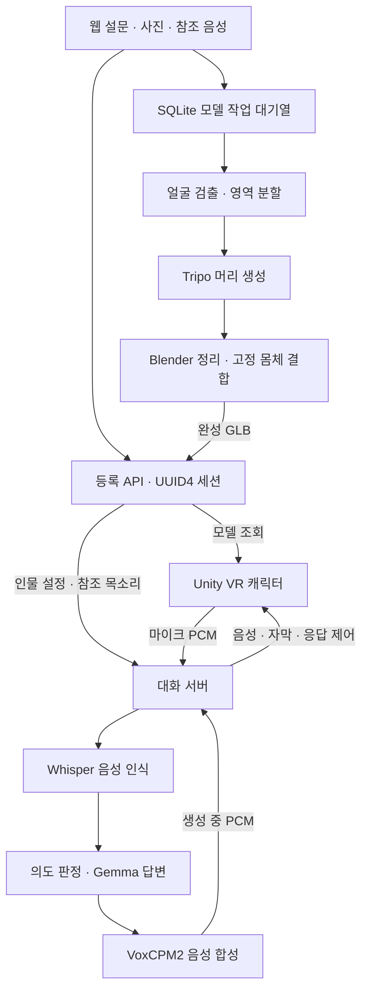

# 다시, 봄 — 프로젝트 기술 개요

대화·모델 제작 코드 대조 기준: 2026-10-01, `hj` 코드(`0d41f937`까지).
Scene_2 그래픽 기준: 2026-10-08, `main`의 `21aa7521`까지. 서버 보관 기준일은 2026-10-03이다.
웹 등록·3D 생성은 체험 전 준비 과정이고, 음성 대화는 체험 중 실시간 처리 과정이다.
운영 확인 날짜와 실제 검사 범위는 [현재 구현 현황](현재_구현_현황.md)을 따른다.

## 1. 전체 연결

## 2. 웹 등록과 인물 설정

HTML·JavaScript 화면과 Python FastAPI 서버가 설문·참조 음성·선택 사진을 받는다.
설문 v2는 성격·관계·말투를 `persona`, 추억과 사실을 `knowledge`, 추가 대화 조건을 `rules`로 구성한다.
설문을 수정하면 미리보기와 확인 상태를 무효화하고, 등록 시 버전을 검사해 이전 설정이 제출되지 않게 한다.

`POST /publish_direct`는 음성을 24kHz 모노 PCM WAV로 변환하고 등록 API의 `/session/start`에 전달한다.
등록 서버가 UUID4를 발급하며 기존 인물 ID를 지정해 덮어쓰는 요청은 거부한다.
사진이 있으면 별도 작업 대기열에 넣는다. 사진 선택만으로 생성하지 않으며 사진이 없으면 인물만 등록한다.
인물 설정은 API로 조회하고 `revision`·`voice_sha256`으로 자료 버전과 참조 음성 일치를 확인한다.

구현: [Web/app.py](../Web/app.py), [설문 변환](../Web/survey_v2.py), [등록 API](../Server/registration/app.py).

## 3. 머리 생성과 고정 몸체

InsightFace로 얼굴 위치를 찾고 MediaPipe 의미 분할로 얼굴·머리카락·목을 남긴다.
옷·배경·어깨를 제거한 이미지를 Tripo에 보내 텍스처가 포함된 머리 GLB를 받는다.
Blender가 잔여 의상과 목 아래를 정리하고, 준비된 몸체의 목 위치에 맞춰 크기·방향을 보정한다.
현재 의상 판정은 밝기·채도를 함께 사용하며 목 단면으로 절단 높이를 검산한다.

몸체는 기존 Human 자산과 뼈대를 재사용하고 머리 정점들을 지정 머리 본에 연결한다.
`tools/body_prep.py`는 FBX의 센티미터 배율을 적용하고 재질을 연결해 몸체 GLB를 준비한다.
최종 결합 GLB에는 메시·재질·텍스처·skin을 포함하며 애니메이션 클립은 제외한다.
동작은 Unity에서 연결한다. 얼굴 표정 리그·립싱크·머리카락 물리의 자동 생성은 없다.

운영 요청 기본값은 `v3.1-20260211`, 머리 생성 면 수 제한 50,000, standard 형상·detailed 텍스처다.
P2 최고사양 실험은 별도다. 작업자 전신 대체 경로는 제거됐고, 몸체·Blender·전처리 준비물이 없으면 실패한다.
세부 설정·흰머리 등 품질 한계: [머리 파이프라인](Tripo_머리_생성_파이프라인.md).

## 4. Unity 캐릭터와 애니메이션

Unity 2022.3.62f2·C# 기반이며 런타임 GLB 로딩은 glTFast를 사용한다.
Meta XR·OpenXR 관련 패키지가 포함돼 있다. 서버의 모델과 Unity에서 사용할 동작 자산을 분리한다.

`PersonaSpawner`가 모델을 받아 두고 `체험 시작`에 맞춰 표시한다. `PersonaHumanoid`는 고정 몸체의
본 이름·기준 자세를 Unity Humanoid에 대응시키며, `PersonaArrival`이 Mixamo 클립을 재생한다.
PlayableGraph로 동작을 섞고 코드가 경로 이동·회전을 제어한다. Animator Root Motion은 끈다.

현재 Scene_2는 `Idle → Catwalk → Waving → Catwalk → 의자 방향 정렬 → 착석 → Sitting Idle`로 진행한다.
걷기·정지 속도에 따라 Idle/Walk 비율을 조절한다. 경로와 인사 지점은 편집 도구에서 직접 그린다.
이동·인사·회전 중 높이는 고정하며 자동 신발 바닥 추종은 제거했다.

착석 후 실제 음성 재생에 맞춰 Sitting Talking을 평균 25%로 선택하되 연속 선택은 막는다.
상체 마스크를 적용하고 같은 답변의 조각·재개에는 재추첨하지 않는다.
설정·문제 해결: [Persona 가이드](../Assets/Scripts/Persona/README.md).

### 4-1. Scene_2 카페와 창밖

카페는 URP의 베이크된 간접광, 자연광·실내광, 약한 색 보정과 Bloom을 사용한다.
근경은 실제 3D 포장 바닥·담장·화단·소품이므로 눈 위치나 고개를 옮기면 상대 위치가 달라진다.
먼 수목은 전체 수관·줄기·밑동이 담긴 알파 PNG를 반경 30m의 세 곡면 메시에 배치한다.
각 메시의 120도 범위와 UV를 이어 한 둘레로 구성하며, 투명 아래 여백을 읽어 밑동을 지면에 맞춘다.
먼 수목은 입체 나무 모델이 아니며, 하늘은 Unity Procedural Skybox다.

정면 큰 창과 왼쪽 타원 창은 서로 다른 평면의 실시간 반사를 사용한다.
관찰자의 뷰·투영 행렬을 실제 평면에 대칭시키므로 반사 속 실내를 임의로 넓히거나 굴절시키지 않는다.
앞 창은 사용자가 승인한 매우 약한 반사를 유지하고, 타원 창에는 옅은 실내 반사를 남겼다.
타원 창 뒤의 원래 막힌 벽은 Scene_2 전용 메시로 복제해 두 개구부를 만들었다. 판매자 원본은 보존한다.
좌·우 눈의 반사 텍스처를 분리하며 해상도는 평면당 눈별 512다. 실내 큐브맵은 다른 소품 반사에 사용한다.

설정·부분 적용 메뉴와 검사 범위는 [현재 그래픽 현황](현재_구현_현황.md#scene_2-그래픽-현재-설정),
이미지와 지면 정렬은 [수목 제작 기록](Scene2_수목_이미지_제작.md)을 따른다.
기하 검사와 고정 카메라 촬영은 확인했으며 최종 HMD의 양안 표시·프레임 시간·플레이어 빌드 검사는 남아 있다.

## 5. 음성 인식과 인물에 맞는 답변

Unity는 16kHz 모노 PCM16 마이크 입력을 WebSocket `/dialogue`로 전송한다.
WebRTC VAD로 발화 후보를 찾고 CPU Silero와 전사 내용 검사로 입력을 검증한다.
Whisper large-v3가 GPU에서 모인 발화 구간을 한국어 텍스트로 바꾼다. 현재 음성 감정 분류 기능은 없다.

Gemma 4 31B QAT는 공통 규칙·인물 설정·사전 지식·최근 대화·핵심 기억·현재 질문으로 답변한다.
일반/추론은 같은 모델의 thinking 설정 차이다. 인물별 설정을 프롬프트에 조립하는 방식이다.
등록 체험에는 떠난 사람을 기억으로 다시 만나는 전제를 추가한다. 개별 사망 원인·시점은 선택 입력이다.
API 호환 이름 `exaone`을 실제 실행 모델명으로 설명하지 않는다.

구조·프로토콜: [서버 음성 대화](서버_음성대화_구조.md).

## 6. 참조 목소리와 스트리밍

VoxCPM2가 등록 음성을 참조해 목소리 특징을 준비하고 답변을 합성한다.
LLM의 첫 구절부터 합성을 요청하며, 같은 구절의 음성이 완성되기 전부터 PCM을 보낸다.
출력은 Unity에 맞춘 24kHz 모노 PCM16이다. 음성 버퍼와 자막을 같은 응답 ID로 관리한다.

추론이 길어질 때는 미리 합성해 둔 인물별 짧은 대기 반응을 한 번 재생한다.
대기 반응을 본답변의 핵심 기억에 넣지 않으며 첫 리액션 시간과 첫 본답변 시간을 따로 측정한다.
현재 운영·참조 음성 기준: [TTS 인계](TTS_작업인계_20260918.md), [대기 리액션](캐릭터_대기_리액션.md).

## 7. 끼어들기와 대화 기억

`semantic_v1`은 실제 발화로 확인된 입력을 바탕으로 재개·수정·주제 전환·대기·되묻기를 판단한다.
Unity가 실제로 멈춘 지점을 서버에 보고하고 응답 ID·재생 커서를 맞춘다.
이미 생성됐어도 사용자가 듣지 않은 답변을 전달된 내용으로 기록하지 않는다.

`session_memory_v1`은 같은 연결 안에서 최근 원문 최대 60개 메시지와 핵심 기억 최대 48개를 관리한다.
사용자 원문 근거를 저장하고, 정정은 갱신하며, 삭제는 관련 원문·핵심 기억·요약·대기열에 함께 적용한다.
연결 종료·초기화 후 복원하는 영구 대화 메모리는 구현하지 않았다.

| 데이터 | 관리 범위 |
|---|---|
| 연결별 대화 기억 | 서버 메모리. 기억 삭제·reset·close 대상 |
| 설문·사진·참조 음성·GLB | 웹·등록 서비스의 DB·파일. 별도 등록 자료 삭제 경로 |
| 등록 인물의 대기 리액션 | 생성 대사·복제 PCM 디스크 캐시. 만료 규칙 적용, 등록 삭제와 자동 연동 없음 |
| 화면 기록·진단 자료 | 대화 기억 삭제와 별도 범위 |

삭제의 실제 범위: [대화 메모리](대화_메모리.md). 전체 자료가 체험 종료와 함께 사라진다고 설명하지 않는다.

## 8. 서비스 분리와 실패 복구

웹 8500·등록 8000·Tripo 작업자는 `~/webapp`, 대화 8002·TTS 8003은 `~/capstone-server` 영역이다.
LLM은 별도 8001 프로세스이며 이전 Qwen 8004는 운영에서 사용하지 않는다.
AI 추론은 서버에서 수행하고 Unity는 VR 화면·캐릭터·마이크·음성 재생을 담당한다.
등록·모델은 HTTP, 실시간 음성과 제어 신호는 WebSocket으로 연결한다.

SQLite 대기열은 작업 소유권과 heartbeat를 관리한다. 단계별 파일·해시·외부 task ID를 저장해 복구한다.
조회·다운로드의 일시적 오류는 재시도하지만 유료 생성 POST는 자동 재제출하지 않는다.
등록 서버가 완성 GLB를 받은 뒤에만 `ready`로 표시한다.

이 프로젝트에서 구현한 연결 부분은 설문 변환·세션 계약, 모델 작업 복구, 머리·몸체 결합,
Humanoid 매핑·경로 연출, 음성 스트리밍·재생 확인, 의미 기반 끼어들기, 연결별 기억·삭제다.
사용한 AI 모델·외부 생성 API의 기능과 프로젝트에서 구현한 제어 코드를 구분해 설명한다.

## 9. 설명과 검증의 범위

- 모델 생성 완료는 닮음·머리카락·목 이음새의 품질 승인을 뜻하지 않는다.
- 전체 모의 검사, 실제 모델 호출, Unity Play, VR 장치 체험의 결과는 각각 구분한다.
- 과거 Qwen 지연·청취 결과를 현재 VoxCPM2의 측정값으로 바꾸지 않는다.
- 얼굴 유사도 백분율·치료 효과·전체 운영비처럼 추가 근거가 필요한 수치는 검증된 기술 성과로 단정하지 않는다.
- 10월 1일 문서 갱신은 코드 대조이며 새로운 유료 생성·서버 배포·VR 장치 검사를 포함하지 않는다.
- 10월 8일 그래픽 문서 갱신은 로컬 코드·자산과 기존 검사 기록 대조다. 운영 서비스를 재개하지 않았다.
