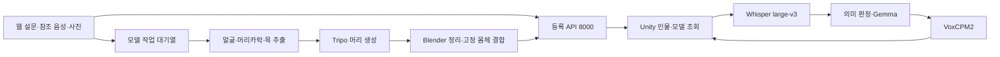

# 현재 구현과 검증 현황

기준일: **2026-10-01**. 현재 `hj` 코드(`0d41f937`까지)와 문서를 대조했다.
`jw`의 Scene_2 캐릭터 입장·애니메이션 변경(`b9151359`)과 `hj`의 머리 파이프라인 후속 수정이 포함돼 있다.
이 문서는 현재 운영 안내의 출발점이다. 날짜가 붙은 실험 문서의 수치·한계는 당시 기록으로 읽는다.
문서 수정이나 Git 머지가 서버 배포·실제 생성·VR 체험 검증을 대신하지 않는다.
기술 흐름을 처음 읽을 때는 [프로젝트 기술 개요](프로젝트_기술_개요.md)를 함께 본다.

## 1. 현재 두 경로

| 영역 | 현재 구현 | 운영·사용 문서 |
|---|---|---|
| 등록 웹 | 설문 v2, 단일 화자 참조 파일, 선택 사진, `/publish_direct`, 서버 발급 UUID4 | [웹 사용법](../Web/README.md), [설문 v2](웹_설문_v2_사용법.md) |
| 3D 제작 | 머리 생성 후 고정 몸체와 결합. 리그 보존·클립 미포함 GLB, 동작은 Unity에서 연결 | [머리 생성 파이프라인](Tripo_머리_생성_파이프라인.md) |
| STT·입력 판정 | Whisper large-v3 CUDA/float16, VAD, 음성 감정 분류 없음 | [Whisper 전환](Whisper_STT_전환.md) |
| 대화 | Gemma 4 31B QAT, 일반/추론 thinking 설정, `semantic_v1`, 연결별 기억 | [서버 구조](서버_음성대화_구조.md) |
| 음성 출력 | VoxCPM2, `reference_audio`, `generation_pcm`, Unity에는 24kHz 모노 PCM16 | [TTS 인계](TTS_작업인계_20260918.md) |
| Unity | 2022.3.62f2, 대화 `AI_Response_Test`, 기존 전신 모델 `Tripo_Model_Test`, 등록 체험 `Scene_2` | [AI 씬](AI_응답_테스트_씬.md), [모델 검사](Tripo_모델_테스트_씬.md) |

사진을 선택하는 것만으로 생성하지 않는다. 설문·참조 음성·인물 확인을 마치고 **세션 시작**을 누르면
사진이 있는 등록을 모델 작업으로 접수한다. 사진이 없으면 인물만 등록한다.
음성·설문 없이 사진만 받는 독립 `/tripo/jobs` 제작 웹은 아직 설계안이다.

### 9월 30일 Scene_2 작업 정리

- 하이라이키를 역할별로 묶고 시험용 Human을 정리했다. 현재 인물은 서버 모델을 로드해 사용한다.
- 고정 Human 몸체의 본과 손가락을 Humanoid에 연결하고, 팔 기준 자세와 발목 보정을 적용했다.
- `체험 시작`으로 모델 표시와 입장 연출을 시작한다. 종료하면 숨기고, 같은 인물로 다시 시작할 수 있다.
- `Idle → Catwalk → Waving → Catwalk → 방향 정렬 → Sitting Idle`로 연결한다.
  이동 경로와 인사 위치는 `Tools > Persona > 이동 경로 그리기`에서 직접 지정한다.
- NPC 답변에서 Sitting Talking을 평균 25%로 선택하되 연속 답변에는 선택하지 않는다.
- 이동·정지·인사 동안 캐릭터 높이는 고정한다. 몸 전체가 위아래로 튀던 바닥 자동 추종은 제거했다.
- `Scale Multiplier`는 몸체·얼굴 전체 배율, `Seated Head Lift Deg`는 앉은 고개 보정이다.
  Scene_2의 현재 값은 각각 1.2와 15도다. Play 중 리깅은 `Tools > Persona > 리깅 보기`에서 확인한다.

코드·메뉴·설정과 단계별 검사는 [머리 파이프라인 7장](Tripo_머리_생성_파이프라인.md#7-고정-몸체의-애니메이션-연결--2026-09-30)을 따른다.

### 9월 30일 hj 후속 수정 — 10월 1일 코드 대조

- 전신 생성·T포즈·Tripo 리깅으로 이어지는 작업자 경로를 제거했다. 몸체 GLB·Blender 누락은 명시적인 실패이며,
  `TRIPO_PIPELINE`·`TRIPO_TPOSE`·`TRIPO_FACE_TRANSPLANT`·`TRIPO_POSE`로 이전 경로를 선택할 수 없다.
- `tools/body_prep.py`로 고정 Human의 FBX 배율과 재질을 정리한다. 결합 GLB는 뼈대를 보존하고
  불필요한 내장 애니메이션을 제외한다. 체험 동작은 Unity의 Mixamo 클립에서 온다.
- `7bfcbd19`: Tripo 조회·다운로드의 일시적 HTTP·네트워크 오류를 재시도한다. 작업 ID는 보존하며
  유료 생성 POST는 자동 재시도하지 않는다. 조회는 30분 제한, 다운로드는 최대 5회다.
- `0d41f937`: 의상 제거 시 밝기와 채도를 함께 보고 목 단면을 절단 높이의 상한으로 사용한다.
  밝은 피부를 흰 옷으로 분류해 얼굴까지 잘라내던 문제를 보정했다. 흰머리 표본 검증은 남아 있다.

위 두 커밋에는 배포·기존 작업 회수 기록이 있다. 이번 문서 점검에서는 코드와 기록을 확인했으며
새 유료 생성·서버 배포·시각 품질 실험을 수행한 것으로 해석하지 않는다.

## 2. 서버에서 확인한 상태

2026-09-29 읽기 전용 확인이다. 신규 등록·유료 생성·서비스 재시작은 수행하지 않았다.

| 대상 | 위치·포트 | 확인 결과 |
|---|---|---|
| 웹 | `~/webapp`, 8500 | 외부 PC와 서버 내부에서 HTTP 200, 등록·사진 입력·상태 조회 연결 |
| 등록 | `~/webapp/Server/registration`, 8000 | `/health` ready |
| Tripo 작업자 | `~/venv/tripo`, 별도 프로세스 | online/configured, 실제 `head` 설정, 고정 결과 대체용 `MODEL_FIXTURE_GLB` 비활성 |
| 머리 처리 준비물 | 웹 영역의 별도 모델·도구 파일 | 몸체 GLB·목/머리 본·분할 모델·얼굴 검출 가중치 확인, Blender 5.0.1 실행 및 Python 의존성 import 성공 |
| 대화 | `~/capstone-server`, 8002 | 17:03 KST `/health` ready, `tts_ready=true`, `gemma4_dialogue_v3` |
| LLM | 8001 | 실행 인자에서 `gemma-4-31B-qat` 확인. API 호환 이름은 `exaone` |
| TTS | 8003 loopback, 기존 `qwentts` venv | 17:03 KST VoxCPM2 ready, `reference_audio`, `generation_pcm` |
| 이전 Qwen 엔진 | 8004 | 운영에서 사용하지 않음. 복구 환경 보존 |

Tripo 웹·작업자·Blender 관련 핵심 소스 8개의 해시를 병합 대상과 대조했다.
작업자는 해당 소스 배포 뒤 시작된 프로세스다.
**이 확인 당시 작업 DB의 성공 22건은 이전 전신 경로였으며, 새 `head` 경로의 웹 등록→완료 기록은 없었다.**
준비 상태와 전체 생성 성공을 구분한다. 실제 얼굴 유사도·목 이음새·머리카락·애니메이션 품질도 별도 검수가 필요하다.

9월 30일 **18:36 KST**에는 사용자가 웹에서 시작한 새 등록의 서버 상태를 읽기 전용으로 확인했다.
확인 중 `processing`·모델 미준비에서 `ready`·`has_model=true`로 바뀌었고 오류는 없었다.
이는 모델 작업 완료와 등록 API 전달 확인이다. 새 결과의 외관 품질·해당 새 인물의 Unity/VR 체험은 별도다.
확인 과정에서 등록·생성 요청을 추가하거나 서버를 재시작하지 않았다.

## 3. 최신 검사와 남은 범위

10월 1일 문서 최신화에서 현재 코드의 전체 모의 검사를 실행했다.

- **570개 통과, 건너뜀 0개** — 하네스 195, 서버 302, 작업자 16, 웹 57.
- 명령: `python tools/check.py --area all --python tools/_work/check_env_20260913/Scripts/python.exe`.
- 결과: `tools/_work/checks/20261001T110001Z-all-866ce2a2/report.json`.
- 이번 변경은 문서와 `Web/.env.example`의 설명 주석이다. 설정값·제품 코드는 바꾸지 않았다.
  실제 서버 배포·유료 API 생성·Unity 실행·VR 장치 검사를 새로 수행한 것은 아니다.

아래는 9월 30일의 모의 검사·Unity Play 기록이다.

- 9월 30일 전체 모의 검사: **565개 통과, 건너뜀 0개** — 하네스 195, 서버 302, 작업자 11, 웹 57.
- 명령: `python tools/check.py --area all --python tools/_work/check_env_20260913/Scripts/python.exe`.
  환경 선택은 [하네스](AI_하네스.md)를 따른다. 결과: `tools/_work/checks/20260930T092230Z-all-75b3fdee/report.json`.
- Unity **Capstone-Design**, `Scene_2`: 컴파일 오류 없음, 누락 스크립트·깨진 프리팹 0개.
- 고정 FBX·GLB의 14개 동작 검사, 경로 그리기·인사 지점·Undo와 대화 제스처 선택 검사를 통과했다.
- 현재 생성 캐릭터의 실제 Play에서 인사 1회 후 착석까지 확인했다. 자동 바닥 추종 제거 후
  이동·정지·인사·회전 357회 관측에서 루트 Y 변화는 0m였다.
- Play 검사의 음성 연결은 비활성화 또는 로컬 모의 PCM이다. 플레이어 빌드·운영 마이크/TTS·VR 장치 검사는 별도다.
- 결과는 `tools/_work/foot_contact_removed_20260930/`, `foot_contact_20260930/`,
  `path_greeting_20260930/`, `sitting_talk_20260930/`에 기록했다. 이 폴더들은 Git 제외다.
- VoxCPM2 전환 당시 합성·취소 후 복구 기록은 [9월 18일 인계](TTS_작업인계_20260918.md) 6장이다.
  과거 Qwen 청취·지연 수치를 현재 Vox 품질이나 지연으로 바꾸어 해석하지 않는다.

문서와 코드를 대조하며 확인한 구현상의 제한도 있다.

- 워커의 `TRIPO_FACE_LIMIT=auto`는 인수를 생략하지만 클라이언트 기본값 때문에 실제 요청에
  `50000`이 들어간다. [머리 설정 문서](Tripo_머리_생성_파이프라인.md) 3장을 따른다.
- 기존 인계 ZIP 도구는 새 머리 처리 파일 일부를 포함하지 않는다. 최신 Git clone과 별도 자산을
  사용하며 [개발환경 가이드](Tripo_개발환경_실행가이드.md) 1장의 포함 범위를 확인한다.

이 두 항목은 이번에 문서로 기록했으며 구현을 수정하거나 운영 설정을 바꾸지 않았다.

## 4. 문서를 읽는 순서

| 목적 | 기준 문서 |
|---|---|
| 작업 범위·안전한 협업 | [AGENTS.md](../AGENTS.md) |
| 웹·3D·VR·음성·기억의 전체 기술 흐름 | [프로젝트 기술 개요](프로젝트_기술_개요.md) |
| 코드 검사·결과 파일 | [AI 하네스](AI_하네스.md) |
| 웹·등록·Tripo·대화 서비스 경계 | [서비스 분리](웹_Tripo_대화AI_서비스_분리.md), [서버 운영](../Server/README.md) |
| 머리 생성·몸체 결합 개발 | [머리 파이프라인](Tripo_머리_생성_파이프라인.md), [팀원 지시서](Tripo_팀원_AI_작업지시서.md), [실행 가이드](Tripo_개발환경_실행가이드.md) |
| 대화 개발·참조 음성 품질 | [대화 AI 가이드](대화_AI_개발가이드.md), [TTS 인계](TTS_작업인계_20260918.md) |
| 이전 실험·기각 이유 | [Tripo 얼굴 조사](Tripo_얼굴_품질_조사_20260927.md), [Qwen 스트리밍 기록](TTS_실시간_스트리밍.md), [Raon 보관](Raon_작업이력_보관.md) |

`설문_인물_3D_통합_설계안.md`와 팀원 지시서의 독립 제작 API는 미구현 제안을 포함한다.
`docs/voice_clone_studio/`는 별도 프로젝트의 보존 문서다. `tools/prompts/`는 비교 실험 입력이므로
문서 최신화를 이유로 내용을 바꾸지 않는다. `tools/_work/` 결과는 Git에 포함되지 않아 새 clone에 없을 수 있다.
