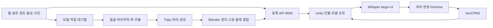

# 현재 구현과 검증 현황

운영 상태 기준일: **2026-10-03**. 프로젝트 서비스 6개를 종료했으며 같은 환경으로 재개할 수 있도록 보관했다.
재개 명령과 보관·검사 기록은 [프로젝트 보관과 재시작](프로젝트_보관_재시작_20261003.md)을 따른다.
같은 날 `hj`가 `jw`의 모든 작업을 포함함을 확인했고, 남은 애니메이션 메타데이터를 Unity에서 검증했다.
원격·`main` 반영 기준은 [브랜치 최종 정리](브랜치_최종정리_20261003.md)에 있다.
기능 코드 대조 기준은 **2026-10-01**, `hj` 코드(`0d41f937`까지)다.
`jw`의 Scene_2 캐릭터 입장·애니메이션 변경(`b9151359`)과 `hj`의 머리 파이프라인 후속 수정이 포함돼 있다.
이 문서는 현재 운영 안내의 출발점이다. 날짜가 붙은 실험 문서의 수치·한계는 당시 기록으로 읽는다.
문서 수정이나 Git 머지가 서버 배포·실제 생성·VR 체험 검증을 대신하지 않는다.
기술 흐름을 처음 읽을 때는 [프로젝트 기술 개요](프로젝트_기술_개요.md)를 함께 본다.
2026-10-07에는 사용자 요청으로 로컬 `main`의 Scene_2 배경·조명·재질을 조정했고, 10월 8일에는 실제 VR 피드백에 따라 창 유리와 창밖을 수정했다. 아래 그래픽 기록은 서버 운영 기준일과 별개다.

## 1. 현재 두 경로

| 영역 | 현재 구현 | 운영·사용 문서 |
|---|---|---|
| 등록 웹 | 설문 v2, 단일 화자 참조 파일, 선택 사진, `/publish_direct`, 서버 발급 UUID4 | [웹 사용법](../Web/README.md), [설문 v2](웹_설문_v2_사용법.md) |
| 3D 제작 | 머리 생성 후 고정 몸체와 결합. 리그 보존·클립 미포함 GLB, 동작은 Unity에서 연결 | [머리 생성 파이프라인](Tripo_머리_생성_파이프라인.md) |
| STT·입력 판정 | Whisper large-v3 CUDA/float16, VAD, 음성 감정 분류 없음 | [Whisper 전환](Whisper_STT_전환.md) |
| 대화 | Gemma 4 31B QAT, 일반/추론 thinking 설정, `semantic_v1`, 연결별 기억 | [서버 구조](서버_음성대화_구조.md) |
| 음성 출력 | VoxCPM2, `reference_audio`, `generation_pcm`, Unity에는 24kHz 모노 PCM16 | [TTS 인계](TTS_작업인계_20260918.md) |
| Unity | 2022.3.62f2, 대화 `AI_Response_Test`, 기존 전신 모델 `Tripo_Model_Test`, 등록 체험 `Scene_2` | [AI 씬](AI_응답_테스트_씬.md), [모델 검사](Tripo_모델_테스트_씬.md) |

사진을 선택하는 것만으로 생성하지 않는다. 설문·참조 음성·인물 확인을 마치고 **세션 시작**을 누르면
사진이 있는 등록을 모델 작업으로 접수한다. 사진이 없으면 인물만 등록한다.
음성·설문 없이 사진만 받는 독립 `/tripo/jobs` 제작 웹은 아직 설계안이다.

### 9월 30일 Scene_2 작업 정리

- 하이라이키를 역할별로 묶고 시험용 Human을 정리했다. 현재 인물은 서버 모델을 로드해 사용한다.
- 고정 Human 몸체의 본과 손가락을 Humanoid에 연결하고, 팔 기준 자세와 발목 보정을 적용했다.
- `체험 시작`으로 모델 표시와 입장 연출을 시작한다. 종료하면 숨기고, 같은 인물로 다시 시작할 수 있다.
- `Idle → Catwalk → Waving → Catwalk → 방향 정렬 → Sitting Idle`로 연결한다.
  이동 경로와 인사 위치는 `Tools > Persona > 이동 경로 그리기`에서 직접 지정한다.
- NPC 답변에서 Sitting Talking을 평균 25%로 선택하되 연속 답변에는 선택하지 않는다.
- 이동·정지·인사 동안 캐릭터 높이는 고정한다. 몸 전체가 위아래로 튀던 바닥 자동 추종은 제거했다.
- `Scale Multiplier`는 몸체·얼굴 전체 배율, `Seated Head Lift Deg`는 앉은 고개 보정이다.
  Scene_2의 현재 값은 각각 1.2와 15도다. Play 중 리깅은 `Tools > Persona > 리깅 보기`에서 확인한다.

코드·메뉴·설정과 단계별 검사는 [머리 파이프라인 7장](Tripo_머리_생성_파이프라인.md#7-고정-몸체의-애니메이션-연결--2026-09-30)을 따른다.

### 10월 7일 Scene_2 자연광·재질 개선

- 전국 대회 시연 영상을 위해 배경을 자연스러운 낮의 카페로 조정했다. COZY 날씨 오브젝트는 비활성화하고
  기존 카페 패키지의 HDR 하늘을 Scene_2 전용 재질로 복제했다. 원본 날씨 프로필·판매자 재질은 보존했다.
- 창가의 5500K Mixed 광원과 3400K 실내 조명을 구성했다. 고정된 실내 조명 16개는 Baked로 전환했고
  CPU Progressive 베이크로 간접광을 저장했다. 현재 라이트맵은 1개이며 캐릭터 동선에 프로브 140개를 추가했다.
- 목재·바닥·식물·포장재 등의 광택을 낮추고, 유리는 URP Lit의 Alpha + Preserve Specular 블렌딩으로
  투과와 반사를 분리했다. 조정한 재질 17개는 `Assets/Graphics/Scene2/Materials/`에 있고 Scene_2에서만 사용한다.
- 실내 반사 프로브를 추가하고 기존 고해상도 프로브는 256으로 줄여 다시 베이크했다.
  거울은 정적 큐브맵 반사다. 움직이는 캐릭터나 사용자의 모습이 실시간으로 거울에 나타나는 기능은 구현하지 않았다.
- VR 카메라에 Neutral 톤매핑·약한 색 보정과 Bloom을 연결했다. 눈높이·리그·캐릭터 경로는 변경하지 않았다.
  인물 모델, 대화 설정, 음성에 반응하는 인물 빛과 서버 운영 상태는 보존했다.
- 조명 데이터는 `Assets/Scenes/Scene_2/`, 전용 설정은 `Assets/Graphics/Scene2/`에 저장했다.
  전역 URP 품질·패키지는 변경하지 않았다.

편집 도구는 `Assets/Editor/Scene2NaturalLighting.cs`, 비교 촬영은 `Scene2GraphicsCapture.cs`다.
Unity의 `Tools > 다시봄 > 그래픽`에서 다음 순서로 사용한다.

1. `자연광·재질 적용`: Scene_2의 전용 설정을 적용하고 저장한다. 수동 재질 조정값도 이 프리셋으로 다시 맞춘다.
2. `실내 조명 베이크 시작`: 비동기로 간접광을 계산한다. 베이크가 끝난 뒤 다음 단계를 실행한다.
3. `실내 반사 베이크·저장`: 실내 큐브맵을 계산하고 씬·자산을 저장한다.
4. `변경 후 촬영·검사`: 입구·계산대·좌석의 고정 구도를 촬영한다. `완성된 카페 보기`로 Scene View도 확인할 수 있다.

촬영·검사 결과는 Git 제외 폴더 `tools/_work/graphics_20261007/`에 저장한다.
변경 전·후는 같은 위치, 눈높이 1.35m, FOV 70도, 1280×720으로 비교했다.
운영 인물 자료·대화 연결 설정·API 키는 그래픽 검사 보고서에 넣지 않는다.

### 10월 8일 Scene_2 창 유리·창밖 초기 수정

- 사용자가 VR에서 창 유리의 내부 풍경 반사 위치가 맞지 않고 너무 진하며, 창밖 바닥과 거리 분위기가
  카페에 맞지 않는다고 확인했다. 기존 유리의 `Preserve Specular`가 반사를 알파와 별개로 유지하고,
  큰 평면 창에 실내 큐브맵을 사용해 공간이 왜곡돼 보이는 설정을 수정했다.
- 출입문·앞쪽 창 유리 3곳을 진열장과 분리해 `WindowGlass.mat`을 사용한다. URP Lit Alpha,
  알파 0.03, `Preserve Specular` 꺼짐, `Environment Reflections` 꺼짐, Renderer의 반사 프로브 사용 꺼짐이다.
  창에는 굴절·왜곡 효과를 추가하지 않았고, 곡면 진열장·유리병 재질은 기존 반사를 유지한다.
- 거리 사진으로 둘러싼 하늘을 Unity 기본 Procedural Skybox로 바꿨다. 창밖 근경은
  `04_카페 배경/카페 앞 정원`의 실제 3D 바닥·담장·화단·식물·야외 테이블로 구성했다.
  공개 카페 소품과 보유 노이즈 텍스처를 재사용했으며 사진이나 새 캐릭터 모델을 생성하지 않았다.
  석재 포장의 상단은 기존 테라스와 같은 약 y=0.0004m이다. 좌우 눈 위치와 고개 이동에 따라 근경의 위치가 달라진다.
- CPU Progressive 간접광과 실내 반사를 다시 베이크했다. 라이트맵은 1개, 프로브는 1691개다.
  실내 벽의 거울은 기존 정적 큐브맵 방식이며 실제 평면·실시간 인물 반사는 아니다.
- 사용자가 직접 바꿨다고 확인한 실내 테이블 4개의 배치를 보존했다. 기존 대화 MonoBehaviour와
  XR 설정, 캐릭터 모델·동작은 변경하지 않았다. 서버는 보관 상태를 유지한다.

`Scene2Courtyard.cs`가 창밖을 구성한다. `자연광·재질 적용`에도 새 하늘·마당·창 유리 설정을 연결해
재실행 시 거리 사진과 강한 창 반사가 복원되지 않게 했다. 부분 수정 메뉴는 `창 유리 반사 수정`,
`창밖 마당 적용`이고, 이후 `실내 조명 베이크 시작 → 실내 반사 베이크·저장` 순서로 다시 굽는다.

검사·촬영 결과는 Git 제외 폴더 `tools/_work/graphics_20261008/`에 저장했다.
입구·계산대·좌석과 함께 창 근처 1.55m 눈높이, 눈 간격 64mm, 고개 이동 0.5m, 서 있는 구도 1.7m를
같은 FOV 70도·1280×720으로 촬영했다. `comparison.html`에서 전후를 비교할 수 있다.
사용자 테이블 조정으로 촬영 사이의 배치도 달라졌으므로 배경·유리 비교와 배치 비교를 구분한다.

Unity Editor 컴파일·씬 검사(누락 스크립트 0, 깨진 프리팹 0)를 통과했다.
대화 하네스는 509개 통과·건너뜀 0이며 결과는
`tools/_work/checks/20261008T054230Z-dialogue-dd7967dd/report.json`이다.
수정 후 실제 HMD 렌더링·렌즈·프레임 시간, 플레이어 빌드와 캐릭터 입장 경로는 아직 검사하지 않았다.
고정 카메라·눈 위치를 옮긴 Editor 촬영을 실제 VR 재검증으로 보고하지 않는다.
소스·문서의 공백 검사는 통과했다. Unity가 생성한 씬·재질·메타의 빈 필드에서
`git diff --check` 공백 경고 130개가 남아 있으며, 이를 없애기 위해 직렬화 파일을 수동 편집하지 않았다.

### 10월 8일 후속 — 평면 반사와 타원 창의 실제 외부 시야

사용자가 말한 왜곡은 유리 자체의 굴절이 아니라 **반사 속 실내가 실제보다 넓게 보이는 현상**이었다.
초기 수정의 반사 제거만으로는 그 의도를 충족하지 못해 아래 구성으로 대체했다.
적용 도중 사용자는 왜곡이 없어졌다고 확인했다. 이후 반사가 강한 곳을 왼쪽 벽의 타원형 표면으로 특정했고,
정면의 큰 창 유리는 현재 상태가 맞다고 확인했다. 이후 타원 창에서 외부가 보이지 않는다는 피드백과
배경 끝이 드러나는 사진에 따라, 왼쪽 벽 개구부와 카페 옆·뒤 배경까지 구성했다.

- 앞 창 2곳과 왼쪽 타원 창 2곳을 실제 평면·관찰자 위치에 맞춘 실시간 반사로 전환했다.
  `CafePlanarReflection.cs`는 눈의 뷰·투영 행렬을 평면에 대칭시키고, 창 너머의 물체는 클립 평면으로 제외한다.
  앞 창과 타원 창은 서로 다른 평면 반사 텍스처를 사용한다. 굴절이나 반사 화각 확대는 사용하지 않는다.
- 창 유리 `WindowGlass`의 정면 반사 계수는 0.006, 비스듬한 각도의 최대값은 0.035, 밝기 계수는 0.6이다.
  바로 전 설정(0.02 × 0.9)에 비해 정면 반사의 선형 밝기 계수를 약 80% 낮췄다.
  유리 색 알파는 0.003이다. 열린 문은 앞 창과 다른 평면이므로 별도 `ClearDoorGlass`로 옅게 표현한다.
  곡면 진열장과 병은 기존 URP 유리 재질을 사용한다.
- 판매자 카페의 타원형 표면은 원래 막힌 벽에 붙인 `Mirror`였다. 반사 강도만 낮추면 벽이 보이므로,
  원본 FBX를 보존하고 Scene_2 전용 벽 메시를 복제해 유리 윤곽에 맞는 두 개구부를 만들었다.
  원본 UV0·UV2를 보간해 벽 질감과 조명이 삼각형 조각마다 끊기는 현상을 방지하고, 벽 두께를 잇는 면도 추가했다.
  왼쪽 유리 `OvalWindowGlass`는 정면 반사 0.075, 비스듬한 최대값 0.16, 밝기 0.8, 유리 색 알파 0.003이다.
  옅은 실내 반사를 남기면서 실제 외부가 투과된다. 밝은 반사 완화는 0.35이며 정면 큰 창의 승인된 강도는 유지한다.
- 현재 OpenXR 설정의 Single Pass Instanced에 맞춰 좌·우 눈의 반사 텍스처·행렬을 분리했다.
  어느 눈에서든 표면이 보일 때 갱신하고, 자기 표면·다른 반사 표면을 반사 렌더링에서 제외해 재귀를 막는다.
  두 평면 모두 눈당 최대 512 해상도다. 컴포넌트 비활성화·씬 종료 시 임시 카메라와 텍스처를 해제한다.
- 창밖은 낮춘 담장, 목재 그늘막과 덩굴, 벤치, 찻잔·주전자, 높이·간격이 다른 식재로 보강했다.
  왼쪽에도 포장 바닥·낮은 담장·높이가 다른 화단과 녹지를 연결했다. 가까운 바닥·식물·소품은 3D다.
  먼 수목만 이미지 생성으로 만든 알파 PNG를 앞·왼쪽·뒤쪽의 곡면 메시에 배치했다. 반경은 26·30·32m이며,
  세 호의 방향을 겹쳐 창에서 배경의 수직 끝과 빈 공간이 드러나지 않게 했다. 하늘은 Procedural Skybox,
  바닥은 기존 테라스와 높이가 이어지는 실제 포장 메시다. 원경 수목은 입체 나무 모델이 아니다.
- CPU Progressive 간접광과 실내 큐브맵을 다시 베이크했다. 큐브맵을 굽는 동안 평면 반사를 잠시 비활성화해
  이전 눈 위치의 화면이 큐브맵에 들어가지 않게 한다. 라이트맵 1개와 프로브 1691개를 유지한다.
  사용자가 옮긴 실내 테이블 4개, 기존 대화 MonoBehaviour, 캐릭터 동작과 XR 설정은 보존했다.

설정 도구는 `Scene2PlanarReflectionSetup.cs`, 개구부 도구는 `Scene2OvalWindowOpenings.cs`,
셰이더는 `CafePlanarSurface.shader`다. 복제 벽의 meta에 원본 메시의 GUID·fileID를 기록해,
개구부를 다시 적용할 때 이미 잘린 메시를 또 자르지 않는다. 원본 자산을 다시 불러와 구성한다.
`평면 반사 적용` 또는 `창 유리 반사 수정`으로 같은 창 구성을 적용한다.
`자연광·재질 적용`에도 연결해 재실행 시 이전 큐브맵 창 반사로 돌아가지 않게 했다.
`평면 반사 기하 검사`, `평면 반사 렌더링 검사`, `타원 창 외부 가시성 검사`를 별도로 제공한다.
벽 개구부·근경을 다시 적용한 경우 조명과 반사 베이크도 다시 실행한다.

검사 결과는 Git 제외 폴더 `tools/_work/graphics_20261008_rework/`에 저장한다.
두 평면·좌우 눈 위치의 기하 표본 8개, 창의 실제 반사 렌더링 표본 12개를 검사했고,
표본의 예상 위치와 렌더링 중심의 최대 차이는 약 1.09픽셀이었다.
배율·상하 방향과 비활성화 후 리소스 해제도 확인했다.
타원 창 두 곳에서 좌·우 눈 위치와 고개 이동을 바꾼 외부 가시성 검사 6개도 통과했다.
실제 벽을 포함한 화면에서 외부 표본 물체가 보였고, 원본 벽 메시로 잠시 대조하면 모두 가려졌다.
Editor 촬영에서 배경 재질 62개는 모두 지원된다. 누락 스크립트·깨진 프리팹은 0개다.
기존 씬 오브젝트 삭제·정원 밖 Transform 변경·기존 MonoBehaviour 변경은 모두 0개다.
`git diff --check`의 새 경고는 Unity가 저장한 씬의 빈 YAML 필드 끝 공백 59곳이며,
소스·문서 공백 검사는 통과했다. 직렬화 파일을 직접 재작성해 경고를 없애지 않았다.
대화 하네스는 509개 통과·건너뜀 0이며 결과는
`tools/_work/checks/20261008T063357Z-dialogue-8df9d06e/report.json`이다.

사용자의 왜곡 개선 확인과 개발자가 실행한 Editor 검사를 구분한다.
개발자가 HMD의 양안 렌더링·프레임 시간이나 플레이어 빌드를 검사한 것은 아니다.
두 반사 평면이 모두 보이면 VR에서 눈별 반사 카메라 렌더링이 추가되므로 최종 장치에서 성능 확인이 필요하다.
운영 서비스와 등록 인물은 재개·교체하지 않았다.

### 9월 30일 hj 후속 수정 — 10월 1일 코드 대조

- 전신 생성·T포즈·Tripo 리깅으로 이어지는 작업자 경로를 제거했다. 몸체 GLB·Blender 누락은 명시적인 실패이며,
  `TRIPO_PIPELINE`·`TRIPO_TPOSE`·`TRIPO_FACE_TRANSPLANT`·`TRIPO_POSE`로 이전 경로를 선택할 수 없다.
- `tools/body_prep.py`로 고정 Human의 FBX 배율과 재질을 정리한다. 결합 GLB는 뼈대를 보존하고
  불필요한 내장 애니메이션을 제외한다. 체험 동작은 Unity의 Mixamo 클립에서 온다.
- `7bfcbd19`: Tripo 조회·다운로드의 일시적 HTTP·네트워크 오류를 재시도한다. 작업 ID는 보존하며
  유료 생성 POST는 자동 재시도하지 않는다. 조회는 30분 제한, 다운로드는 최대 5회다.
- `0d41f937`: 의상 제거 시 밝기와 채도를 함께 보고 목 단면을 절단 높이의 상한으로 사용한다.
  밝은 피부를 흰 옷으로 분류해 얼굴까지 잘라내던 문제를 보정했다. 흰머리 표본 검증은 남아 있다.

위 두 커밋에는 배포·기존 작업 회수 기록이 있다. 이번 문서 점검에서는 코드와 기록을 확인했으며
새 유료 생성·서버 배포·시각 품질 실험을 수행한 것으로 해석하지 않는다.

## 2. 서버에서 확인한 상태

현재 서버 보관 상태는 위 10월 3일 재시작 안내가 기준이다. 아래 표는 종료 전 과거 운영 확인 기록이다.

2026-09-29 읽기 전용 확인이다. 신규 등록·유료 생성·서비스 재시작은 수행하지 않았다.

| 대상 | 위치·포트 | 확인 결과 |
|---|---|---|
| 웹 | `~/webapp`, 8500 | 외부 PC와 서버 내부에서 HTTP 200, 등록·사진 입력·상태 조회 연결 |
| 등록 | `~/webapp/Server/registration`, 8000 | `/health` ready |
| Tripo 작업자 | `~/venv/tripo`, 별도 프로세스 | online/configured, 실제 `head` 설정, 고정 결과 대체용 `MODEL_FIXTURE_GLB` 비활성 |
| 머리 처리 준비물 | 웹 영역의 별도 모델·도구 파일 | 몸체 GLB·목/머리 본·분할 모델·얼굴 검출 가중치 확인, Blender 5.0.1 실행 및 Python 의존성 import 성공 |
| 대화 | `~/capstone-server`, 8002 | 17:03 KST `/health` ready, `tts_ready=true`, `gemma4_dialogue_v3` |
| LLM | 8001 | 실행 인자에서 `gemma-4-31B-qat` 확인. API 호환 이름은 `exaone` |
| TTS | 8003 loopback, 기존 `qwentts` venv | 17:03 KST VoxCPM2 ready, `reference_audio`, `generation_pcm` |
| 이전 Qwen 엔진 | 8004 | 운영에서 사용하지 않음. 복구 환경 보존 |

Tripo 웹·작업자·Blender 관련 핵심 소스 8개의 해시를 병합 대상과 대조했다.
작업자는 해당 소스 배포 뒤 시작된 프로세스다.
**이 확인 당시 작업 DB의 성공 22건은 이전 전신 경로였으며, 새 `head` 경로의 웹 등록→완료 기록은 없었다.**
준비 상태와 전체 생성 성공을 구분한다. 실제 얼굴 유사도·목 이음새·머리카락·애니메이션 품질도 별도 검수가 필요하다.

9월 30일 **18:36 KST**에는 사용자가 웹에서 시작한 새 등록의 서버 상태를 읽기 전용으로 확인했다.
확인 중 `processing`·모델 미준비에서 `ready`·`has_model=true`로 바뀌었고 오류는 없었다.
이는 모델 작업 완료와 등록 API 전달 확인이다. 새 결과의 외관 품질·해당 새 인물의 Unity/VR 체험은 별도다.
확인 과정에서 등록·생성 요청을 추가하거나 서버를 재시작하지 않았다.

## 3. 최신 검사와 남은 범위

10월 7일 그래픽 변경은 정확한 **Capstone-Design / Unity 2022.3.62f2 / Scene_2**에서 확인했다.

- Unity 컴파일 확인, 씬 검사에서 누락 스크립트·깨진 프리팹 0개, 사용 중인 카페 재질의 지원되지 않는 셰이더 0개.
- 기존 씬 오브젝트 삭제 0개, 기존 Transform의 위치·회전·배율 변경 0개, URP 카메라를 제외한 기존 MonoBehaviour 변경 0개.
- 실제 Editor 렌더링으로 입구·계산대·좌석의 변경 전·후 화면과 조명·반사 결과를 확인했다.
- 기본 모의 검사 **509개 통과, 건너뜀 0개** — 하네스 207, 서버 302.
  명령은 `python tools/check.py --area dialogue --python tools/_work/check_env_20260913/Scripts/python.exe`,
  결과는 `tools/_work/checks/20261007T083950Z-dialogue-26c3e01f/report.json`이다.
- `git diff --check`는 Unity가 저장한 빈 YAML 필드의 끝 공백 602곳을 보고한다.
  `value` 594곳, `m_Name`·`m_EditorClassIdentifier` 각 4곳이며, 씬을 직접 재작성해 없애지 않았다.
- 서비스는 재개하지 않았다. AI 테스트 메뉴는 Play Mode·실제 연결을 요구하므로 운영 대화 검사는 수행하지 않았다.
  플레이어 빌드·VR 장치의 양안 렌더링·프레임 시간·새 캐릭터의 체험 품질도 이번 검사에 포함되지 않는다.

10월 3일 최신 전체 모의 검사는 **582개 통과, 건너뜀 0개**다. 실제 서버의 종료→재개→종료도 확인했다.
저장한 6개 서비스의 실행 인자·환경·작업 폴더가 같았고, 외부 PC에서 웹 HTTP 200을 확인한 뒤 최종 종료했다.
결과 파일과 범위는 [보관 기록](프로젝트_보관_재시작_20261003.md#4-종료재시작-검증-기록)에 있다.

10월 1일 문서 최신화에서 현재 코드의 전체 모의 검사를 실행했다.

- **570개 통과, 건너뜀 0개** — 하네스 195, 서버 302, 작업자 16, 웹 57.
- 명령: `python tools/check.py --area all --python tools/_work/check_env_20260913/Scripts/python.exe`.
- 결과: `tools/_work/checks/20261001T110001Z-all-866ce2a2/report.json`.
- 이번 변경은 문서와 `Web/.env.example`의 설명 주석이다. 설정값·제품 코드는 바꾸지 않았다.
  실제 서버 배포·유료 API 생성·Unity 실행·VR 장치 검사를 새로 수행한 것은 아니다.

아래는 9월 30일의 모의 검사·Unity Play 기록이다.

- 9월 30일 전체 모의 검사: **565개 통과, 건너뜀 0개** — 하네스 195, 서버 302, 작업자 11, 웹 57.
- 명령: `python tools/check.py --area all --python tools/_work/check_env_20260913/Scripts/python.exe`.
  환경 선택은 [하네스](AI_하네스.md)를 따른다. 결과: `tools/_work/checks/20260930T092230Z-all-75b3fdee/report.json`.
- Unity **Capstone-Design**, `Scene_2`: 컴파일 오류 없음, 누락 스크립트·깨진 프리팹 0개.
- 고정 FBX·GLB의 14개 동작 검사, 경로 그리기·인사 지점·Undo와 대화 제스처 선택 검사를 통과했다.
- 현재 생성 캐릭터의 실제 Play에서 인사 1회 후 착석까지 확인했다. 자동 바닥 추종 제거 후
  이동·정지·인사·회전 357회 관측에서 루트 Y 변화는 0m였다.
- Play 검사의 음성 연결은 비활성화 또는 로컬 모의 PCM이다. 플레이어 빌드·운영 마이크/TTS·VR 장치 검사는 별도다.
- 결과는 `tools/_work/foot_contact_removed_20260930/`, `foot_contact_20260930/`,
  `path_greeting_20260930/`, `sitting_talk_20260930/`에 기록했다. 이 폴더들은 Git 제외다.
- VoxCPM2 전환 당시 합성·취소 후 복구 기록은 [9월 18일 인계](TTS_작업인계_20260918.md) 6장이다.
  과거 Qwen 청취·지연 수치를 현재 Vox 품질이나 지연으로 바꾸어 해석하지 않는다.

문서와 코드를 대조하며 확인한 구현상의 제한도 있다.

- 워커의 `TRIPO_FACE_LIMIT=auto`는 인수를 생략하지만 클라이언트 기본값 때문에 실제 요청에
  `50000`이 들어간다. [머리 설정 문서](Tripo_머리_생성_파이프라인.md) 3장을 따른다.
- 기존 인계 ZIP 도구는 새 머리 처리 파일 일부를 포함하지 않는다. 최신 Git clone과 별도 자산을
  사용하며 [개발환경 가이드](Tripo_개발환경_실행가이드.md) 1장의 포함 범위를 확인한다.

이 두 항목은 이번에 문서로 기록했으며 구현을 수정하거나 운영 설정을 바꾸지 않았다.

## 4. 문서를 읽는 순서

| 목적 | 기준 문서 |
|---|---|
| 작업 범위·안전한 협업 | [AGENTS.md](../AGENTS.md) |
| 웹·3D·VR·음성·기억의 전체 기술 흐름 | [프로젝트 기술 개요](프로젝트_기술_개요.md) |
| 코드 검사·결과 파일 | [AI 하네스](AI_하네스.md) |
| 웹·등록·Tripo·대화 서비스 경계 | [서비스 분리](웹_Tripo_대화AI_서비스_분리.md), [서버 운영](../Server/README.md) |
| 머리 생성·몸체 결합 개발 | [머리 파이프라인](Tripo_머리_생성_파이프라인.md), [팀원 지시서](Tripo_팀원_AI_작업지시서.md), [실행 가이드](Tripo_개발환경_실행가이드.md) |
| 대화 개발·참조 음성 품질 | [대화 AI 가이드](대화_AI_개발가이드.md), [TTS 인계](TTS_작업인계_20260918.md) |
| 이전 실험·기각 이유 | [Tripo 얼굴 조사](Tripo_얼굴_품질_조사_20260927.md), [Qwen 스트리밍 기록](TTS_실시간_스트리밍.md), [Raon 보관](Raon_작업이력_보관.md) |

`설문_인물_3D_통합_설계안.md`와 팀원 지시서의 독립 제작 API는 미구현 제안을 포함한다.
`docs/voice_clone_studio/`는 별도 프로젝트의 보존 문서다. `tools/prompts/`는 비교 실험 입력이므로
문서 최신화를 이유로 내용을 바꾸지 않는다. `tools/_work/` 결과는 Git에 포함되지 않아 새 clone에 없을 수 있다.
