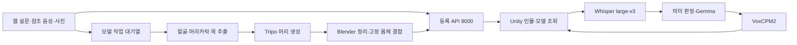

# 현재 구현과 검증 현황

기준일: **2026-09-29**. 코드 기준은 `jw`의 `135fd4da`이며 `hj`의 `e476eac3`까지 병합했다.
이 문서는 현재 운영 안내의 출발점이다. 날짜가 붙은 실험 문서의 수치·한계는 당시 기록으로 읽는다.
문서 수정이나 Git 머지가 서버 배포·실제 생성·VR 체험 검증을 대신하지 않는다.

## 1. 현재 두 경로

| 영역 | 현재 구현 | 운영·사용 문서 |
|---|---|---|
| 등록 웹 | 설문 v2, 단일 화자 참조 파일, 선택 사진, `/publish_direct`, 서버 발급 UUID4 | [웹 사용법](../Web/README.md), [설문 v2](웹_설문_v2_사용법.md) |
| 3D 제작 | `head` 경로: 머리 생성 후 리깅된 고정 몸체와 결합 | [머리 생성 파이프라인](Tripo_머리_생성_파이프라인.md) |
| STT·입력 판정 | Whisper large-v3 CUDA/float16, VAD, 음성 감정 분류 없음 | [Whisper 전환](Whisper_STT_전환.md) |
| 대화 | Gemma 4 31B QAT, 일반/추론 thinking 설정, `semantic_v1`, 연결별 기억 | [서버 구조](서버_음성대화_구조.md) |
| 음성 출력 | VoxCPM2, `reference_audio`, `generation_pcm`, Unity에는 24kHz 모노 PCM16 | [TTS 인계](TTS_작업인계_20260918.md) |
| Unity | 2022.3.62f2, 대화 `AI_Response_Test`, 기존 전신 모델 `Tripo_Model_Test`, 등록 체험 `Scene_2` | [AI 씬](AI_응답_테스트_씬.md), [모델 검사](Tripo_모델_테스트_씬.md) |

사진을 선택하는 것만으로 생성하지 않는다. 설문·참조 음성·인물 확인을 마치고 **세션 시작**을 누르면
사진이 있는 등록을 모델 작업으로 접수한다. 사진이 없으면 인물만 등록한다.
음성·설문 없이 사진만 받는 독립 `/tripo/jobs` 제작 웹은 아직 설계안이다.

## 2. 서버에서 확인한 상태

2026-09-29 읽기 전용 확인이다. 신규 등록·유료 생성·서비스 재시작은 수행하지 않았다.

| 대상 | 위치·포트 | 확인 결과 |
|---|---|---|
| 웹 | `~/webapp`, 8500 | 외부 PC와 서버 내부에서 HTTP 200, 등록·사진 입력·상태 조회 연결 |
| 등록 | `~/webapp/Server/registration`, 8000 | `/health` ready |
| Tripo 작업자 | `~/venv/tripo`, 별도 프로세스 | online/configured, 실제 `head` 설정, 고정 결과 대체용 `MODEL_FIXTURE_GLB` 비활성 |
| 머리 처리 준비물 | 웹 영역의 별도 모델·도구 파일 | 몸체 GLB·목/머리 본·분할 모델·얼굴 검출 가중치 확인, Blender 5.0.1 실행 및 Python 의존성 import 성공 |
| 대화 | `~/capstone-server`, 8002 | 17:03 KST `/health` ready, `tts_ready=true`, `gemma4_dialogue_v3` |
| LLM | 8001 | 실행 인자에서 `gemma-4-31B-qat` 확인. API 호환 이름은 `exaone` |
| TTS | 8003 loopback, 기존 `qwentts` venv | 17:03 KST VoxCPM2 ready, `reference_audio`, `generation_pcm` |
| 이전 Qwen 엔진 | 8004 | 운영에서 사용하지 않음. 복구 환경 보존 |

Tripo 웹·작업자·Blender 관련 핵심 소스 8개의 해시를 병합 대상과 대조했다.
작업자는 해당 소스 배포 뒤 시작된 프로세스다.
**이 확인 당시 작업 DB의 성공 22건은 이전 전신 경로였으며, 새 `head` 경로의 웹 등록→완료 기록은 없었다.**
준비 상태와 전체 생성 성공을 구분한다. 실제 얼굴 유사도·목 이음새·머리카락·애니메이션 품질도 별도 검수가 필요하다.

## 3. 최신 검사와 남은 범위

- 병합 후 모의 검사: **565개 통과, 건너뜀 0개** — 하네스 195, 서버 302, 작업자 11, 웹 57.
- 명령: `python tools/check.py --area all --python tools/_work/check_env_20260913/Scripts/python.exe`.
  이 Python 경로는 이번 PC에 있던 검사 환경이다. 다른 PC는 [하네스](AI_하네스.md)의 설치·선택 절차를 따른다.
- 결과: `tools/_work/checks/20260929T075937Z-all-9780c25b/report.json`.
  기본 Anaconda Python에서는 `httpx`·`fastapi` 누락으로 먼저 실패했고, 기존 검사 환경으로 전부 통과했다.
- Unity: **Capstone-Design** 인스턴스에서 컴파일·도메인 재적재 완료, 새 컴파일 오류 없음.
  `Scene_2`의 Human 몸체와 `Tools > 다시봄 > 모델 미리보기` 메뉴 반영 확인.
  기존 MCP 연결 종료 예외 2건은 이번 머지 전부터 있었다.
- 이번 검사에서 미실행: 실제 Tripo 생성, Play Mode 체험, 플레이어 빌드, 마이크·VR 장치 검사.
- VoxCPM2 전환 당시 합성·취소 후 복구 기록은 [9월 18일 인계](TTS_작업인계_20260918.md) 6장이다.
  과거 Qwen 청취·지연 수치를 현재 Vox 품질이나 지연으로 바꾸어 해석하지 않는다.

문서와 코드를 대조하며 확인한 구현상의 제한도 있다.

- 워커의 `TRIPO_FACE_LIMIT=auto`는 인수를 생략하지만 클라이언트 기본값 때문에 실제 요청에
  `50000`이 들어간다. [머리 설정 문서](Tripo_머리_생성_파이프라인.md) 3장을 따른다.
- 기존 인계 ZIP 도구는 새 머리 처리 파일 일부를 포함하지 않는다. 최신 Git clone과 별도 자산을
  사용하며 [개발환경 가이드](Tripo_개발환경_실행가이드.md) 1장의 포함 범위를 확인한다.

이 두 항목은 이번에 문서로 기록했으며 구현을 수정하거나 운영 설정을 바꾸지 않았다.

## 4. 문서를 읽는 순서

| 목적 | 기준 문서 |
|---|---|
| 작업 범위·안전한 협업 | [AGENTS.md](../AGENTS.md) |
| 코드 검사·결과 파일 | [AI 하네스](AI_하네스.md) |
| 웹·등록·Tripo·대화 서비스 경계 | [서비스 분리](웹_Tripo_대화AI_서비스_분리.md), [서버 운영](../Server/README.md) |
| 머리 생성·몸체 결합 개발 | [머리 파이프라인](Tripo_머리_생성_파이프라인.md), [팀원 지시서](Tripo_팀원_AI_작업지시서.md), [실행 가이드](Tripo_개발환경_실행가이드.md) |
| 대화 개발·참조 음성 품질 | [대화 AI 가이드](대화_AI_개발가이드.md), [TTS 인계](TTS_작업인계_20260918.md) |
| 이전 실험·기각 이유 | [Tripo 얼굴 조사](Tripo_얼굴_품질_조사_20260927.md), [Qwen 스트리밍 기록](TTS_실시간_스트리밍.md), [Raon 보관](Raon_작업이력_보관.md) |

`설문_인물_3D_통합_설계안.md`와 팀원 지시서의 독립 제작 API는 미구현 제안을 포함한다.
`docs/voice_clone_studio/`는 별도 프로젝트의 보존 문서다. `tools/prompts/`는 비교 실험 입력이므로
문서 최신화를 이유로 내용을 바꾸지 않는다. `tools/_work/` 결과는 Git에 포함되지 않아 새 clone에 없을 수 있다.
